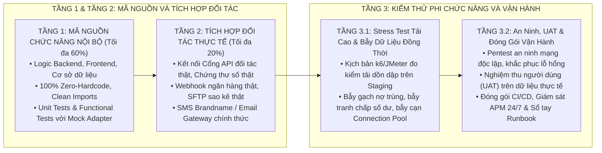

# QUY TẮC DỰ ÁN MICRO FINANCE (ERP PLATFORM) - SOẠN THẢO VÀ CHUẨN HÓA TÀI LIỆU KỸ THUẬT

Dự án này là phân hệ Tài chính Vi mô (Micro Finance Platform) thuộc hệ sinh thái ERP Doanh nghiệp, quản lý vòng đời tín dụng vi mô, hợp đồng vay vốn, tiết kiệm, giải ngân, quản lý dòng tiền, thẩm định tín dụng chấm điểm rủi ro (Credit Scoring), tính lãi suất động theo dư nợ thực tế/niên kim, trích lập dự phòng rủi ro nợ xấu, đối soát sao kê ngân hàng và lập báo cáo tài chính tuân thủ chuẩn mực kế toán và an toàn thông tin.

---

## 1. QUY TẮC BẮT BUỘC ÁP DỤNG

Mọi hoạt động phân tích, soạn thảo, chỉnh sửa tài liệu kỹ thuật và thiết kế chức năng trong workspace này phải tuân thủ nghiêm ngặt:

1. **Nguyên tắc toàn cục:** Tuân thủ 100% các điều khoản trong quy chuẩn toàn cục:
   * **Ngôn ngữ thuần túy, trong sáng:** Sử dụng tiếng Việt kỹ thuật mạch lạc, chuyên nghiệp. **Tuyệt đối loại bỏ 100% tiếng Anh đệm song ngữ trong ngoặc đơn** (không viết dạng song ngữ hoặc mở ngoặc đơn dịch nghĩa như *Hạng hội viên (Tier)*, *Lượt chơi (Turns)*, *Kỹ sư Điều phối (Human Orchestrator)*, *Kiến trúc (Architecture)*,...).
   * **Bảo toàn thuật ngữ chuyên ngành kỹ thuật khó thay thế:** Giữ nguyên các danh từ riêng, định danh mã nguồn và thuật ngữ chuyên môn quốc tế không có từ tiếng Việt tương đương chuẩn xác hoặc khi dịch ra sẽ xa nghĩa đúng (ví dụ: *Engine* - không dịch thành *Động cơ*, *FIFO / LIFO*, *Pipeline*, *Gateway*, *Framework*, *Pattern*, *Token*, *Schema*, *Docker*, *Kubernetes*, *Database*, *Redis*, *Kafka*, *RESTful API*, *JSON*, *SOAP*, *CI/CD*, *Unit Test*, *Smoke Test*, *Rollback*, *Audit Log*, *RBAC*, *CR*, *UAT*, *SIT*, *APM*, *Prometheus*, *Grafana*, *AES-256*, *TLS 1.3*). Khi sử dụng các thuật ngữ này, dùng trực tiếp thuật ngữ chuẩn mà không cần dịch gượng ép hay mở ngoặc giải nghĩa song ngữ thừa thãi.
   * **Trực quan và định dạng:** Không lạm dụng icon/emoji, sử dụng ký tự Unicode thuần túy thay cho công thức LaTeX chứa dấu `$`, sơ đồ Mermaid LR 2 cột 4:3, bằng chứng thực chứng (Zero Over-Reporting) và bảo đảm toàn vẹn dữ liệu đồng thời.
2. **Quy chuẩn Hồ sơ Đề xuất Giải pháp (Proposal):** Tuân thủ cấu trúc 7 phần tại [.agents/rules/proposal_authoring_rules.md](file:///Users/micro/Source/erp/mifinace/.agents/rules/proposal_authoring_rules.md), sử dụng kỹ năng `proposal-writer` tại [.agents/skills/proposal-writer/SKILL.md](file:///Users/micro/Source/erp/mifinace/.agents/skills/proposal-writer/SKILL.md).
3. **Quy chuẩn Tài liệu Giải pháp Tổng thể (Master Solution):** Tuân thủ cấu trúc 4 trụ cột (Nghiệp vụ, Kiến trúc, Vận hành, Triển khai) tại [.agents/rules/master_solution_rules.md](file:///Users/micro/Source/erp/mifinace/.agents/rules/master_solution_rules.md), sử dụng kỹ năng `master-solution-writer` tại [.agents/skills/master-solution-writer/SKILL.md](file:///Users/micro/Source/erp/mifinace/.agents/skills/master-solution-writer/SKILL.md).
4. **Quy chuẩn Tài liệu Giải pháp Kỹ thuật (Technical Solution):** Tuân thủ cấu trúc 3 phần (Hạ tầng/Tô pô, Chi tiết Service/Module/DDD, Ngăn xếp Công nghệ) tại [.agents/rules/technical_solution_rules.md](file:///Users/micro/Source/erp/mifinace/.agents/rules/technical_solution_rules.md), sử dụng kỹ năng `technical-solution-writer` tại [.agents/skills/technical-solution-writer/SKILL.md](file:///Users/micro/Source/erp/mifinace/.agents/skills/technical-solution-writer/SKILL.md).
5. **Quy chuẩn Tài liệu Thiết kế Tổng thể (HLD Viettel):** Tuân thủ cấu trúc 4 phần, mô hình kiến trúc phân lớp và phân vùng hệ thống 5 lớp an ninh (`Enterprise Multi-Zone Architecture`) kèm bảng đặc tả 5 cột (Mục 3.1), sơ đồ phân rã chức năng 3 tầng (Mục 3.2), sơ đồ giao tiếp tích hợp (Mục 3.3), sơ đồ quy hoạch mạng tổng thể (Mục 3.4) và bảng định cỡ tải/bảng giả thiết thiết lập địa chỉ IP đề xuất (Mục 3.5 - cập nhật sau khi cấp IP thật) chuẩn `BM.02.QT.00.CNTT.28` tại [.agents/rules/hld_authoring_rules.md](file:///Users/micro/Source/erp/mifinace/.agents/rules/hld_authoring_rules.md), sử dụng kỹ năng `hld-writer` tại [.agents/skills/hld-writer/SKILL.md](file:///Users/micro/Source/erp/mifinace/.agents/skills/hld-writer/SKILL.md). Tuyệt đối **không trình bày chi tiết code** (tên class, controller, service hay tên file màn hình giao diện mobile/web) trong HLD; chỉ mô tả mức dịch vụ logic và kênh tương tác.
6. **Quy chuẩn Tài liệu Thiết kế Chi tiết Dữ liệu (DBDD Viettel):** Tuân thủ cấu trúc 6 phần, bảng đặc tả trường 8 cột, Constraint, Index, Trigger, Stored Procedure, File Design và Tablespace/Partitioning chuẩn `BM.03.QT.00.CNTT.28` tại [.agents/rules/db_design_rules.md](file:///Users/micro/Source/erp/mifinace/.agents/rules/db_design_rules.md), sử dụng kỹ năng `db-design-writer` tại [.agents/skills/db-design-writer/SKILL.md](file:///Users/micro/Source/erp/mifinace/.agents/skills/db-design-writer/SKILL.md).
7. **Quy chuẩn viết tài liệu SRS / TKCT:** Tuân thủ chi tiết tại [.agents/rules/srs_authoring_rules.md](file:///Users/micro/Source/erp/mifinace/.agents/rules/srs_authoring_rules.md), sử dụng kỹ năng `srs-authoring` tại [.agents/skills/srs-authoring/SKILL.md](file:///Users/micro/Source/erp/mifinace/.agents/skills/srs-authoring/SKILL.md).
8. **Quy chuẩn viết tài liệu Thiết kế Chi tiết Cấp thấp (LLD):** Tuân thủ cấu trúc 11 phần tại [.agents/rules/lld_authoring_rules.md](file:///Users/micro/Source/erp/mifinace/.agents/rules/lld_authoring_rules.md), sử dụng kỹ năng `lld-writer` tại [.agents/skills/lld-writer/SKILL.md](file:///Users/micro/Source/erp/mifinace/.agents/skills/lld-writer/SKILL.md).
9. **Quy chuẩn Kiểm thử Tải cao & Bẫy Toàn vẹn Dữ liệu:** Tuân thủ 4 bài bẫy dữ liệu tại [.agents/rules/loadtest_concurrency_rules.md](file:///Users/micro/Source/erp/mifinace/.agents/rules/loadtest_concurrency_rules.md), sử dụng kỹ năng `loadtest-concurrency-writer` tại [.agents/skills/loadtest-concurrency-writer/SKILL.md](file:///Users/micro/Source/erp/mifinace/.agents/skills/loadtest-concurrency-writer/SKILL.md).
10. **Quy chuẩn Đặc tả Kiến trúc Backend & Tiến trình ngầm:** Tuân thủ kiến trúc Hexagonal và Outbox Pattern tại [.agents/rules/be_process_spec_rules.md](file:///Users/micro/Source/erp/mifinace/.agents/rules/be_process_spec_rules.md), sử dụng kỹ năng `be-process-writer` tại [.agents/skills/be-process-writer/SKILL.md](file:///Users/micro/Source/erp/mifinace/.agents/skills/be-process-writer/SKILL.md).
11. **Quy chuẩn Đặc tả Thiết kế Giao diện UI/UX & Đa ngôn ngữ:** Tuân thủ phong cách thiết kế hiện đại mới mẻ, Theme Sáng mặc định và cơ chế chuyển đổi Light/Dark Mode cho Web; mặc định hỗ trợ đa ngôn ngữ 5 thứ tiếng (Việt, Anh, Trung, Nhật, Hàn) đồng bộ cho cả Backend (`messages_*.properties`) và Frontend (`*.json`); tuân thủ chuẩn FSD / Clean Architecture, thứ tự cột DataTable (`Checkbox` → `STT` → `Thao tác` → `Dữ liệu`) và Zod schema tại [.agents/rules/ui_design_spec_rules.md](file:///Users/micro/Source/erp/mifinace/.agents/rules/ui_design_spec_rules.md), sử dụng kỹ năng `ui-writer` tại [.agents/skills/ui-writer/SKILL.md](file:///Users/micro/Source/erp/mifinace/.agents/skills/ui-writer/SKILL.md).
12. **Quy chuẩn Xuất bản Tài liệu sang Word (Docx/PDF):** Tuân thủ quy tắc biên dịch sơ đồ Mermaid nền trắng `-b white` và quản trị file tại [.agents/rules/docx_export_rules.md](file:///Users/micro/Source/erp/mifinace/.agents/rules/docx_export_rules.md).
13. **Quy chuẩn Ước lượng Nỗ lực Viettel (Estimation):** Tuân thủ định mức chuẩn và công thức Excel động 100% tại [.agents/rules/viettel_estimation_rules.md](file:///Users/micro/Source/erp/mifinace/.agents/rules/viettel_estimation_rules.md), sử dụng kỹ năng `viettel-estimation-writer` tại [.agents/skills/viettel-estimation-writer/SKILL.md](file:///Users/micro/Source/erp/mifinace/.agents/skills/viettel-estimation-writer/SKILL.md).
14. **Quy chuẩn Kịch bản & Nghiệm thu UAT Viettel:** Tuân thủ cấu trúc Dashboard và công thức động tại [.agents/rules/viettel_uat_rules.md](file:///Users/micro/Source/erp/mifinace/.agents/rules/viettel_uat_rules.md), sử dụng kỹ năng `viettel-uat-writer` tại [.agents/skills/viettel-uat-writer/SKILL.md](file:///Users/micro/Source/erp/mifinace/.agents/skills/viettel-uat-writer/SKILL.md).
15. **Quy chuẩn Sổ tay Cài đặt và Vận hành (Runbook Viettel):** Tuân thủ cấu trúc 7 phần, bảng danh sách IP máy chủ, bảng mã lỗi 9 cột và playbook xử lý sự cố 3 tầng chuẩn `HDCD_VH` tại [.agents/rules/operations_guide_rules.md](file:///Users/micro/Source/erp/mifinace/.agents/rules/operations_guide_rules.md), sử dụng kỹ năng `operations-guide-writer` tại [.agents/skills/operations-guide-writer/SKILL.md](file:///Users/micro/Source/erp/mifinace/.agents/skills/operations-guide-writer/SKILL.md).
16. **Quy chuẩn Tài liệu Hướng dẫn Sử dụng (User Guide Viettel):** Tuân thủ cấu trúc 5 phần, bảng danh mục chức năng và bảng thao tác 3 cột chuẩn `HDSD` tại [.agents/rules/user_guide_rules.md](file:///Users/micro/Source/erp/mifinace/.agents/rules/user_guide_rules.md), sử dụng kỹ năng `user-guide-writer` tại [.agents/skills/user-guide-writer/SKILL.md](file:///Users/micro/Source/erp/mifinace/.agents/skills/user-guide-writer/SKILL.md).
17. **Quy chuẩn Trực quan hóa Kiến trúc bằng Sơ đồ Flowchart:**
    * **Tất cả các nội dung và mô hình kiến trúc** (Kiến trúc phân lớp Microservices, phân rã chức năng dạng cây, giao tiếp tích hợp hệ thống ngoài, kiến trúc an toàn thông tin ATTT, kiến trúc sao lưu phục hồi thảm họa DR) **BẮT BUỘC phải được thể hiện bằng Sơ đồ Flowchart (`flowchart LR` hoặc `flowchart TD`)**.
    * **Chỉ trình bày duy nhất 1 sơ đồ phù hợp nhất** cho mỗi mục thiết kế kiến trúc, không liệt kê nhiều phương thức lựa chọn thay thế trong tài liệu giao nộp.
    * **Tuyệt đối cấm** đưa các câu chữ, nhãn tiêu đề giải thích kỹ thuật định dạng (ví dụ: *"Ký tự Unicode Chuẩn (Đảm bảo hiển thị trọn vẹn 100% trên mọi nền tảng)"*, *"Phương thức 1 / 2 / 3"*, *"Theo quy chuẩn docsbase"*,...) vào nội dung văn bản.
    * **Trường hợp sử dụng Sơ đồ Khối Hộp Ký tự Unicode:** Bắt buộc tuân thủ 4 quy tắc: Độ rộng cố định 85 - 90 ký tự, độ dài dòng nhất quán 100%, căn dóng tọa độ cột trực giao (`│`, `▼`, `┼`) và tối đa 2 cột con song song mỗi tầng để triệt tiêu hoàn toàn lỗi lệch hàng cột.
18. **Quy chuẩn Soạn thảo Tài liệu Hướng dẫn Upcode (HDUP Viettel/Mosan):** Tuân thủ cấu trúc 6 phần, bảng danh mục file thay đổi 5 cột dạng cây thư mục ASCII kèm nhãn `(CREATE)` / `(UPDATE)` / `(DELETE)`, quy trình cấu hình từng phân hệ (DB, Core OSGi, APIGW, Web CMS, WSO2, VSA), kịch bản Smoke Test và kịch bản Rollback chuẩn `HDUP` tại [.agents/rules/upcode_guide_rules.md](file:///Users/micro/Source/erp/mifinace/.agents/rules/upcode_guide_rules.md), sử dụng kỹ năng `upcode-guide-writer` tại [.agents/skills/upcode-guide-writer/SKILL.md](file:///Users/micro/Source/erp/mifinace/.agents/skills/upcode-guide-writer/SKILL.md).
19. **Quy chuẩn Thiết kế Logo, Nhận diện Thương hiệu & Favicon:** Tuân thủ tiêu chí Sáng tạo - Độc đáo - Hiện đại - Đơn giản (Creative, Unique, Modern, Minimalist); hình khối dứt khoát (Flat Vector, nét đậm chắc chắn, độ tương phản cao), không dùng chi tiết vụn vặt rườm rà; bảo đảm hiển thị sắc nét nhận diện rõ ràng ngay cả khi thu nhỏ về kích thước Favicon (16×16 px, 32×32 px); lưu trữ chuẩn tại `docs/assets/`.
20. **Quy chuẩn Rà soát Bảo mật, Xác thực Phiên và Nghiệm thu Thực chứng (Security & Pentest Review):** Tuân thủ 5 nguyên tắc cốt lõi: Mặc định từ chối trên 100% luồng rẽ nhánh dữ liệu (chống IDOR), đồng bộ trạng thái Redis Stateless (bảo toàn `failCounter` OTP), phòng vệ 2 chiều thu hồi Token (Action & Gate Filter), nghiệm thu thực chứng (Hard Evidence / PoC) và sửa lỗi nhất quán toàn cục tại [.agents/rules/security_review_rules.md](file:///Users/micro/Source/erp/mifinace/.agents/rules/security_review_rules.md).
21. **Quy chuẩn Tối ưu Tiêu đề (Heading Optimization) — Ngắn gọn, Súc tích, Trọng tâm:**
    * **Toàn bộ tiêu đề các cấp (Heading 1, 2, 3, 4)** bắt buộc phải được đặt tên ngắn gọn, súc tích, đi thẳng vào bản chất kỹ thuật/nghiệp vụ.
    * **Tuyệt đối không viết tiêu đề dài dòng, rườm rà, nhồi nhét từ ngữ phụ trợ thừa thãi** (loại bỏ các cụm từ như: *Tài liệu thiết kế kiến trúc và đặc tả thông số...*, *Tổng quan kiến trúc và định cỡ...*, *Ứng dụng chi tiết trong 3 trụ cột...*, *Kết quả nghiệm thu triển khai và bằng chứng thực chứng...*, *Chi tiết tệp cấu hình chính thức...*).
    * **Cấu trúc đặt tên chuẩn:**
      * **Heading 1:** Tên hệ thống / Chuyên đề cốt lõi (Ví dụ: `# TRỢ LÝ AI NỘI BỘ`, `# THÔNG SỐ MÁY CHỦ MICRO-SERVER`, `# HẠ TẦNG VÀ DỊCH VỤ DÙNG CHUNG`).
      * **Heading 2:** Tên chương mục trọng tâm (Ví dụ: `## 1. KIẾN TRÚC VÀ PHẦN CỨNG`, `## 2. MA TRẬN MÔ HÌNH AI`, `## 3. ỨNG DỤNG NGHIỆP VỤ`, `## 4. QUY TRÌNH TRIỂN KHAI`, `## 2. CẤU HÌNH DỊCH VỤ`, `## 3. HIỆN TRẠNG CSDL ORACLE`, `## 9. NGHIỆM THU VÀ BẰNG CHỨNG`).
      * **Heading 3 & 4:** Tên đối tượng, phân hệ hoặc bước hành động cụ thể (Ví dụ: `### 1.1. Cấu hình phần cứng`, `### 4.1. Giai đoạn 1: Chuẩn bị phần cứng`, `### 9.1. Trạng thái 13 containers`).
22. **Quy chuẩn Giám sát & Quản lý Nhật ký Tập trung (Centralized Monitoring & ELK):**
    * **Tuân thủ 5 nguyên tắc cốt lõi:** Xuất log cấu trúc JSON chuẩn Elastic Common Schema (ECS), giới hạn dung lượng logging Docker (`max-size: 50m`, `max-file: 3`), mở điểm cuối kiểm tra sức khỏe (`/actuator/health`) và thu thập chỉ số (`/actuator/prometheus`), áp dụng chính sách ILM tự động xóa log sau 30 ngày bảo vệ an toàn đĩa cứng, và thiết lập cảnh báo sự cố khẩn cấp qua Telegram Bot. Chi tiết quy hoạch xem tại [centralized-monitoring-elk.md](file:///Users/micro/Source/docsbase/rd/centralized-monitoring-elk.md) và hướng dẫn tích hợp chi tiết cho dịch vụ xem tại [service-monitoring-guide.md](file:///Users/micro/Source/docsbase/rd/service-monitoring-guide.md).
23. **Quy chuẩn Rà soát, Đánh giá và Soạn thảo Báo cáo Pentest (Pentest Assessment & Reporting):** Tuân thủ cấu trúc báo cáo an toàn thông tin chuẩn mẫu Natcash/Viettel (Thông tin chung, Bảng phân loại lỗ hổng, Ma trận danh sách lỗi, Đặc tả chi tiết 8 phần từng lỗi: Phân loại, Tổng quan, Ảnh hưởng kinh doanh, Tham khảo, Mô tả kỹ thuật, CVSS v3.1, Ảnh hưởng kỹ thuật, PoC tái hiện kèm Request/Response thật, Giải pháp khắc phục triệt để đa tầng) và tích hợp các bẫy tấn công hệ thống tải cao nhiều người dùng (Tranh chấp đồng thời/Race Condition, Double Spending, Distributed Brute-force, Session Hijacking, Keystore/Keychain, Root/Jailbreak, SSL Pinning) tại [.agents/rules/pentest_assessment_rules.md](file:///Users/micro/Source/erp/mifinace/.agents/rules/pentest_assessment_rules.md), sử dụng kỹ năng `pentest-assessment-writer` tại [.agents/skills/pentest-assessment-writer/SKILL.md](file:///Users/micro/Source/erp/mifinace/.agents/skills/pentest-assessment-writer/SKILL.md).

---

## 2. CẤU TRÚC 4 THÀNH PHẦN BẮT BUỘC CỦA MỖI CHỨC NĂNG

Mỗi mục chức năng (Heading 3) bắt buộc phải có đủ 4 mục con (Heading 4):
1. **Thông tin chung chức năng:** Mục đích, trạng thái hồ sơ áp dụng, đường dẫn thao tác (đơn lẻ vs hàng loạt), quy định ghi nhật ký hệ thống (Audit Log), quy định phân quyền (RBAC).
2. **Màn hình:** Hình ảnh giao diện thiết kế (Mockup / Figma), các trạng thái màn hình (mặc định, không có dữ liệu, popup xác nhận, toast thông báo).
3. **Mô tả chi tiết các thành phần:** Bảng chuẩn 6 cột (`STT`, `Tên *`, `Kiểu dữ liệu [Độ dài]`, `Input/Output`, `Giá trị khởi tạo`, `Mô tả & Mapping CSDL & Ràng buộc`).
4. **Luồng nghiệp vụ:** Các bước tuần tự 1..N, phân nhánh tình huống (TH1: Hợp lệ/Có dữ liệu, TH2: Không hợp lệ/Không có dữ liệu, TH3: Trùng lặp), tương tác popup, chi tiết cập nhật CSDL (trạng thái, phiên bản, cờ công bố), phản hồi giao diện, bẫy toàn vẹn dữ liệu đồng thời và **sơ đồ Sequence Diagram chuẩn mực** (hoặc sơ đồ Sequence Text Art / Bảng kịch bản tuần tự) mô hình hóa toàn bộ tương tác giữa Người dùng - Giao diện - Backend - CSDL / Dịch vụ ngoài.

---

## 3. QUY ĐỊNH VẼ SƠ ĐỒ WORKFLOW (SEQUENCE DIAGRAM)

Mọi sơ đồ luồng công việc (workflow), quy trình nghiệp vụ và luồng tương tác giữa các tác nhân/hệ thống trong tài liệu SRS bắt buộc phải:
* **Vẽ dưới dạng Sequence Diagram tường minh và rõ ràng:** Thể hiện rõ thứ tự tương tác thời gian từ trên xuống dưới, các đối tượng tham gia (`actor`, `participant`, `database`), các hộp kích hoạt (`activate`/`deactivate`).
* **Sử dụng hình khối và đường nét chuẩn mực:**
  * Đường nét dóng thẳng trực giao chuẩn UML: Mũi tên nét liền `->>` cho lệnh gọi/gửi dữ liệu đồng bộ, mũi tên nét đứt `-->>` cho phản hồi kết quả.
  * Phân nhánh điều kiện bằng khung chuẩn: `alt` / `else` (Hợp lệ / Lỗi nghiệp vụ / Trùng dữ liệu), `opt` (Tùy chọn), `loop` (Vòng lặp), `critical` (Giao dịch CSDL nguyên tử).
* **Tuyệt đối không sử dụng các nét vẽ lượn cong tùy tiện:** Không dùng các đường nối cong tự do, nét lượn sóng phi tiêu chuẩn làm giảm tính chính xác và độ nghiêm ngặt của tài liệu kỹ thuật.
* **Phương án dự phòng khi công cụ xem trước không render được Mermaid:** Chuyển đổi sang dạng **Sơ đồ Khối Hộp Ký tự Unicode (Text Art)** hoặc **Bảng Ma trận Kịch bản Tương tác Tuần tự** với các cột: `Bước`, `Tác nhân gửi`, `Tác nhân nhận`, `Hành động / Dữ liệu truyền`, `Phản hồi mong muốn`.

---

## 4. QUY ĐỊNH VẼ SƠ ĐỒ PHÂN RÃ CHỨC NĂNG (FUNCTIONAL DECOMPOSITION TREE)

Mọi sơ đồ phân rã chức năng / phân hệ hệ thống trong toàn bộ tài liệu kỹ thuật (SRS, HLD, Technical Solution, Proposal, Master Solution) bắt buộc phải tuân thủ nghiêm ngặt các nguyên tắc thiết kế sau:

### 4.1. Cấu trúc Cây Phân cấp 3 Tầng Ngang (`flowchart LR`)
* **Tầng 0 (Gốc Hệ thống):** Tên hệ thống tổng thể ở cột đầu tiên bên trái (`ROOT["HỆ THỐNG XÁC THỰC SMART OTP"]:::cLevel0`).
* **Tầng 1 (Phân hệ / Nhóm chức năng chính):** Nút gốc rẽ nhánh sang các phân hệ cốt lõi ở cột giữa, mỗi phân hệ đặt trong 1 ô riêng biệt (`MOD1["1. PHÂN HỆ NỀN TẢNG LÕI"]:::cLevel1`).
* **Tầng 2 (Chức năng con phân rã):** Từ mỗi phân hệ rẽ nhánh sang các chức năng cụ thể ở cột thứ 3 bên phải. **Bắt buộc tách riêng 100% từng chức năng con vào một ô độc lập** (`F1_1["1.1. Mật mã OCRA RFC 6287"]:::cLevel2`), tuyệt đối không gộp nhiều chức năng vào 1 ô.

### 4.2. Nguyên tắc Bố cục và Dóng thẳng hàng 100% Lề trái (Left-Edge Alignment)
* **Đồng bộ tuyệt đối chiều dài ký tự các ô Phân hệ Tầng 1:**
  * Bộ máy Dagre của Mermaid tính toạ độ X của các ô con dựa vào toạ độ mép phải của ô cha. Để toàn bộ các ô chức năng con ở Cột 3 dóng thẳng tắp theo lề trái, **tất cả các ô phân hệ ở Tầng 1 bắt buộc phải có độ dài ký tự xấp xỉ nhau và chỉ viết trên 1 dòng duy nhất (tuyệt đối không dùng thẻ ngắt dòng ` ` trong ô phân hệ)**.
* **Quy chuẩn khoảng cách và đường nối:**
  * Khởi tạo directive: `%%{init: {'flowchart': {'nodeSpacing': 8, 'rankSpacing': 140, 'padding': 3, 'curve': 'basis'}}}%%`
  * `rankSpacing: 140`: Kéo dãn khoảng cách ngang rộng rãi giữa các tầng, giúp sơ đồ thanh thoát và các đường mũi tên uốn cong mềm mại.
  * `nodeSpacing: 8`: Thu hẹp khoảng cách dọc giữa các ô cùng cột, giúp toàn bộ sơ đồ gọn gàng, vừa vặn trong 1 khung nhìn duy nhất.
  * `curve: 'basis'`: Đường nối uốn cong tự nhiên, chạm khít 100% vào mép viền trái của từng ô (khoảng cách bằng 0).
* **Quy chuẩn kích thước và khoảng đệm bên trong ô (Internal Balanced Padding):**
  * Tăng khoảng đệm chiều ngang và căn đều 4 phía để ô cân đối, ôm vừa vặn nội dung chữ:
    * Cấp 0 (Gốc): `classDef cLevel0 font-size:12px,font-weight:bold,padding:6px 16px;`
    * Cấp 1 (Phân hệ): `classDef cLevel1 font-size:11px,font-weight:bold,padding:5px 14px;`
    * Cấp 2 (Chức năng con): `classDef cLevel2 font-size:10px,padding:4px 10px;`

### 4.3. Các Điều Cấm Kỵ Tuyệt Đối khi Vẽ Sơ đồ Phân rã Chức năng
* **CẤM dùng liên kết ẩn `~~~` giữa các hàng trong `flowchart LR`:** Việc nối `A ~~~ B` trong sơ đồ ngang sẽ ép các ô sang các Rank ngang kế tiếp, gây lỗi dàn bậc thang kéo dài vô tận sang phải.
* **CẤM thiết lập cố định CSS `width: ...px` trong `classDef`:** Ép cứng chiều rộng sẽ làm xung đột với ma trận tính toạ độ Dagre SVG, khiến đầu mũi tên bị tách rời xa viền ô.
* **CẤM vẽ dạng chuỗi tiến trình nối đuôi nhau (`A --> B --> C --> D`):** Phân rã chức năng là cấu trúc phân cấp tĩnh (Hierarchy), không phải là quy trình nghiệp vụ (Workflow).
* **CẤM dùng khung bao `subgraph` viền nền vàng:** Giữ phong cách sơ đồ phẳng, tinh tế và chuyên nghiệp.

---

## 5. QUY ĐỊNH VẼ SƠ ĐỒ KIẾN TRÚC PHÂN LỚP VÀ PHÂN VÙNG HỆ THỐNG (ENTERPRISE MULTI-ZONE ARCHITECTURE)

Mọi sơ đồ kiến trúc phân lớp và quy hoạch phân vùng an ninh hệ thống trong HLD và Technical Solution (Mục 3.1) bắt buộc phải tuân thủ nghiêm ngặt các nguyên tắc thiết kế sau:

### 5.1. Quy hoạch 5 Phân vùng An ninh & Vận hành Chuyên biệt (`flowchart TD`)
1. **Vùng 1: Kênh Truy cập Khách hàng & Mạng ngoài (`ZONE_ACCESS`):** Chứa các kênh tương tác (App Mobile, Web Portal, POS QR/SDK, Leased Line MPLS Ngân hàng, USSD *202# & SMSC) định dạng `direction LR` và dàn ngang bằng liên kết ẩn `~~~`.
2. **Vùng 2: Vùng DMZ Dải Ngoài Biên An Ninh (`ZONE_DMZ` - Subnet Dải Ngoài):** Chứa Cụm NGINX Plus Load Balancer / Tường lửa WAF (IP VIP), Cổng API Gateway Biên (Customer API & Enterprise WSO2), Webview Checkout/Sandbox Biên, Xác thực Tập trung Viettel VSA CAS SSO & RBAC định dạng `direction LR` và dàn ngang bằng `~~~`.
3. **Vùng 3: Vùng Dải Trong / Ứng Dụng Nghiệp Vụ Lõi (`ZONE_INT` - Subnet Dải Trong):** Định dạng `direction TB`, gom cụm thành các subgraph chức năng độc lập (`direction LR`), dàn ngang bằng `~~~`:
   * `SRV_CORE`: Cụm Máy chủ Core App (Socket TCP ISO 8583) & Smart OTP Core Engine (OCRA RFC 6287).
   * `SRV_PARTNER`: Cụm Máy chủ Đối tác & Cổng Thanh toán (Partner Service, Merchant Pay, QR POS API).
   * `SRV_BROKER`: Cụm Broker & Điều phối Cụm (Kafka Event-Driven 9092, Eureka Discovery 8761, Zookeeper 2181, Messaging Service SMSC/Push).
4. **Vùng 4: Vùng Quản trị & Vận hành Private OAM (`ZONE_OAM` - Subnet VPN/LAN Nội bộ):** Chứa CMS Backend, Payment Point CMS, Giám sát APM (Prometheus, Grafana, ELK Logging) và Bastion Host SSH Port 22 định dạng `direction LR`.
5. **Vùng 5: Vùng Cơ sở Dữ liệu & Lưu trữ Bền vững (`ZONE_DB` - Subnet DB Zone):** Chứa CSDL Quan hệ Cụm Master RAC Node 01 & 02 (Oracle RAC / PostgreSQL Patroni), Cụm Redis Sentinel HA định dạng `direction LR`.

### 5.2. Luồng Truyền thông Liên Phân vùng & Cú pháp Chuẩn
* **Luồng truyền thông chuẩn:**
  * Khách hàng → DMZ: `ZONE_ACCESS -->|"1. HTTPS TLS 1.3 / Leased Line MPLS"| ZONE_DMZ`
  * DMZ → Dải Trong: `ZONE_DMZ ==>|"2. Tường lửa Dải Trong (Pin-hole Firewall) & Token JWT"| ZONE_INT`
  * Dải Trong → CSDL: `ZONE_INT -->|"3. Giao thức TCP Port 1521 / Port 6379"| ZONE_DB`
  * OAM → Dải Trong: `ZONE_OAM -.->|"4. Quản trị & Đối soát Nghiệp vụ (VPN LAN)"| ZONE_INT`
  * OAM → CSDL: `ZONE_OAM -.->|"5. Truy vấn Báo cáo & QL Dữ liệu (Port 1521)"| ZONE_DB`
* **Directive và ClassDef:**
  * `%%{init: {'flowchart': {'nodeSpacing': 14, 'rankSpacing': 24, 'padding': 8}, 'themeVariables': {'fontSize': '13px', 'fontFamily': 'Inter, Arial, sans-serif'}}}%%`
  * `classDef cClient fill:#e8f4fd,stroke:#2b6cb0,stroke-width:1.5px,color:#1a365d;`
  * `classDef cExt fill:#f1f5f9,stroke:#475569,stroke-width:1.5px,color:#0f172a;`
  * `classDef cDmz fill:#fef3c7,stroke:#d97706,stroke-width:1.5px,color:#78350f;`
  * `classDef cCore fill:#ecfdf5,stroke:#059669,stroke-width:1.5px,color:#064e3b;`
  * `classDef cPartner fill:#f0fdf4,stroke:#16a34a,stroke-width:1.5px,color:#14532d;`
  * `classDef cKafka fill:#fff1f2,stroke:#e11d48,stroke-width:1.5px,color:#881337;`
  * `classDef cGov fill:#f8fafc,stroke:#64748b,stroke-width:1.5px,color:#334155;`
  * `classDef cOam fill:#eff6ff,stroke:#3b82f6,stroke-width:1.5px,color:#1e3a8a;`
  * `classDef cDb fill:#f5f3ff,stroke:#7c3aed,stroke-width:1.5px,color:#4c1d95;`
* **Bảng Đặc tả 5 Cột Đi Kèm Bắt Buộc:** Phân vùng an ninh | Tên máy chủ (Hostname) | Cụm dịch vụ / Phân hệ cài đặt | Cổng dịch vụ & Giao thức | Chức năng cốt lõi & Cơ chế an ninh.

---

## 6. QUY ĐỊNH VẼ SƠ ĐỒ GIAO TIẾP HỆ THỐNG NGOÀI (SYSTEM INTEGRATION FLOWCHART)

Mọi mục thiết kế giao tiếp tích hợp hệ thống ngoài trong HLD và Technical Solution (Mục 3.3) bắt buộc:
* **Sử dụng Sơ đồ Flowchart (`flowchart LR`):**
  * Tách biệt 2 vùng rõ rệt bằng `subgraph`: **Tầng Client & Điều phối Cổng APIGateway** (BE App / BE CMS Orchestration Layer) và **Tầng Các Dịch vụ Chuyên biệt Độc lập** (Smart OTP Core, Wallet Core, SMS Gateway, BCCS Viễn thông, VSA Admin).
  * **Nguyên tắc Kiến trúc Cốt lõi:** Toàn bộ luồng giao dịch và tác vụ do **Cổng BE Gateway điều hướng và điều phối tuần tự**; các dịch vụ chuyên biệt (Smart OTP Core, Wallet Core, SMS Gateway, BCCS) **hoàn toàn độc lập và tuyệt đối không gọi trực tiếp chéo nhau**.
  * **Gắn nhãn giao thức cụ thể trên từng đường liên kết:** Ghi rõ giao thức truyền thông và chuẩn dữ liệu trên từng mũi tên kết nối (ví dụ: `HTTPS / CAS Protocol`, `SMPP / RESTful API`, `TCP Socket / ISO 8583`, `RESTful HTTPS`).
  * Sử dụng Flowchart trực quan thay vì vẽ Sequence Diagram phức tạp hoặc chỉ liệt kê văn bản đơn thuần.

---

## 7. NGUYÊN TẮC ZERO-HARDCODE VÀ QUẢN TRỊ DỮ LIỆU ĐỐI TƯỢNG (ZERO-HARDCODE & NO DEFAULT DATA)

Áp dụng cho toàn bộ hoạt động lập trình, thiết kế kiến trúc, xây dựng cơ sở dữ liệu và soạn thảo tài liệu kỹ thuật:

* **Không hardcode chuỗi hoặc số ma thuật — Bắt buộc sử dụng 100% Enum:**
  * Toàn bộ mã trạng thái (Status), phân loại (Type), phương thức (Method), mã lỗi (ErrorCode), đơn vị tiền tệ (Currency), điều khoản thanh toán/thương mại (PaymentTerm, Incoterm), vai trò người dùng (UserRole) **bắt buộc phải được khai báo và sử dụng 100% bằng Enum** ở cả Backend và Frontend.
  * Tuyệt đối **CẤM** dùng chuỗi tự do (String literal) để so sánh logic hoặc kiểm tra điều kiện (ví dụ: cấm `if ("PIN_INVALID".equals(code))`, cấm `if (role == "ADMIN")`, cấm `if (status == "ACTIVE")`).
* **Không điền giá trị mặc định khi khởi tạo hay trả thông tin đối tượng (Zero Fake Default Values):**
  * **Khi khởi tạo đối tượng (Entity, DTO, Request, Response, State, Form):**
    * Tuyệt đối **CẤM gán cứng các giá trị mặc định giả lập** (như tự ý điền "Cảng Quốc Tế", "Cảng Hải Phòng", "16 tuần", "24 tháng", "Đại Diện Ban Đấu Thầu", số tiền mặc định, chuỗi mặc định...).
    * Mọi trường dữ liệu bắt buộc phải được lấy 100% từ nguồn thực tế (truy vấn Cơ sở dữ liệu, Request payload gửi lên, hoặc để `null` / rỗng `""` / `[]` nếu đối tượng chưa có dữ liệu).
  * **Đối với giao diện Frontend:**
    * State khởi tạo của form nhập liệu, bảng tính toán, danh mục BoQ, giá trị đơn giá, xuất xứ bắt buộc phải để rỗng hoặc tải trực tiếp từ API, cấm tự ý điền sẵn dữ liệu giả lập.
* **Không hardcode thông điệp và văn bản giao diện:**
  * Toàn bộ câu chữ thông báo, nhãn trường, lỗi validation phải được quản lý tập trung qua hệ thống đa ngôn ngữ i18n hoặc bảng mã lỗi hệ thống (ErrorCode), cấm hardcode câu chữ tự do trong Controller, Service hay React Component.

---

## 8. NGUYÊN TẮC RÀ SOÁT BẢO MẬT, XÁC THỰC PHIÊN VÀ KIỂM THỬ AN NINH THỰC CHỨNG (SECURITY REVIEW & CALL-PATH VERIFICATION)

Áp dụng cho toàn bộ hoạt động lập trình, rà soát mã nguồn (Code Review), vá lỗ hổng Pentest và nghiệm thu bảo mật hệ thống:

1. **Nguyên tắc "Mặc Định Từ Chối Trên 100% Luồng Dữ Liệu" (Default Deny & 100% Call-Path Verification):**
   * **Kiểm tra quyền sở hữu tại điểm trả dữ liệu cuối cùng:** Không bao giờ giả định dữ liệu lấy từ hệ thống ngoài (Core eWallet, WSO2, vi dịch vụ nội bộ) đã an toàn. Mọi dữ liệu trước khi trả về cho Client bắt buộc phải so khớp danh tính người dùng (`loggedInfo`).
   * **Dò vết 100% các nhánh rẽ (`if/else/return`):** Tuyệt đối không kết luận một API an toàn chỉ vì thấy có đoạn kiểm tra quyền ở nhánh phụ (Fallback/DB) mà bỏ quên luồng chính. Dữ liệu không chứng minh được thuộc quyền sở hữu của người gọi bắt buộc phải từ chối ngay (`ERR_PARAMETERS_INVALID`).

2. **Nguyên tắc "Đồng Bộ Trạng Thái Trong Kiến Trúc Phi Trạng Thái" (Stateless Distributed Cache Persistence):**
   * **Biến trong RAM là vô nghĩa nếu không ghi lại xuống Cache:** Backend là Stateless, mỗi HTTP request là một luồng độc lập. Mọi thay đổi trạng thái đối tượng nghiệp vụ (như tăng số lần thử sai `failCounter++`, đổi trạng thái phiên, ghi nhận thời gian) bắt buộc phải được gọi lệnh ghi đè ngược lại Redis (`setOtpTransaction` / `RedisService.set`).
   * **Bảo toàn trạng thái tại mọi nhánh thoát lỗi (`Early Return / Catch`):** Khi hàm trả về lỗi xác thực OTP, bắt buộc phải cập nhật trạng thái `failCounter` vào Redis trước khi trả về response lỗi cho Client để ngăn chặn tấn công vét cạn (Brute-force).

3. **Nguyên tắc "Phòng Vệ Chiều Sâu Khép Kín 2 Chiều" (Action-Gate Defense-in-Depth):**
   * **Phía Hành Động (Action Integrity):** Khi người dùng Đăng xuất (Logout), Đổi PIN hoặc Khóa tài khoản, phải xác định định danh chính xác từ phiên đã xác thực (tránh bẫy `null` trong key format), xóa triệt để trên toàn bộ các tầng cache (Redis Token, Redis Device) và cập nhật trạng thái DB (`LOGGED_OUT`).
   * **Phía Cổng Chặn (Gate / Filter / Interceptor):** Bộ lọc bảo mật (`RsAuthFilter`) bắt buộc phải kiểm tra đa lớp: Token phiên có tồn tại trong Cache không VÀ trạng thái thiết bị có đang là `LOGGED_IN` không (từ chối `401 Unauthorized` ngay lập tức nếu là `LOGGED_OUT`).

4. **Nguyên tắc "Bằng Chứng Thực Chứng — Hard Evidence or Zero" Trong Nghiệm Thu An Ninh:**
   * Tuyệt đối **CẤM** đánh giá "PASS" hoặc "Đã khắc phục" chỉ bằng việc đọc mã nguồn bằng mắt.
   * Bắt buộc phải có **kịch bản kiểm thử thực nghiệm (Proof of Concept - PoC)** mô phỏng đúng hành vi tấn công (gửi request chéo tài khoản cho IDOR, gửi liên tiếp 5 OTP sai rồi 1 OTP đúng cho Brute-force, dùng lại token cũ sau khi logout).
   * Cấu hình hạ tầng (Nginx Rate-Limiting, WAF) chỉ được coi là hoàn tất khi đã kích hoạt thực tế trên Staging và có kết quả đo kiểm chặn mã lỗi `429 Too Many Requests`.

5. **Nguyên tắc "Sửa Lỗi Nhất Quán Toàn Cục" (Global Consistency over Local Patch):**
   * Khi phát hiện và vá một lỗ hổng bảo mật tại một điểm (Controller/Service), bắt buộc phải dò quét toàn bộ codebase (`grep_search`) để tìm và sửa đồng bộ trên tất cả các chức năng có logic tương tự, tuyệt đối không sửa cục bộ để sót các endpoint khác.

---

## 9. QUY CHUẨN ĐÁNH GIÁ TIẾN ĐỘ 3 TẦNG ĐỘC LẬP (3-TIER PROGRESS VALUATION)

Tiến độ của một dự án/phân hệ chỉ được coi là hoàn tất 100% khi và chỉ khi vượt qua cả 3 tầng độc lập, tuyệt đối không lấy tầng này bù cho tầng khác:

* **Tầng 1 — Mã nguồn chức năng nội bộ (Tỷ trọng 60%):** Xây dựng xong logic nghiệp vụ, Entity, Repository, API, giao diện và bài test đơn luồng nội bộ.
* **Tầng 2 — Tích hợp Đối tác Bên ngoài Thực tế (Tỷ trọng 20%):** Hoàn tất kết nối thông suốt với các dịch vụ bên ngoài (ngân hàng, cơ quan nhà nước, nhà mạng viễn thông, chứng thư số). Nếu đang chạy Mock Adapter → Tầng này bắt buộc chấm 0%.
* **Tầng 3 — Kiểm thử Phi Chức Năng, Tải Cao & Vận Hành (Tỷ trọng 20%):** Thực thi kịch bản k6/JMeter tải lớn trên cụm phân tán Staging, Pentest an ninh, UAT thực tế và sẵn sàng Production.
