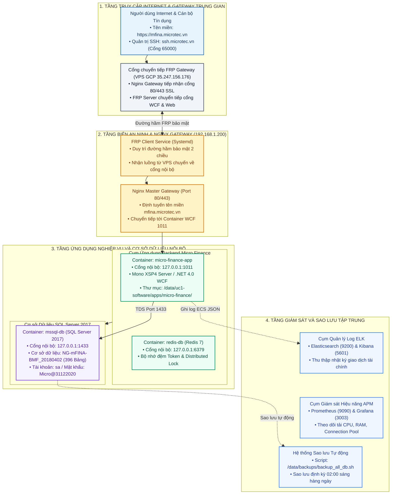

# HẠ TẦNG TRIỂN KHAI VÀ THÔNG SỐ DỊCH VỤ MICRO FINANCE

---

## 1. HẠ TẦNG MÁY CHỦ MICRO-SERVER

Hệ thống Micro Finance (NG.mFinance) được thiết lập và vận hành trên cụm máy chủ nội bộ chuyên trách `micro-server` đặt tại mạng nội bộ LAN, được công bố ra ngoài Internet thông qua Cổng chuyển tiếp bảo mật FRP Gateway (VPS Google Cloud) kết hợp Cloudflare SSL.

### 1.1. Cấu hình phần cứng
* **Tên máy chủ (Hostname):** `micro`
* **Địa chỉ mạng nội bộ LAN:** `192.168.1.200`
* **Hệ điều hành:** Ubuntu 22.04 LTS (Kernel Linux 5.15.0 x86_64)
* **Vi xử lý CPU:** 2 × Intel Xeon E5-2670 @ 2.60GHz (Tổng cộng 16 nhân / 32 luồng vật lý, tập lệnh SSE4.2 / AVX)
* **Bộ nhớ RAM:** 62 GB DDR3 ECC Registered (Khả dụng ~54 GB)
* **Card đồ họa GPU:** Inno3D / ZOTAC GeForce RTX 3060 12GB GDDR6 (3.584 nhân CUDA, 112 Tensor Cores Gen 3)
* **Ổ đĩa SSD Hệ điều hành (`sdb`):** 240 GB Enterprise SSD (Phân vùng Root `/` dung lượng 218 GB)
* **Ổ đĩa HDD Dữ liệu lớn (`sda`):** 4 TB SAS RAID (3.6 TB quản lý bằng LVM `vg_data`)

### 1.2. Phân vùng lưu trữ LVM

| Phân vùng LVM | Điểm gắn kết (Mount Point) | Dung lượng | Trách nhiệm chuyên trách đối với Micro Finance |
| :--- | :--- | :--- | :--- |
| `vg_data-lv_uc1_software` | `/data/uc1-software` | 787 GB | **Phần mềm & Cơ sở dữ liệu:** Chứa tệp nguồn ứng dụng WCF Micro Finance (`/data/uc1-software/apps/micro-finance/`), cấu hình Sub-Nginx UC1 và dữ liệu CSDL SQL Server 2017 (`mssql-db`). |
| `vg_data-lv_uc3_infra` | `/data/uc3-infra` | 492 GB | **Hạ tầng & Giám sát tập trung:** Chứa Docker Data-Root, Cổng chuyển tiếp FRP Client, Cụm thu thập nhật ký tập trung ELK (Elasticsearch, Logstash, Kibana) và Prometheus + Grafana. |
| `vg_data-lv_backups` | `/data/backups` | 295 GB | **Sao lưu dữ liệu tự động:** Lưu trữ bản sao lưu định kỳ hàng ngày của CSDL `NG-mFINA-BMF_20180402` và tệp cấu hình hệ thống. |

---

## 2. THÔNG SỐ DỊCH VỤ VÀ CSDL

### 2.1. Thông số kỹ thuật dịch vụ

| Hạng mục | Thông số cấu hình thực tế | Ý nghĩa & Vai trò vận hành |
| :--- | :--- | :--- |
| **Tên Dịch vụ** | `micro-finance-app` | Dịch vụ máy chủ WCF SOAP Backend của hệ thống Micro Finance. |
| **Môi trường thực thi** | Docker Container | Khởi chạy trên môi trường Docker Linux qua Mono XSP4 Server (.NET Framework 4.0). |
| **Thư mục ứng dụng** | `/data/uc1-software/apps/micro-finance/` | Chứa mã nguồn biên dịch nhị phân và các tệp cấu hình WCF Services (.svc). |
| **Cổng dịch vụ nội bộ** | `127.0.0.1:1011` | Cổng HTTP tiếp nhận yêu cầu từ Nginx Master Gateway. |
| **Tên miền truy cập Public** | `https://mfina.microtec.vn/` | Tên miền dịch vụ công bố ra ngoài qua Cloudflare và Cổng FRP Gateway VPS. |
| **Cơ sở dữ liệu liên kết** | `NG-mFINA-BMF_20180402` | Cơ sở dữ liệu tài chính vi mô chuẩn với **396 bảng nghiệp vụ**. |
| **Hệ quản trị CSDL** | Microsoft SQL Server 2017 (`mssql-db`) | Container SQL Server 2017 trên Docker (`127.0.0.1:1433`). |
| **Tài khoản quản trị CSDL** | `sa` | Tài khoản kết nối cơ sở dữ liệu. |
| **Mật khẩu chuẩn hóa** | `Micro@31122020` | Mật khẩu truy cập hệ thống chuẩn doanh nghiệp. |
| **Chuỗi kết nối JDBC** | `jdbc:sqlserver://127.0.0.1:1433;databaseName=NG-mFINA-BMF_20180402;encrypt=false` | Chuỗi kết nối từ các ứng dụng Java / Dịch vụ trung gian. |
| **Chuỗi kết nối ADO.NET** | `Data Source=127.0.0.1,1433;Initial Catalog=NG-mFINA-BMF_20180402;User ID=sa;Password=Micro@31122020;MultipleActiveResultSets=True` | Chuỗi kết nối chuẩn cho các thành phần .NET Backend. |
| **Bộ nhớ đệm Redis** | `redis-db` (`127.0.0.1:6379`, DB `0`) | Bộ nhớ đệm phân tán quản lý phiên đăng nhập và khóa phân tán Distributed Locks. |

---

## 3. ĐIỀU PHỐI MẠNG VÀ TÊN MIỀN

Toàn bộ dịch vụ cơ sở dữ liệu và ứng dụng nghiệp vụ được thiết lập theo nguyên tắc **Zero-Public (Không mở cổng CSDL trực tiếp ra ngoài Internet)**:
1. **Truy cập từ Internet:**
   * Khách hàng và cán bộ truy cập vào địa chỉ `https://mfina.microtec.vn/` (Cổng 443 SSL).
   * Yêu cầu đi qua CDN Cloudflare → Cổng VPS FRP Gateway (`35.247.156.176`).
   * FRP Server trên VPS chuyển tiếp lưu lượng qua đường hầm ngược (Reverse Tunnel) an toàn vào máy chủ nội bộ `micro-server` (`192.168.1.200`).
2. **Xử lý tại Máy chủ Nội bộ:**
   * Nginx Master Gateway tại máy chủ tiếp nhận luồng từ FRP Client và chuyển hướng vào Container `micro-finance-app` (Cổng `1011`).
   * Ứng dụng WCF Backend kết nối nội bộ tới CSDL SQL Server 2017 (`mssql-db:1433`) và Redis (`redis-db:6379`) trong cùng mạng Docker `databases_default`.
3. **Quản trị Máy chủ từ xa:**
   * Quản trị viên kết nối SSH bảo mật qua địa chỉ: `ssh -p 65000 root@35.247.156.176` hoặc `ssh -p 65000 adev@ssh.microtec.vn`.

---

## 4. VẬN HÀNH, GIÁM SÁT VÀ SAO LƯU

### 4.1. Giám sát tập trung
Dịch vụ Micro Finance được tích hợp vào hệ thống giám sát tập trung đặt tại `/data/uc3-infra/monitoring/`:
* **Quản trị nhật ký giao dịch qua ELK:** Nhật ký kiểm toán và vết giao dịch tài chính được đồng bộ về cụm Elasticsearch (`127.0.0.1:9200`) và trực quan hóa qua Kibana Dashboard (`https://kibana.microtec.vn/`).
* **Giám sát hiệu năng APM qua Prometheus & Grafana:** Thu thập các chỉ số thời gian thực về CPU, RAM, số lượng luồng, thời gian phản hồi API và trạng thái Connection Pool CSDL hiển thị trên Grafana Dashboard (`https://monitor.microtec.vn/`).
* **Cảnh báo sự cố:** Tích hợp Alertmanager (`127.0.0.1:9093`) tự động gửi cảnh báo khẩn cấp qua Telegram Bot khi có sự cố nghẽn kết nối CSDL hoặc gián đoạn dịch vụ.

### 4.2. Sao lưu dữ liệu tự động
* **Kịch bản thực thi:** `/data/backups/backup_all_db.sh`
* **Lịch biểu Crontab:** `0 2 * * *` (Tự động kích hoạt lúc **02:00 sáng hàng ngày**).
* **Quy trình sao lưu:**
  1. Trích xuất bản sao lưu đầy đủ của CSDL `NG-mFINA-BMF_20180402` từ SQL Server.
  2. Kích hoạt sao lưu snapshot `dump.rdb` của Redis hệ thống.
  3. Đóng gói nén toàn bộ tệp cấu hình ứng dụng, tệp `.env` và cấu hình Nginx thành tệp nén `.tar.gz`.
  4. Tự động dọn dẹp các bản sao lưu cũ vượt quá **30 ngày** trên phân vùng `/data/backups/` để tối ưu dung lượng đĩa cứng.
