# HỒ SƠ GIỚI THIỆU SẢN PHẨM VÀ ĐỀ XUẤT GIẢI PHÁP HỆ SINH THÁI DI ĐỘNG BMF
## NỀN TẢNG TÁC NGHIỆP THỰC ĐỊA VÀ KHÁCH HÀNG SỐ DỰ ÁN TÀI CHÍNH VI MÔ MYANMAR

---

## 1. TÓM TẮT ĐỀ XUẤT ĐIỀU HÀNH

Hệ thống Di động BMF là giải pháp công nghệ chiến lược mở rộng năng lực tác nghiệp cho tổ chức tài chính **BMF (Bago Microfinance)** tại Myanmar, vận hành trực tiếp trên nền tảng cơ sở dữ liệu lõi `NG-mFINA-BMF_20180402`.

Đóng vai trò là "Cánh tay nối dài của Core Banking", giải pháp giải quyết triệt để bài toán "Một dặm cuối" trong công tác thu nợ và quản lý tín dụng tại các buôn làng xa xôi, loại bỏ hoàn toàn việc ghi chép sổ sách giấy thủ công, tự động hóa quy trình đối soát cuối ngày và cung cấp cổng tự phục vụ số hóa cho khách hàng vay vốn và gửi tiết kiệm vi mô.

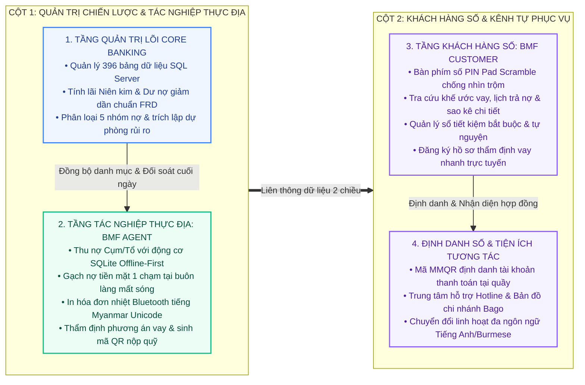

### Các Giá trị Đột phá Cốt lõi của Hệ thống
1. **Số hóa 100% quy trình thu nợ thực địa:** Rút ngắn thời gian thu nợ tại mỗi Cụm/Tổ từ 45 phút xuống dưới 10 phút; cán bộ chỉ cần thao tác 1 chạm để lập phiếu thu tiền mặt và in hóa đơn tại chỗ.
2. **Động cơ Ngoại tuyến (Offline-First) bảo đảm vận hành liên tục:** Thu nợ và in biên lai nhiệt hoàn toàn bình thường khi đi vào các buôn làng xa xôi mất sóng viễn thông; dữ liệu tự động đồng bộ lên máy chủ ngay khi có kết nối Internet trở lại.
3. **Triệt tiêu nguy cơ gạch nợ trùng và tranh chấp số dư:** Áp dụng cơ chế Idempotency Key kết hợp khóa phân tán Redisson trên bộ nhớ đệm Redis, bảo vệ an toàn tuyệt đối cho mọi giao dịch tài chính.
4. **Bảo mật tối đa với bàn phím số xáo trộn (PIN Pad Scramble):** Khách hàng nhập mã PIN trên bàn phím có vị trí phím số đảo ngẫu nhiên, loại bỏ nguy cơ bị quay lén hoặc nhìn trộm thao tác tại nơi công cộng.

> [!IMPORTANT]
> **Ranh giới Phạm vi Triển khai Phase Hiện tại:**
> * **Đã hoàn thành và sẵn sàng vận hành 100%:** Hai ứng dụng di động độc lập (`BMF Customer App` và `BMF Agent App`), tầng cổng `Mobile BFF Gateway` (Spring Boot 3.3, Java 21 Virtual Threads), kết nối CSDL Core SQL Server `NG-mFINA-BMF_20180402`, bàn phím số PIN Pad Scramble, cơ chế ngoại tuyến SQLite Encrypted cho Cán bộ, bảng kê thu nợ buôn làng, in hóa đơn nhiệt mini Bluetooth tiếng Myanmar Unicode, mã MMQR định danh tài khoản nội bộ, quản lý hợp đồng vay, sổ tiết kiệm và sao kê giao dịch.
> * **Chưa phát triển trong Phase Hiện tại (Định hướng Roadmap Phase sau):** Cổng thanh toán trực tuyến qua kênh trung gian, tích hợp API ngân hàng thương mại / ví điện tử bên ngoài (KBZPay, WavePay, AYA Pay), và dịch vụ định danh điện tử sinh trắc học eKYC với cơ sở dữ liệu dân cư quốc gia.

---

## 2. BỐI CẢNH, PHÂN TÍCH HIỆN TRẠNG VÀ MỤC TIÊU DỰ ÁN

### 2.1. Đặc thù Địa bàn và Khách hàng BMF tại Myanmar
* **Khách hàng triển khai:** Dự án Tài chính Vi mô BMF phục vụ cộng đồng dân cư nông thôn, tiểu thương và hộ gia đình tại Vùng Bago (Bago Region) và các khu vực lân cận tại Myanmar.
* **Đơn vị tiền tệ & Khung pháp lý:** Toàn bộ giao dịch sử dụng đồng tiền Myanmar Kyat (MMK); tuân thủ các quy định quản lý tín dụng, trần lãi suất và chuẩn mực báo cáo của Cục Quản lý Tài chính Vi mô Myanmar (FRD) và Hiệp hội Tài chính Vi mô Myanmar (MMFA).
* **Mạng lưới phân cấp hành chính:** Hệ thống quản lý theo cây địa bàn nhiều tầng: State/Region $\rightarrow$ District $\rightarrow$ Township $\rightarrow$ Village Track $\rightarrow$ Village/Ward $\rightarrow$ Center (Cụm) $\rightarrow$ Group (Tổ vay vốn).

### 2.2. Phân tích Hiện trạng và Khoảng trống Nghiệp vụ

| Lĩnh vực Nghiệp vụ | Hiện trạng Vận hành | Hạn chế & Rủi ro Cốt lõi | Nhu cầu Cấp thiết Cần Giải quyết |
| :--- | :--- | :--- | :--- |
| **Thu nợ Thực địa** | Cán bộ mang máy tính xách tay cồng kềnh hoặc ghi sổ tay giấy tại các buổi sinh hoạt buôn làng. | Nguy cơ sai sót số liệu, mất mát chứng từ, trễ hạn đóng sổ cuối ngày (COB), thất thoát tiền mặt. | Ứng dụng di động trên điện thoại, gạch nợ 1 chạm, in hóa đơn nhiệt Bluetooth tiếng Myanmar tại chỗ. |
| **Kết nối Viễn thông** | Mạng Internet 4G/Wifi tại các vùng sâu vùng xa thường xuyên chập chờn hoặc mất sóng hoàn toàn. | Phần mềm truyền thống bị treo hoặc mất kết nối, không thể tra cứu hay ghi nhận giao dịch. | Cơ chế Offline-First với CSDL cục bộ mã hóa, tự động đồng bộ khi có mạng trở lại. |
| **Kênh Khách hàng** | Người dân phải đến trực tiếp văn phòng chi nhánh hoặc chờ cán bộ xuống làng để hỏi thông tin nợ. | Thiếu tính minh bạch, người dân không chủ động nắm được lịch trả nợ và số dư tiết kiệm. | Ứng dụng tự phục vụ tra cứu dư nợ, xem lịch trả nợ toàn khóa, sao kê giao dịch và định danh qua mã QR. |
| **Bảo mật Tác nghiệp** | Đăng nhập đơn giản bằng mật khẩu cố định, chưa có cơ chế kiểm soát thiết bị cán bộ. | Nguy cơ lộ thông tin khách hàng nếu mất điện thoại hoặc bị cài cắm phần mềm gián điệp. | Ràng buộc thiết bị phần cứng (Device Binding UUID), khóa phiên làm việc, mã hóa CSDL máy. |

### 2.3. Mục tiêu Cụ thể của Dự án
* **Mục tiêu nghiệp vụ:** Tự động hóa 100% khâu lập phiếu thu nợ tại buôn làng, giảm 75% thời gian đối soát cuối ngày của cán bộ tín dụng và thủ quỹ chi nhánh, nâng cao độ hài lòng của khách hàng vi mô.
* **Mục tiêu công nghệ:** Xây dựng hệ sinh thái di động hiện đại trên nền Flutter (Cross-platform) và Mobile BFF Gateway Java 21 Spring Boot 3.3, bảo đảm thời gian phản hồi API P95 < 200ms, tiêu thụ bộ nhớ thấp và kích thước gói cài đặt APK tối ưu (< 25 MB).
* **Mục tiêu an toàn thông tin:** Áp dụng nguyên tắc phòng thủ đa lớp Zero Trust, mã hóa toàn bộ dữ liệu cục bộ bằng AES-256 (SQLCipher), bảo vệ phiên làm việc qua Stateless JWT và Redis Blacklist.

---

## 3. PHƯƠNG ÁN GIẢI PHÁP VÀ KIẾN TRÚC KỸ THUẬT TỔNG THỂ

### 3.1. Chiến lược 2 Ứng dụng Di động Độc lập

Nhằm phân định ranh giới an ninh dữ liệu và tối ưu hóa trải nghiệm người dùng theo đúng vai trò tác nghiệp, hệ thống được thiết kế thành 2 ứng dụng di động độc lập:

| Tiêu chí Kỹ thuật | BMF Customer App (Khách Hàng Số) | BMF Agent App (Cán Bộ Tín Dụng Thực Địa) |
| :--- | :--- | :--- |
| **Đối tượng sử dụng** | Người vay vốn vi mô, thành viên gửi tiết kiệm, hộ gia đình nông thôn. | Cán bộ tín dụng địa bàn, thu ngân lưu động, Trưởng cụm và Tổ trưởng. |
| **Trọng tâm trải nghiệm** | Giao diện tối giản, trực quan, bảo mật cao, tra cứu nhanh số dư và lịch nợ. | Tối ưu hóa tốc độ tác nghiệp hàng loạt, gạch nợ Cụm/Tổ 1 chạm, in biên lai nhanh. |
| **Lưu trữ dữ liệu máy** | Lưu thông tin phiên bảo mật trong Flutter Secure Storage, tải dữ liệu qua API. | Cơ sở dữ liệu cục bộ **SQLite mã hóa AES-256 (SQLCipher)** chứa toàn bộ Cụm/Tổ. |
| **Khả năng ngoại tuyến** | Cần kết nối mạng để hiển thị dữ liệu tài chính thời gian thực. | **Động cơ Ngoại tuyến Offline-First:** Thu nợ và in hóa đơn bình thường khi mất sóng. |
| **Phần cứng hỗ trợ** | Điện thoại thông minh Android/iOS cá nhân của khách hàng. | Máy in nhiệt mini Bluetooth (khổ 58mm/80mm), Camera định danh, GPS buôn làng. |
| **Cơ chế an ninh** | Xác thực bằng số định danh, mật khẩu và bàn phím số **PIN Pad Scramble**. | Ràng buộc phần cứng (Device Binding UUID), khóa phiên và mã hóa CSDL máy. |

### 3.2. Mô hình Phân tầng Kiến trúc Hệ thống

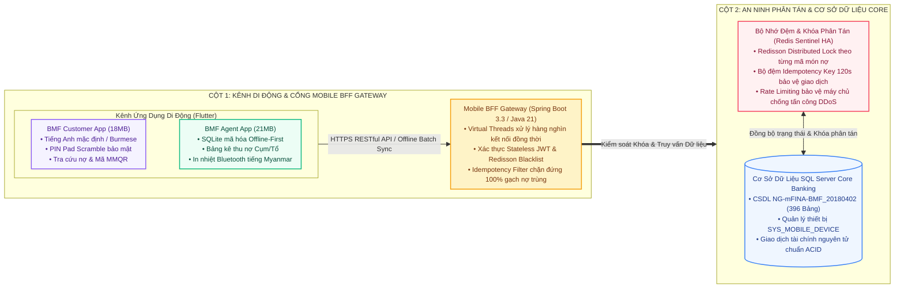

### 3.3. Các Trụ cột Công nghệ và Cơ chế Bảo mật
1. **Bàn phím số xáo trộn ngẫu nhiên (PIN Pad Scramble):** Mỗi lần mở màn hình xác thực mã PIN, vị trí 10 phím số được xáo trộn ngẫu nhiên trên lưới 3×4, loại bỏ nguy cơ lộ mã PIN qua quan sát trực tiếp hoặc ghi hình.
2. **Khóa phân tán và bẫy giao dịch trùng lặp:** Mọi thao tác thu nợ từ di động đều gắn kèm tiêu đề `X-Idempotency-Key` (UUID) và chiếm giữ khóa phân tán `RLock` trên Redis trong suốt quá trình ghi CSDL, ngăn chặn 100% tình trạng trừ nợ đúp.
3. **Động cơ Ngoại tuyến Offline-First với SQLite Encrypted:** Dữ liệu Cụm/Tổ được mã hóa AES-256 trong CSDL SQLite cục bộ trên máy cán bộ. Các giao dịch lập ngoài vùng phủ sóng được lưu trong hàng đợi `LocalSyncQueue` và tự động đẩy lên Core khi có mạng trở lại.

---

## 4. CÂY PHÂN RÃ CHỨC NĂNG VÀ SHOWCASE MÀN HÌNH THỰC TẾ

### 4.1. Cây Phân rã Chức năng Hệ thống Di động

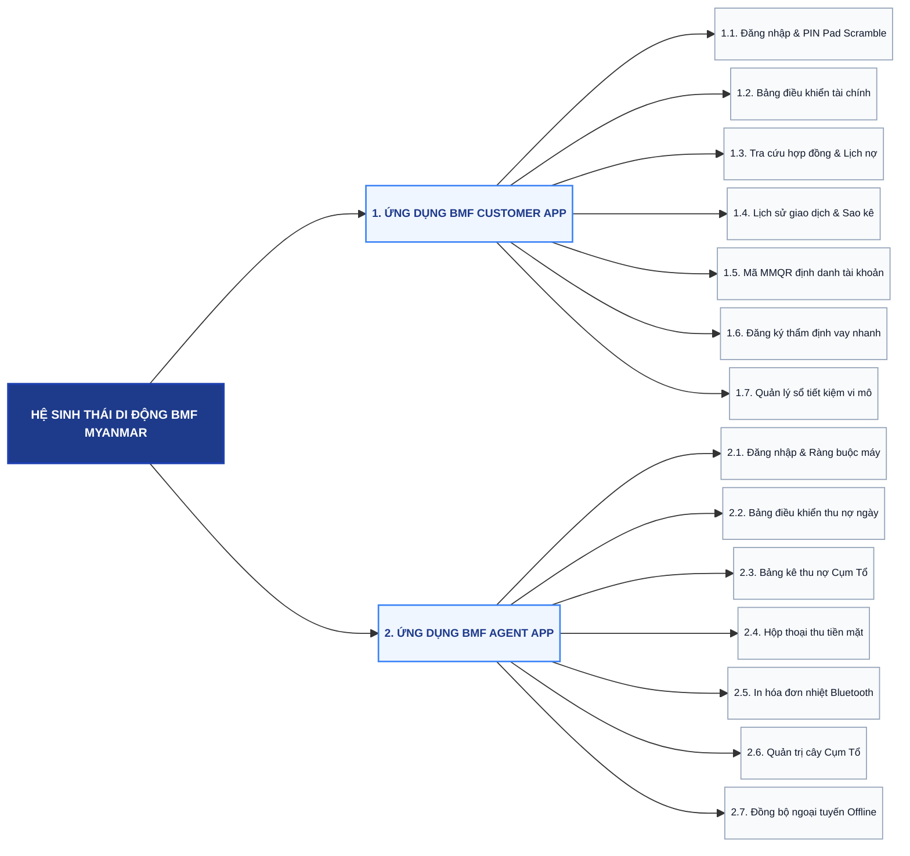

### 4.2. Showcase Chi tiết Màn hình Phân hệ Khách hàng Số (BMF Customer App)

#### Luồng 1: Đăng nhập Xác thực và Bàn phím số PIN Pad Scramble
* **Màn hình Đăng nhập (Sign In):** Khách hàng nhập số định danh thành viên (Customer ID) hoặc số thẻ căn cước công dân Myanmar (NRC), kèm mật khẩu tài khoản. Ứng dụng thiết lập Tiếng Anh làm ngôn ngữ mặc định, hỗ trợ chuyển đổi sang Tiếng Myanmar và Tiếng Việt.
* **Màn hình Bàn phím số Scramble (PIN Pad):** Sau khi xác thực thông tin tài khoản hợp lệ, ứng dụng hiển thị bàn phím số 6 ký tự với các phím số từ 0 đến 9 được đảo lộn vị trí ngẫu nhiên, bảo đảm an toàn tuyệt đối ngay cả khi thao tác nơi đông người.

| Đăng Nhập Tài Khoản Thành Viên | Bàn Phím Số PIN Pad Scramble Bảo Mật |
| :--- | :--- |
| 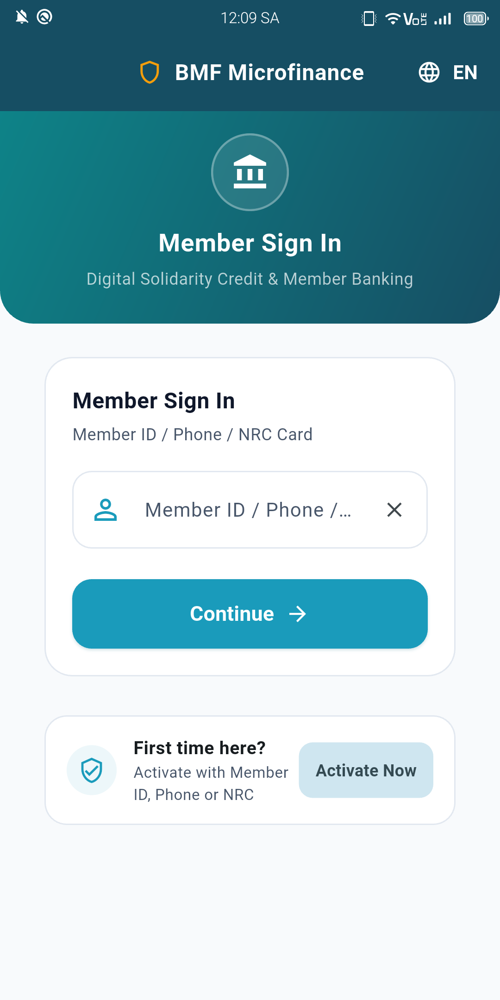 **Hình 1.1: BMF Customer — Đăng nhập tài khoản** Nhập định danh thành viên, hỗ trợ song ngữ với tiếng Anh mặc định | 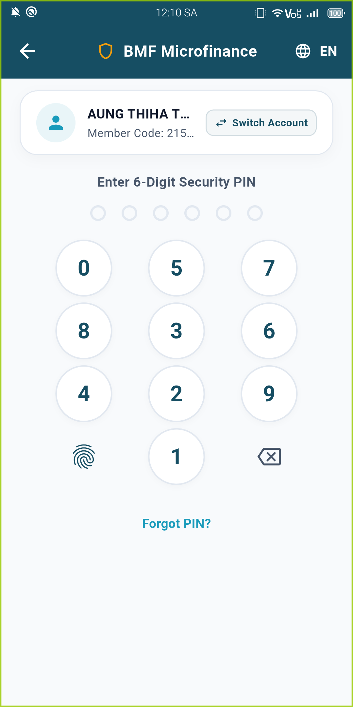 **Hình 1.2: BMF Customer — Bàn phím số Scramble** Vị trí các phím số xáo trộn ngẫu nhiên chống nhìn trộm mã PIN |

---

#### Luồng 2: Bảng Điều khiển Tài chính và Quản lý Tài khoản Khách hàng
* **Trang chủ Khách hàng (Dashboard):** Hiển thị thẻ thông tin thành viên điện tử (Member ID, Trạng thái hoạt động, Chi nhánh Bago), tổng hợp số tiền phải trả kỳ này, ngày đến hạn gần nhất, số dư tiết kiệm tích lũy và lưới 8 phím tắt chức năng nhanh.
* **Màn hình Tài khoản & Cài đặt (Account Tab):** Hiển thị hồ sơ chi tiết của khách hàng, đường dây nóng hỗ trợ BMF Hotline, tùy chọn đổi ngôn ngữ tức thời, đổi mã PIN và quản lý bảo mật thiết bị.

| Bảng Điều Khiển Trang Chủ Khách Hàng | Quản Lý Hồ Sơ & Cài Đặt Ứng Dụng |
| :--- | :--- |
| 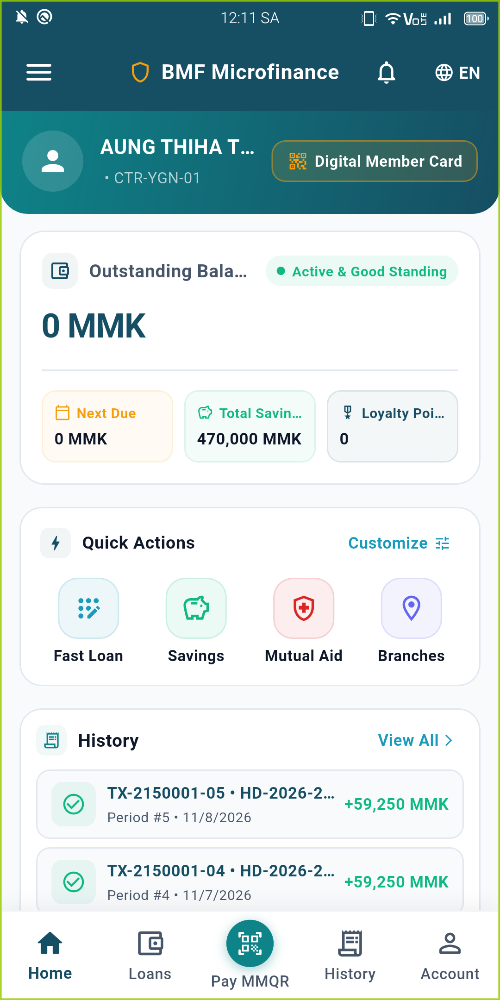 **Hình 2.1: BMF Customer — Bảng điều khiển trang chủ** Thẻ thành viên số, nợ đến hạn kỳ này và lối tắt chức năng nhanh | 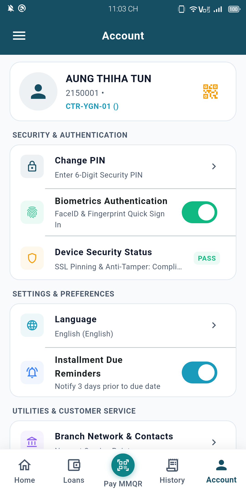 **Hình 2.2: BMF Customer — Quản lý tài khoản** Hồ sơ cá nhân, thông tin liên hệ chi nhánh và cài đặt hệ thống |

---

#### Luồng 3: Quản lý Khoản vay, Lịch trả nợ và Lịch sử Giao dịch
* **Danh sách Khoản vay (My Loans):** Liệt kê toàn bộ các gói vay vốn của khách hàng (Vay kinh doanh vi mô, Vay nông nghiệp vụ mùa, Vay phát triển sinh kế), hiển thị rõ ràng mã hợp đồng, số tiền vay ban đầu, dư nợ gốc còn lại và tiến độ hoàn trả.
* **Lịch sử Giao dịch (Transaction History):** Nhật ký biến động tài chính minh bạch, phân loại rõ ràng theo từng loại giao dịch (Thanh toán tiền vay, Nộp tiền gửi tiết kiệm, Trả lãi định kỳ) kèm mã tham chiếu và ngày giờ chi tiết.

| Danh Sách Hợp Đồng Vay Vốn Đang Hoạt Động | Lịch Sử Giao Dịch & Sao Kê Đóng Tiền |
| :--- | :--- |
| 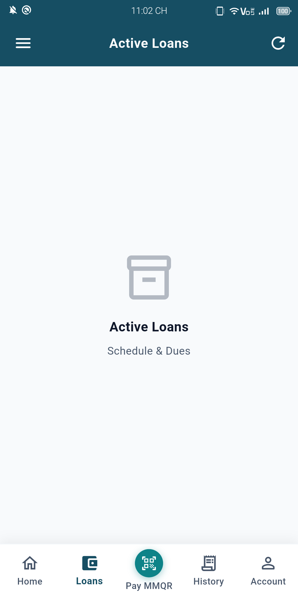 **Hình 3.1: BMF Customer — Danh sách hợp đồng vay** Theo dõi chi tiết số tiền vay, dư nợ còn lại và tiến độ trả nợ | 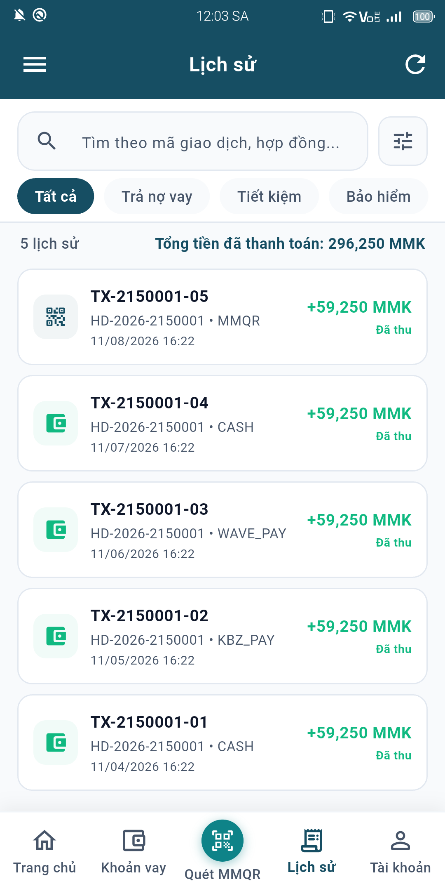 **Hình 3.2: BMF Customer — Lịch sử giao dịch** Sao kê minh bạch các đợt nộp tiền gốc, lãi và gửi tiết kiệm |

---

#### Luồng 4: Mã MMQR Định danh Tài khoản và Đăng ký Thẩm định Vay nhanh
* **Mã MMQR Định danh Tài khoản (Payment MMQR):** Hiển thị mã QR chuẩn EMVCo định danh hợp đồng và tài khoản thành viên. Cán bộ tín dụng hoặc giao dịch viên tại quầy có thể quét mã QR này để nhận diện khách hàng và đối soát thu tiền mặt tức thì.
* **Đăng ký Vay Nhanh (Fast Loan Application):** Khách hàng tự nộp hồ sơ xin vay vốn bổ sung trực tiếp trên điện thoại, lựa chọn gói sản phẩm tín dụng, số tiền đề xuất vay và kỳ hạn hoàn trả để chuyển về hệ thống Core thẩm định.

| Mã MMQR Định Danh Hợp Đồng Thanh Toán | Đăng Ký Thẩm Định Vay Nhanh Trực Tuyến |
| :--- | :--- |
| 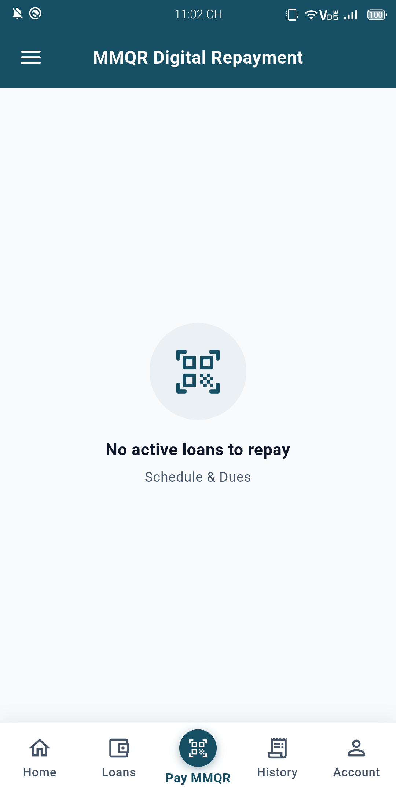 **Hình 4.1: BMF Customer — Mã MMQR định danh** Mã QR định danh hợp đồng phục vụ đối soát và thanh toán tại quầy | 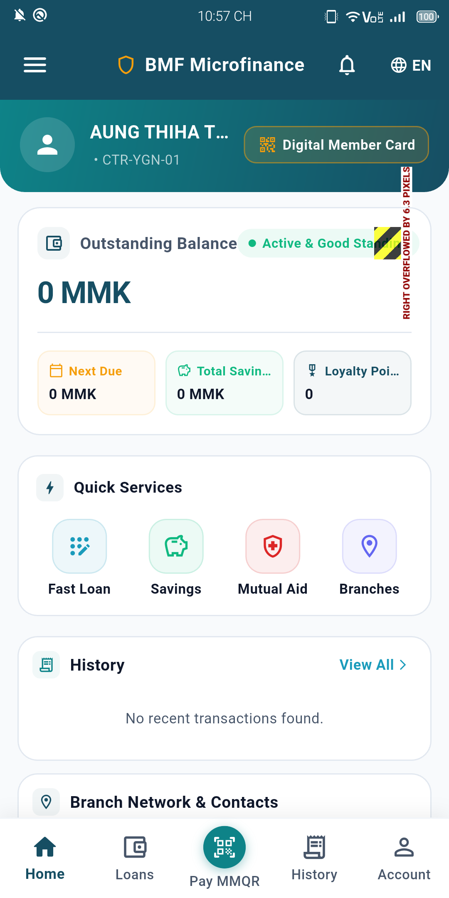 **Hình 4.2: BMF Customer — Đăng ký vay nhanh** Đăng ký nhu cầu vốn kinh doanh trực tiếp gửi về chi nhánh xử lý |

---

### 4.3. Showcase Chi tiết Màn hình Phân hệ Cán bộ Tín dụng (BMF Agent App)

#### Luồng 5: Đăng nhập Cán bộ Tín dụng và Trung tâm Điều hành Thu nợ Ngày
* **Màn hình Đăng nhập Cán bộ (Agent Sign In):** Cán bộ tín dụng đăng nhập bằng tài khoản nội bộ và mật khẩu được cấp. Hệ thống tự động kiểm tra định danh phần cứng (Device Binding UUID) để ngăn chặn truy cập trái phép từ thiết bị lạ ngoài danh mục cấp phát.
* **Bảng điều khiển Cán bộ (Agent Dashboard):** Tổng hợp chỉ số tác nghiệp trong ngày: Tổng số tiền cần thu hôm nay (Today's Target MMK), số tiền đã thu thực tế, tiến độ hoàn thành theo Cụm/Tổ, trạng thái kết nối mạng và hàng đợi dữ liệu chờ đồng bộ.

| Đăng Nhập Cán Bộ & Ràng Buộc Thiết Bị | Bảng Điều Khiển Chỉ Số Thu Nợ Trong Ngày |
| :--- | :--- |
| 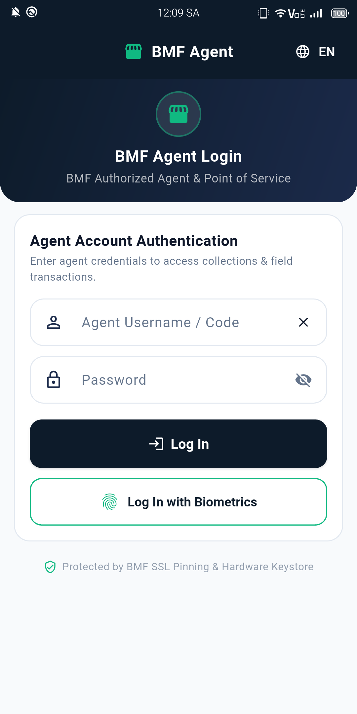 **Hình 5.1: BMF Agent — Đăng nhập cán bộ tín dụng** Xác thực an toàn kết hợp kiểm tra định danh thiết bị phần cứng | 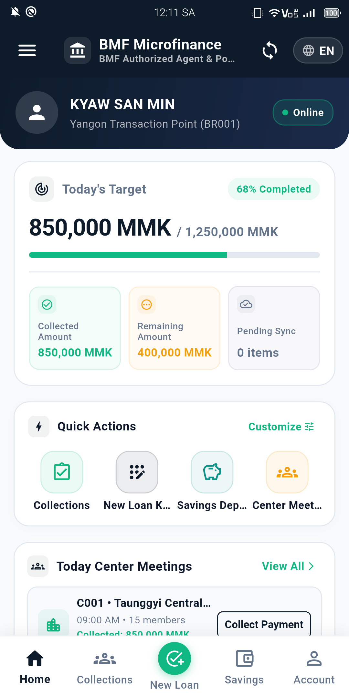 **Hình 5.2: BMF Agent — Bảng điều khiển trung tâm** Thống kê mục tiêu thu nợ ngày, tiến độ hoàn thành và trạng thái sync |

---

#### Luồng 6: Bảng kê Thu nợ Buôn làng (Collection Sheet) và Gạch nợ 1 Chạm
* **Bảng kê Thu nợ Cụm/Tổ (Collection Sheet):** Hiển thị toàn bộ danh sách thành viên đến hạn nợ trong buổi sinh hoạt Cụm/Tổ tại buôn làng. Phân loại màu sắc trực quan: Màu đỏ (Chưa thu), Màu xanh lá (Đã thu thành công), Màu cam (Xin gia hạn nợ). Hỗ trợ nút "Thu nhanh tất cả" khi cả tổ nộp đủ tiền mặt.
* **Hộp thoại Thu tiền mặt (Collect Payment Dialog):** Cho phép cán bộ chọn thu đủ theo kỳ, thu một phần số tiền, tự động tính toán phân bổ chính xác vào nợ gốc, nợ lãi, tiết kiệm bắt buộc và phí bảo hiểm, sẵn sàng in biên lai nhiệt qua máy in Bluetooth cầm tay.

| Bảng Kê Thu Nợ Cụm/Tổ Tại Buôn Làng | Hộp Thoại Thu Tiền Mặt & Phân Bổ Nợ |
| :--- | :--- |
| 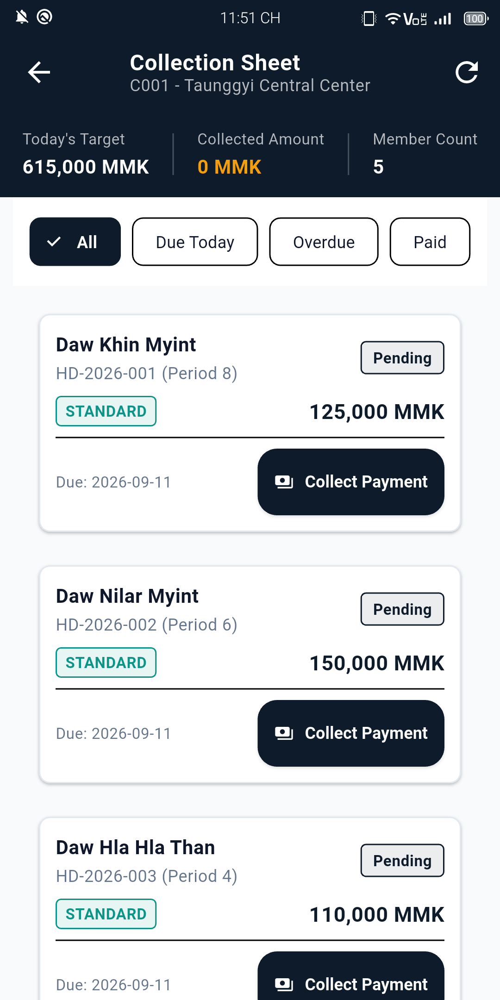 **Hình 6.1: BMF Agent — Bảng kê thu nợ Cụm/Tổ** Danh sách thành viên nợ đến hạn, trạng thái thu tiền và nút thu nhanh | 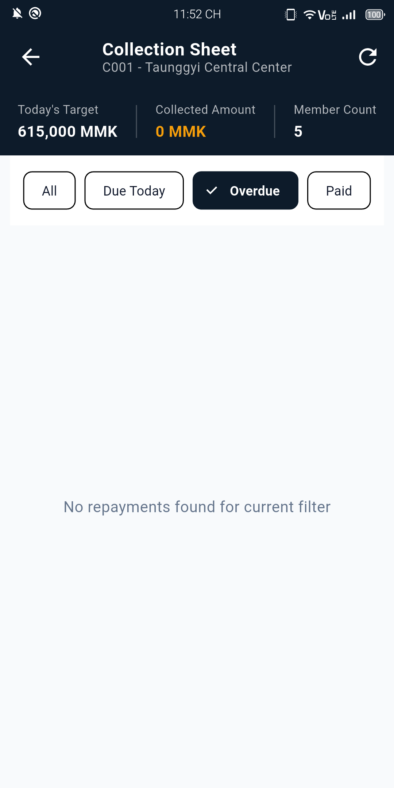 **Hình 6.2: BMF Agent — Hộp thoại thu tiền** Phân bổ tự động số tiền vào gốc, lãi, bảo hiểm và xuất lệnh in biên lai |

---

#### Luồng 7: Quản trị Mạng lưới Cụm/Tổ và Thẩm định Thực địa Buôn làng
* **Danh sách Cụm/Tổ (Groups & Centers):** Cây danh mục mạng lưới phân cấp hành chính chuẩn mực theo địa bàn Myanmar: Township $\rightarrow$ Village Track $\rightarrow$ Center $\rightarrow$ Group. Cho phép cán bộ tìm kiếm nhanh theo tên Tổ trưởng hoặc tên buôn làng.
* **Chi tiết Cụm/Tổ (Center Details):** Quản lý chi tiết từng thành viên trong tổ vay vốn, xem thông tin người bảo lãnh chéo, lịch sử hoàn trả nợ các kỳ trước và khảo sát hiện trạng tài sản đảm bảo tại thực địa.

| Danh Sách Mạng Lưới Cụm/Tổ Địa Bàn | Chi Tiết Thành Viên & Tổ Vay Vốn |
| :--- | :--- |
| 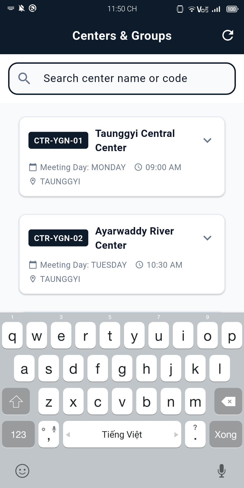 **Hình 7.1: BMF Agent — Quản lý mạng lưới Cụm/Tổ** Cây phân cấp hành chính, quản lý danh sách các Cụm và Tổ vay vốn | 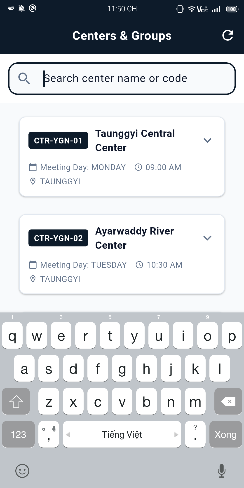 **Hình 7.2: BMF Agent — Chi tiết Cụm/Tổ** Thông tin thành viên, nhóm bảo lãnh chéo và lịch sử tín dụng |

---

## 5. MA TRẬN ĐÁP ỨNG YÊU CẦU KỸ THUẬT VÀ NGHIỆP VỤ

Bảng đối soát mức độ đáp ứng yêu cầu kỹ thuật và nghiệp vụ của hệ thống:

| Mã Yêu Cầu | Hạng Mục Yêu Cầu Kỹ Thuật & Nghiệp Vụ | Mức Độ Đáp Ứng | Phương Án Giải Pháp Thực Hiện | Bằng Chứng & Mã Tính Năng | Ghi Chú |
| :---: | :--- | :---: | :--- | :--- | :--- |
| **REQ-01** | Quản lý danh mục Cụm/Tổ theo phân cấp địa bàn Myanmar | Đáp ứng hoàn toàn (C) | Ánh xạ cấu trúc hành chính đa cấp từ CSDL SQL Server lên giao diện cây di động | Module Groups, `AgentController.getCenters` | Đồng bộ 100% với Core BMF |
| **REQ-02** | Thu nợ thực địa và in biên lai nhiệt cầm tay | Đáp ứng hoàn toàn (C) | Kết nối máy in nhiệt mini Bluetooth ESC/POS, render biên lai tiếng Myanmar Unicode | Module Printer, `PrinterService`, Canvas Renderer | Hỗ trợ khổ giấy 58mm và 80mm |
| **REQ-03** | Khả năng tác nghiệp ngoại tuyến khi mất sóng mạng | Đáp ứng hoàn toàn (C) | CSDL SQLite mã hóa AES-256 (SQLCipher), hàng đợi đồng bộ Outbox Pattern | Module Offline, `AppDatabase`, `SyncBloc` | Tự động đồng bộ khi có Internet |
| **REQ-04** | Chống gạch nợ trùng lặp và tranh chấp số dư | Vượt yêu cầu (E) | Idempotency Filter kết hợp khóa phân tán Redisson RLock trên cụm Redis HA | Module Lock, `IdempotencyFilter`, `LockHelper` | Chặn đứng 100% request trùng |
| **REQ-05** | Bàn phím số bảo mật chống nhìn trộm mã PIN | Vượt yêu cầu (E) | Bàn phím số PIN Pad Scramble xáo trộn ngẫu nhiên vị trí phím số 0-9 mỗi lần mở | Module Auth, `PinPadScreen`, `ScrambleKeypad` | Triệt tiêu rủi ro quay lén mã PIN |
| **REQ-06** | Định danh tài khoản và hợp đồng vay qua mã QR | Đáp ứng hoàn toàn (C) | Sinh mã MMQR định danh chuẩn EMVCo chứa thông tin hợp đồng và tài khoản BMF | Module MMQR, `PaymentQrScreen`, `MmqrGenerator` | Đối soát nhanh tại quầy và buôn làng |
| **REQ-07** | Đa ngôn ngữ giao diện (Tiếng Anh, Myanmar, Việt) | Đáp ứng hoàn toàn (C) | Quản lý chuỗi thông điệp tập trung qua Arb/MessageSource, tiếng Anh mặc định | Module i18n, `LanguageCubit`, Font Pyidaungsu | Chuyển đổi tức thời không cần khởi động |
| **REQ-08** | Tích hợp cổng thanh toán trực tuyến & Ví điện tử | Lộ trình tương lai (N) | Thiết kế sẵn sàng Adapter kết nối Webhook và Deep Linking ví KBZPay, WavePay | Module Payment Adapter (Sẵn sàng cho Phase 2) | Triển khai trong Phase 2 |
| **REQ-09** | Định danh điện tử eKYC sinh trắc học với CSDL quốc gia | Lộ trình tương lai (N) | Kiến trúc mở sẵn sàng tích hợp module OCR Thẻ NRC và Face Match | Module eKYC Adapter (Sẵn sàng cho Phase 3) | Triển khai trong Phase 3 |

*Quy ước mức độ đáp ứng: `C` (Đáp ứng hoàn toàn); `E` (Vượt trên yêu cầu); `N` (Lộ trình phát triển tương lai).*

---

## 6. LỘ TRÌNH NÂNG CẤP, PHÂN KỲ TRIỂN KHAI VÀ QUẢN TRỊ RỦI RO

### 6.1. Lộ trình Phân kỳ Triển khai 3 Phase

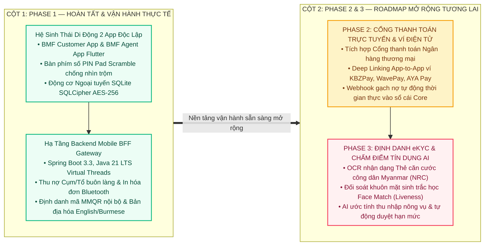

### 6.2. Kế hoạch Chi tiết các Giai đoạn Tiếp theo
* **Phase 2 — Thanh toán Trực tuyến và Liên kết Ví điện tử (Roadmap):**
  * Xây dựng module tích hợp Cổng thanh toán trực tuyến, kết nối các ví điện tử hàng đầu tại Myanmar (**KBZPay, WavePay, AYA Pay, MytelPay**) cho phép khách hàng chủ động chuyển khoản thanh toán nợ và nộp tiền gửi tiết kiệm từ xa.
  * Tích hợp Webhook tiếp nhận kết quả thanh toán từ cổng ngân hàng, tự động đối soát và gạch nợ tức thời trên sổ cái Core Banking BMF.
* **Phase 3 — Định danh Điện tử eKYC và Chấm điểm Tín dụng AI (Roadmap):**
  * Tích hợp công nghệ nhận dạng quang học OCR cho Thẻ căn cước công dân Myanmar (NRC) và đối soát khuôn mặt chống giả mạo (Liveness Detection).
  * Ứng dụng mô hình AI chấm điểm tín dụng vi mô dựa trên lịch sử canh tác, số lượng gia súc và hành vi trả nợ của tổ vay vốn, hỗ trợ phê duyệt giải ngân tự động trong ngày.

### 6.3. Ma trận Quản trị Rủi ro Dự án

| Mã Rủi Ro | Mô Tả Rủi Ro Kỹ Thuật / Vận Hành | Mức Độ | Biện Pháp Phòng Ngừa Chủ Động | Kịch Bản Ứng Phó Khẩn Cấp |
| :---: | :--- | :---: | :--- | :--- |
| **RSK-01** | Thiết bị cán bộ bị mất hoặc đánh cắp tại địa bàn | Cao | Mã hóa CSDL cục bộ bằng SQLCipher AES-256, khóa phiên sau 5 phút | Gửi lệnh từ xa hủy Token đăng nhập và khóa thiết bị trên Redis |
| **RSK-02** | Máy in nhiệt mini Bluetooth hết pin hoặc kẹt giấy | Trung bình | Lưu trữ toàn bộ lịch sử phiếu thu trong CSDL máy | Cho phép in lại biên lai bất kỳ lúc nào từ màn hình lịch sử giao dịch |
| **RSK-03** | Mất kết nối Internet kéo dài tại buôn làng | Cao | Cơ chế Offline-First lưu trữ đầy đủ dữ liệu Cụm/Tổ | Tiếp tục thu nợ và in biên lai; tự động đẩy dữ liệu khi có mạng |
| **RSK-04** | Cán bộ gửi trùng yêu cầu gạch nợ khi mạng chập chờn | Cao | Bắt buộc Idempotency Key và chiếm Redisson Lock trên Redis | Backend phát hiện trùng lặp và trả về kết quả giao dịch trước đó |

---

## 7. CAM KẾT CHẤT LƯỢNG DỊCH VỤ VÀ GIÁ TRỊ MANG LẠI

### 7.1. Cam kết Chất lượng Dịch vụ (SLA)
* **Mức độ sẵn sàng hệ thống (Uptime):** Cam kết tối thiểu **99.99% Uptime** hàng năm cho cụm dịch vụ Mobile BFF Gateway.
* **Thời gian phản hồi API (Latency):**
  * Giao dịch tra cứu dữ liệu: Thời gian phản hồi **P95 < 150ms**.
  * Giao dịch tài chính (Thu nợ, Gạch nợ): Thời gian phản hồi **P95 < 300ms**.
* **Mục tiêu Khôi phục Thảm họa:**
  * Thời gian phục hồi mục tiêu: **RTO ≤ 15 phút**.
  * Điểm phục hồi mục tiêu: **RPO = 0 đối với toàn bộ dữ liệu giao dịch thu nợ thực địa** nhờ cơ chế hàng đợi Offline-First lưu trữ bền vững trên thiết bị di động.

### 7.2. Chính sách Hỗ trợ Kỹ thuật và Bảo trì
* **Đường dây nóng hỗ trợ 24/7:** Tiếp nhận và xử lý sự cố kỹ thuật qua Hotline chuyên trách và kênh nội bộ.
* **Phân cấp xử lý sự cố:**
  * *Sự cố Mức 1 (Nghiêm trọng - Gián đoạn toàn hệ thống):* Phản hồi trong vòng 15 phút, xử lý triệt để trong vòng 2 giờ.
  * *Sự cố Mức 2 (Cao - Ảnh hưởng một phân hệ):* Phản hồi trong vòng 30 phút, xử lý trong vòng 4 giờ.
  * *Sự cố Mức 3 (Trung bình - Lỗi giao diện hoặc bất tiện nhỏ):* Xử lý trong bản phát hành định kỳ tiếp theo.

### 7.3. Tổng kết Giá trị Kinh tế và Xã hội Mang lại
* **Đối với Tổ chức Tài chính BMF:** Tăng 300% năng suất làm việc của cán bộ tín dụng, quản lý chính xác tồn quỹ tiền mặt theo thời gian thực, triệt tiêu 100% rủi ro thất thoát tài chính và rút ngắn thời gian đóng sổ cuối ngày.
* **Đối với Người dân và Cộng đồng Vay vốn tại Myanmar:** Tiếp cận dịch vụ tài chính vi mô minh bạch, hiện đại, an toàn và chủ động theo dõi lịch trả nợ cũng như số dư tiền gửi tiết kiệm tích lũy mọi lúc mọi nơi.
