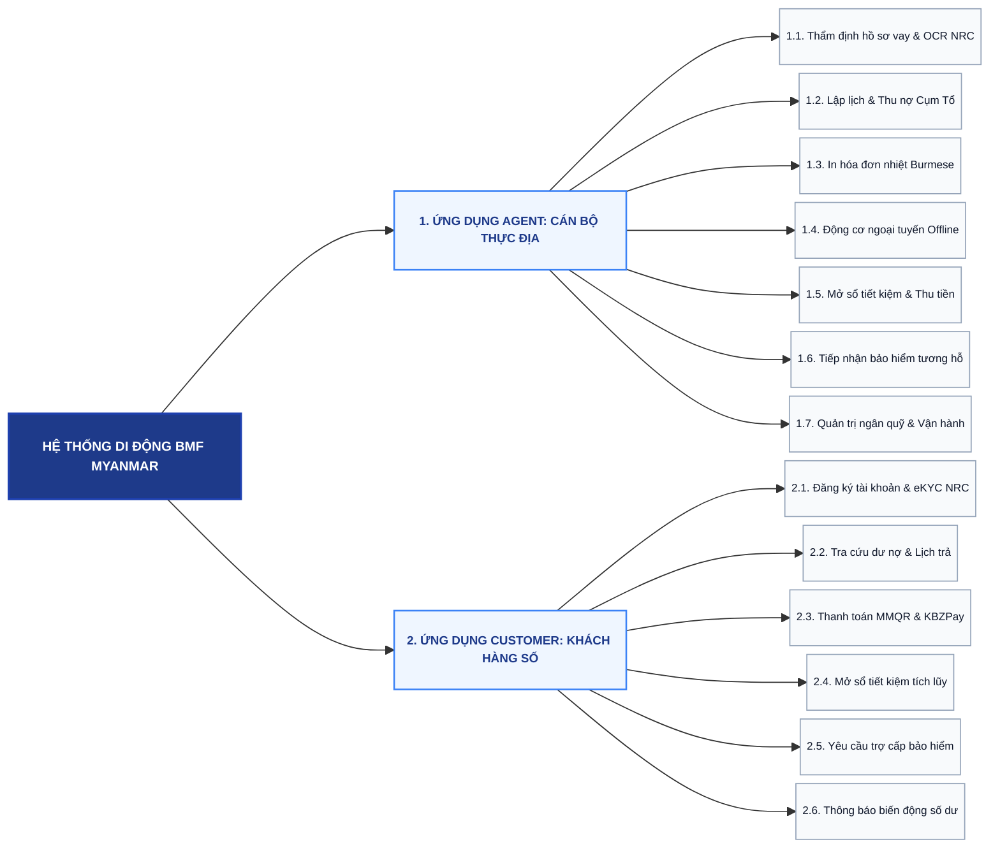
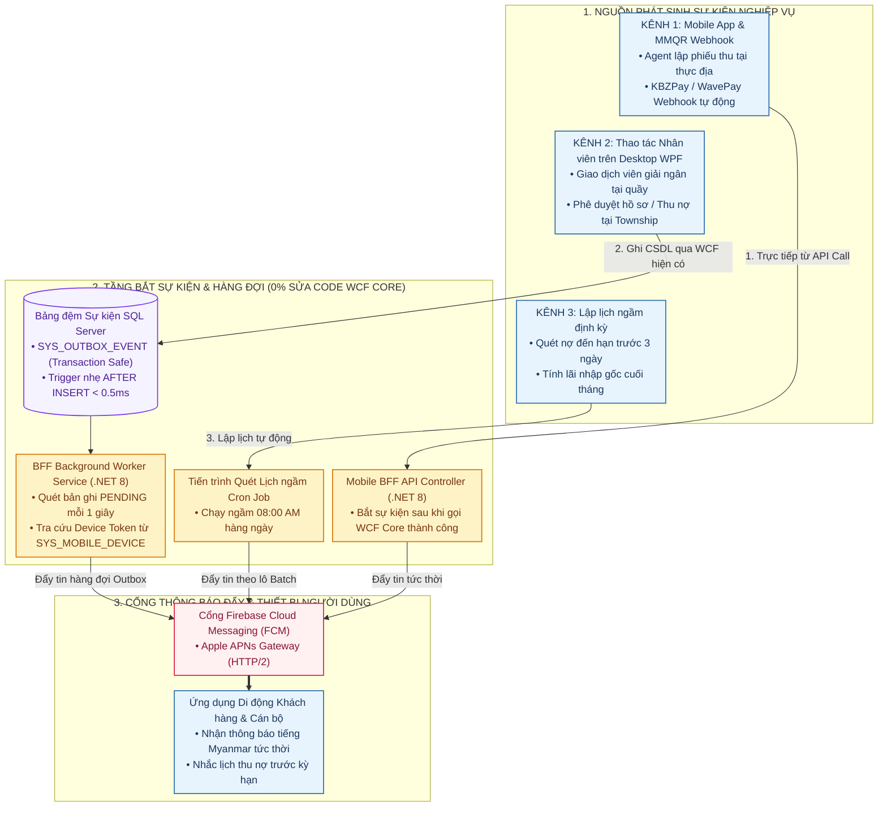
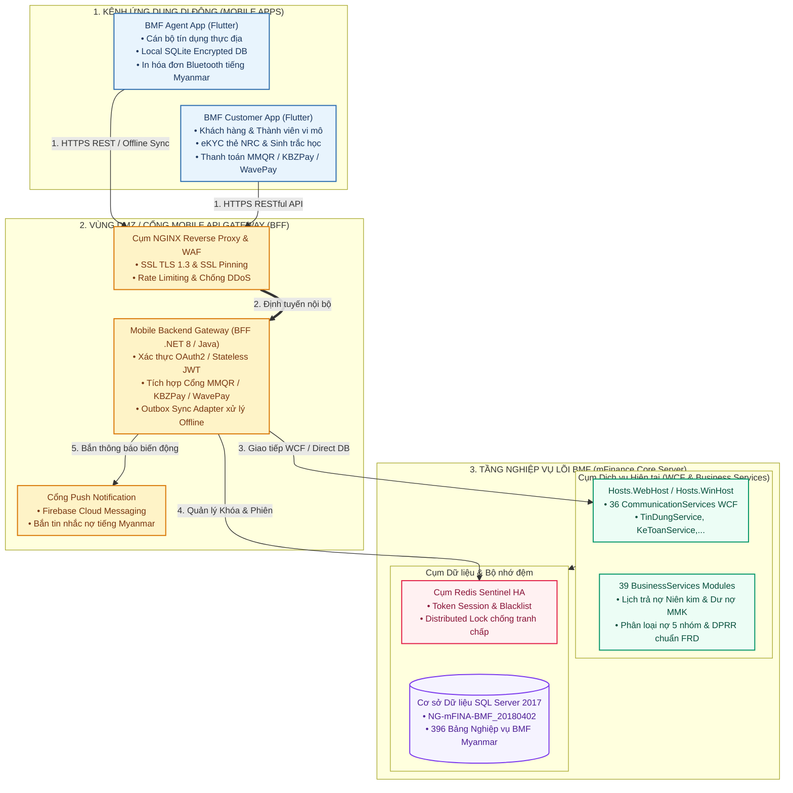
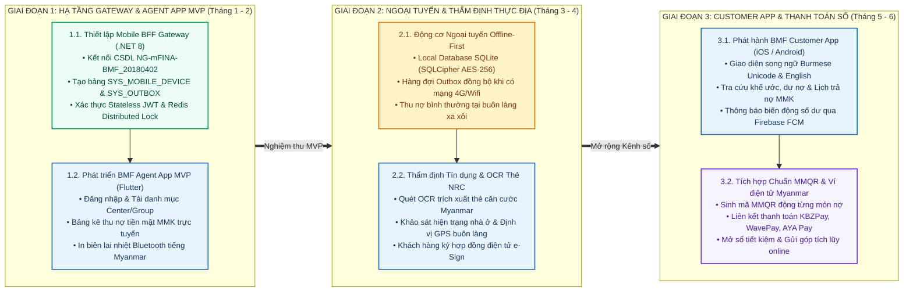

# ĐỀ XUẤT GIẢI PHÁP PHÂN HỆ MOBILE BMF MYANMAR

---

## 1. BỐI CẢNH VÀ TÍNH CẤP THIẾT TẠI MYANMAR

### 1.1. Đặc thù địa bàn và khách hàng BMF
* **Khách hàng triển khai:** Dự án Tài chính Vi mô **BMF (Bago Microfinance)**, phục vụ cộng đồng dân cư nông thôn, tiểu thương và hộ gia đình tại vùng Bago Region cùng các bang/vùng lân cận tại Myanmar.
* **Đơn vị tiền tệ & Quy định pháp lý:** Vận hành hoàn toàn bằng đồng **MMK (Myanmar Kyat)**; tuân thủ các quy chuẩn quản lý tín dụng, trần lãi suất và báo cáo của **Cục Quản lý Tài chính Vi mô Myanmar (FRD)** và **Hiệp hội Tài chính Vi mô Myanmar (MMFA)**.
* **Đặc thù địa bàn phân cấp:** Mạng lưới quản lý theo đơn vị hành chính Myanmar: **State/Region → District → Township → Village Track → Village/Ward → Center (Cụm) → Group (Tổ vay vốn)**.
* **Hạn chế của phần mềm Desktop WPF hiện tại:** Hệ thống Desktop WPF vận hành tốt tại các văn phòng chi nhánh/Township, nhưng khi Cán bộ tín dụng đi xuống các buôn làng xa xôi, việc mang máy tính cồng kềnh hoặc ghi chép sổ sách giấy làm tăng rủi ro sai lệch số liệu và trễ hạn đóng sổ cuối ngày COB.
* **Thách thức về hạ tầng viễn thông:** Mạng Internet 4G/Wifi tại các vùng nông thôn Myanmar thường xuyên không ổn định hoặc mất kết nối; do đó, **khả năng hoạt động ngoại tuyến Offline-First là yêu cầu sống còn** đối với ứng dụng di động thực địa.

### 1.2. Định hướng phát triển cánh tay nối dài của Core BMF
1. **Kế thừa toàn diện nghiệp vụ Core BMF:** Ứng dụng di động đóng vai trò là kênh tác nghiệp thực địa cho cán bộ và cổng tự phục vụ cho khách hàng, thừa hưởng 100% quy tắc tài chính, thuật toán tính lãi và phân loại nợ từ CSDL `NG-mFINA-BMF_20180402`.
2. **Bản địa hóa 100% cho thị trường Myanmar:**
   * Tích hợp công nghệ nhận dạng quang học OCR cho **Thẻ căn cước công dân Myanmar (NRC)**.
   * Hỗ trợ thanh toán số qua chuẩn **MMQR** và các ví điện tử phổ biến tại Myanmar (**KBZPay, WavePay, AYA Pay, MytelPay**).
   * Giao diện song ngữ **Tiếng Myanmar (Unicode)** và **Tiếng Anh**.
   * Máy in nhiệt Bluetooth cầm tay in hóa đơn bằng tiếng Myanmar trực tiếp tại các buôn làng.

---

## 2. CHIẾN LƯỢC TÁCH 2 ỨNG DỤNG ĐỘC LẬP

### 2.1. So sánh phương án kiến trúc

| Tiêu chí Đánh giá | Phương án 1: Làm chung 1 App (All-in-One) | Phương án 2: Tách riêng 2 App độc lập (Khuyến nghị) |
| :--- | :--- | :--- |
| **Đối tượng người dùng** | Gộp chung Cán bộ tín dụng, Thu ngân và Người dân địa phương. | **Phân định rõ ràng:** BMF Agent App (Cán bộ nội bộ) và BMF Customer App (Khách hàng đại chúng). |
| **Trải nghiệm người dùng** | Phức tạp, dễ gây nhầm lẫn; phải chuyển đổi vai trò, giao diện cồng kềnh đối với người dân nông thôn Myanmar. | **Tối ưu hóa chuyên biệt:** Customer App cực kỳ đơn giản, trực quan bằng tiếng Myanmar; Agent App chuyên sâu, tối ưu thao tác nhanh cho thu nợ Cụm/Tổ hàng loạt. |
| **Bảo mật và An toàn thông tin** | Nguy cơ cao về leo thang đặc quyền và lộ dữ liệu nhạy cảm nếu có lỗ hổng trên ứng dụng. | **Áp dụng Zero Trust tuyệt đối:** Tách biệt vùng an ninh. Agent App bắt buộc ràng buộc thiết bị (Device Binding), Customer App xác thực sinh trắc học. |
| **Cơ chế Lưu trữ Ngoại tuyến** | Khó quản lý phân vùng dữ liệu cache; tăng dung lượng cài đặt app không cần thiết cho khách hàng. | **Tối ưu bộ nhớ:** Agent App tích hợp Local Database (SQLite mã hóa AES-256) chứa dữ liệu toàn bộ Cụm/Tổ; Customer App giữ kích thước gọn nhẹ (< 30 MB). |
| **Vòng đời Phát hành & Nâng cấp** | Rủi ro liên đới: Cập nhật tính năng khách hàng có thể gây lỗi hoặc gián đoạn hoạt động thu nợ của cán bộ tại thực địa. | **Độc lập hoàn toàn:** Nâng cấp, vá lỗi và duyệt app trên Apple App Store / Google Play không ảnh hưởng chéo lẫn nhau. |

> [!IMPORTANT]
> **Quyết định Chiến lược:** **BẮT BUỘC TÁCH THÀNH 2 ỨNG DỤNG DI ĐỘNG ĐỘC LẬP**:
> 1. **`BMF Agent` (Ứng dụng Thực địa Cán bộ Tín dụng):** Phục vụ Cán bộ tín dụng, Thu ngân lưu động, Trưởng cụm (Center Leader) và Tổ trưởng vay vốn (Group Leader).
> 2. **`BMF Member` / `BMF Customer` (Ứng dụng Khách hàng & Thành viên):** Phục vụ Người vay vốn vi mô, Thành viên gửi tiết kiệm và Khách hàng cá nhân tại Myanmar.

---

## 3. MA TRẬN KẾ THỪA VÀ TIỆN ÍCH MỞ RỘNG

Hệ thống Mobile App kế thừa các phân hệ nghiệp vụ trên Desktop App và bổ sung các tiện ích tối ưu cho thị trường Myanmar:

| STT | Phân hệ Desktop Core | Nghiệp vụ Lõi Kế thừa trên Mobile | Tiện ích Mở rộng Bản địa hóa Myanmar | Ứng dụng Áp dụng |
| :---: | :--- | :--- | :--- | :---: |
| **1** | **Khách hàng & Cụm/Tổ (KHTV)** | • Quản lý hồ sơ thành viên, sổ gia đình.<br/>• Cây mạng lưới State/Region → Township → Village → Center → Group.<br/>• Chấm điểm hộ nghèo đa chiều theo hiện trạng. | • **Camera OCR thẻ NRC:** Tự động quét thẻ căn cước Myanmar (`[Region]/[Township](N)[Number]`).<br/>• **Chụp ảnh thực địa:** Lưu ảnh chân dung, ảnh hiện trạng nhà.<br/>• **Bản đồ GPS:** Định vị buôn làng và tuyến di chuyển. | **BMF Agent** |
| **2** | **Tín dụng & Thẩm định (TDVM)** | • Tiếp nhận đơn xin vay, thẩm định phương án.<br/>• Hợp đồng tín dụng, khế ước nhận nợ (MMK).<br/>• Lập lịch trả nợ (Niên kim, Dư nợ giảm dần).<br/>• Phân loại 5 nhóm nợ theo chuẩn FRD Myanmar. | • **Chụp ảnh tài sản đảm bảo:** Khảo sát đất đai, gia súc, nông sản.<br/>• **Ký chữ ký điện tử:** Ký trực tiếp trên màn hình cảm ứng.<br/>• **Máy tính trả nợ MMK:** Ước tính lịch trả gốc/lãi tức thì. | **BMF Agent & Customer** |
| **3** | **Thu nợ Thực địa (TDVM/NQUY)** | • Bảng kê thu nợ theo Cụm/Tổ định kỳ.<br/>• Phân bổ số tiền thu vào nợ gốc, lãi, phí bảo hiểm.<br/>• Hỗ trợ thu đủ, thu một phần hoặc gia hạn nợ. | • **In hóa đơn nhiệt Bluetooth:** In biên lai tiếng Myanmar Unicode cầm tay tại chỗ.<br/>• **Tạo mã MMQR động:** Quét mã chuyển khoản qua ví điện tử.<br/>• **Động cơ Ngoại tuyến:** Thu nợ bình thường khi mất sóng mạng. | **BMF Agent** |
| **4** | **Huy động Tiết kiệm (HDVO)** | • Mở sổ tiết kiệm bắt buộc và tự nguyện (MMK).<br/>• Thu tiền gửi góp định kỳ, gửi thêm vào sổ.<br/>• Tính lãi tiền gửi dồn tích và nhập gốc tự động.<br/>• Tra cứu số dư sổ tiết kiệm và sao kê giao dịch. | • **In sổ phụ di động:** In giấy xác nhận gửi tiền qua máy in nhiệt.<br/>• **Mở sổ online:** Khách hàng tự mở sổ tiết kiệm tích lũy.<br/>• **Thông báo biến động số dư:** Bắn tin Push Notification. | **BMF Agent & Customer** |
| **5** | **Bảo hiểm Tương hỗ (BHTH)** | • Khai báo quyền lợi quỹ tương trợ thành viên.<br/>• Thu phí bảo hiểm tích hợp trong lịch thu nợ.<br/>• Tiếp nhận hồ sơ rủi ro (tai nạn, thiên tai, dịch bệnh). | • **Chụp ảnh chứng từ y tế:** Tải hóa đơn viện phí, giấy xác nhận của trưởng làng trực tiếp từ điện thoại.<br/>• **Theo dõi tiến độ bồi thường:** Cập nhật trạng thái duyệt chi. | **BMF Agent & Customer** |
| **6** | **Ngân quỹ Thực địa (NQUY)** | • Quản lý tồn quỹ tiền mặt MMK cán bộ tại địa bàn.<br/>• Kiểm đếm tiền mặt sau buổi sinh hoạt Cụm/Tổ.<br/>• Lập phiếu nộp tiền về két phòng giao dịch Township. | • **Cảnh báo vượt hạn mức quỹ MMK:** Khóa chức năng thu tiền mặt nếu cầm vượt mức quy định.<br/>• **Bàn giao quỹ qua QR:** Quét mã QR đối soát nộp tiền về thủ quỹ. | **BMF Agent** |
| **7** | **Thanh toán Số Myanmar** | • Gạch nợ tự động vào hệ thống sổ cái kế toán.<br/>• Đối soát giao dịch chuyển khoản qua tài khoản ngân hàng. | • **Tích hợp MMQR & Ví điện tử:** KBZPay, WavePay, AYA Pay, MytelPay.<br/>• **App-to-App Banking:** Chuyển sang app ví điện tử xác thực OTP. | **BMF Customer** |
| **8** | **Bảo mật & Ngôn ngữ** | • Phân quyền vai trò người dùng (RBAC).<br/>• Ghi nhật ký kiểm toán hệ thống (Audit Trail). | • **Giao diện đa ngôn ngữ:** Tiếng Myanmar Unicode & Tiếng Anh.<br/>• **Ràng buộc thiết bị:** Khóa app theo IMEI/UUID.<br/>• **Đăng nhập Sinh trắc học:** FaceID / Vân tay mở khóa nhanh. | **BMF Agent & Customer** |

---

## 4. CÂY PHÂN RÃ CHỨC NĂNG MOBILE



---

## 5. ĐẶC TẢ CHI TIẾT TÍNH NĂNG MOBILE

### 5.1. Ứng dụng Cán bộ Tín dụng (BMF Agent App)

#### 5.1.1. Khách hàng, Cụm/Tổ và Thẩm định Tín dụng
* **Tiếp nhận hồ sơ vay & eKYC Thẻ NRC Myanmar:**
  * Sử dụng Camera quét mặt trước/sau **Thẻ căn cước công dân Myanmar (NRC)**, tự động trích xuất thông tin: Mã bang/vùng, mã Township, loại công dân `(N)` và số định danh 6 chữ số theo chuẩn quốc gia Myanmar.
  * Chụp ảnh chân dung khách hàng, ảnh hiện trạng nhà ở và tài sản đảm bảo tại buôn làng.
  * Tự động tính điểm hộ nghèo đa chiều theo thuật toán của mFinance Core và đề xuất hạn mức vay MMK phù hợp với sản phẩm tín dụng BMF.
* **Ký điện tử và lập khế ước nhận nợ:**
  * Sinh bản xem trước hợp đồng tín dụng và lịch trả nợ bằng tiếng Myanmar và tiếng Anh theo phương pháp Niên kim hoặc Dư nợ giảm dần.
  * Khách hàng ký chữ ký điện tử trực tiếp trên màn hình, tự động gắn kèm tọa độ GPS vị trí buôn làng và thời gian xác thực.

#### 5.1.2. Thu nợ Cụm/Tổ và Động cơ Ngoại tuyến
* **Tải dữ liệu danh bạ và lịch thu nợ theo Cụm/Tổ:**
  * Trước khi xuống buôn làng, cán bộ bấm nút đồng bộ tải toàn bộ danh sách thành viên đến hạn nợ của các Cụm/Tổ được phân công phụ trách.
  * Dữ liệu được lưu trữ mã hóa an toàn trong CSDL SQLite cục bộ (SQLCipher AES-256) trên thiết bị.
* **Thực hiện thu nợ lưu động:**
  * Hiển thị bảng kê thu nợ trực quan: Số tiền gốc, lãi, tiết kiệm bắt buộc, phí bảo hiểm (đơn vị MMK).
  * Cho phép chọn hình thức thu: Thu đủ theo lịch, thu một phần, thu trước hạn hoặc lập biên bản vắng mặt/gia hạn nợ.
  * Tính toán tức thời số dư còn lại sau khi thu và cập nhật trạng thái đã thu trên giao diện.
* **In hóa đơn nhiệt cầm tay bằng tiếng Myanmar qua Bluetooth:**
  * Kết nối tự động với máy in nhiệt mini Bluetooth chuẩn lệnh ESC/POS (khổ giấy 58mm hoặc 80mm).
  * In ngay biên lai thu tiền bằng ký tự tiếng Myanmar Unicode cho người dân với đầy đủ thông tin: Mã giao dịch, tên thành viên, số thẻ NRC, mã Cụm/Tổ, số tiền MMK thu chi tiết, ngày giờ và tên cán bộ thu tiền.
* **Động cơ Ngoại tuyến (Offline-First Sync Engine):**
  * Toàn bộ thao tác lập phiếu thu tiền, in biên lai vẫn hoạt động bình thường khi cán bộ đi vào khu vực mất sóng mạng viễn thông.
  * Các giao dịch được đưa vào hàng đợi đồng bộ cục bộ (Local Sync Queue). Khi thiết bị phát hiện có kết nối mạng Internet trở lại, hệ thống tự động đẩy dữ liệu lên máy chủ theo mô hình Outbox Pattern kèm cơ chế kiểm tra toàn vẹn dữ liệu (Idempotency Key chống gạch nợ trùng lặp).

#### 5.1.3. Tiết kiệm, Bảo hiểm và Quản lý Ngân quỹ Thực địa
* **Thu tiền gửi tiết kiệm và mở sổ tại buôn làng:**
  * Thu tiền gửi tiết kiệm tự nguyện định kỳ từ thành viên; in biên nhận gửi tiền tại chỗ bằng đồng MMK.
  * Hỗ trợ mở sổ tiết kiệm tích lũy cho người dân trực tiếp tại buổi sinh hoạt Cụm/Tổ.
* **Tiếp nhận hồ sơ trợ cấp bảo hiểm tương hỗ:**
  * Khi thành viên gặp rủi ro (ốm đau, tai nạn, thiên tai), cán bộ chụp ảnh chứng từ y tế, xác nhận của trưởng làng để nộp hồ sơ yêu cầu trợ cấp trực tiếp về văn phòng BMF Township thẩm định.
* **Quản trị quỹ tiền mặt lưu động tại địa bàn:**
  * Quản lý tổng số tiền mặt MMK cán bộ đang thu giữ theo thời gian thực.
  * Cảnh báo nguy cơ mất an toàn khi số tiền vượt hạn mức tồn quỹ cho phép.
  * Cuối ngày, cán bộ sinh mã QR tổng kết thu tiền để thủ quỹ tại văn phòng Township quét mã đối soát và nhập kho quỹ tiền mặt nhanh chóng.

---

### 5.2. Ứng dụng Khách hàng & Thành viên (BMF Customer App)

#### 5.2.1. Định danh và Quản lý Khoản vay
* **Đăng ký tài khoản và eKYC trực tuyến:**
  * Khách hàng tự tải app, xác thực Thẻ NRC Myanmar và quét khuôn mặt (FaceID / Sinh trắc học) để kích hoạt tài khoản thành viên.
  * Liên kết tự động với mã khách hàng hiện có trên hệ thống BMF Core qua số NRC và số điện thoại.
* **Tra cứu hợp đồng tín dụng và lịch trả nợ:**
  * Hiển thị danh sách các khoản vay đang hoạt động, dư nợ gốc ban đầu, dư nợ còn lại, ngày đến hạn kỳ tiếp theo và số tiền MMK phải trả chi tiết.
  * Hiển thị bảng lịch trả nợ toàn khóa trực quan theo từng kỳ và phân loại trạng thái nhóm nợ (Nhóm 1 đến Nhóm 5) theo quy định FRD Myanmar.

#### 5.2.2. Thanh toán Số qua Chuẩn MMQR và Ví điện tử Myanmar
* **Thanh toán nợ qua mã MMQR động:**
  * Ứng dụng tự động sinh mã MMQR chuẩn Ngân hàng Trung ương Myanmar (CBM) chứa đầy đủ thông tin: Số tài khoản thụ hưởng của BMF, số tiền MMK cần trả chính xác và nội dung chuyển khoản chuẩn hóa (`[Customer_ID] [Loan_Code] [Period]`).
  * Khách hàng có thể bấm nút mở trực tiếp (App-to-App deep linking) sang các ứng dụng Ví điện tử hàng đầu Myanmar như **KBZPay, WavePay, AYA Pay, CB Pay, MytelPay** để xác thực thanh toán.
  * Sau khi đối tác thanh toán gửi Webhook xác nhận giao dịch thành công, hệ thống Core BMF tự động gạch nợ tức thời trên sổ cái.

#### 5.2.3. Tiết kiệm Vi mô, Bảo hiểm và Tương tác Số
* **Quản lý sổ tiết kiệm và mở sổ trực tuyến:**
  * Tra cứu danh sách sổ tiết kiệm có kỳ hạn, không kỳ hạn, tiết kiệm tích lũy; theo dõi số tiền lãi MMK dồn tích thực tế hàng ngày.
  * Khách hàng có thể nộp thêm tiền gửi định kỳ trực tiếp từ tài khoản ví điện tử.
* **Tra cứu quyền lợi bảo hiểm và nộp hồ sơ trợ cấp:**
  * Xem quyền lợi mức chi trả của quỹ tương hỗ vi mô; tự nộp hồ sơ yêu cầu trợ cấp kèm ảnh chụp chứng từ y tế.
* **Trung tâm Thông báo Đẩy (Push Notification):**
  * Tự động gửi thông báo nhắc nợ trước ngày đến hạn 3 ngày và 1 ngày bằng tiếng Myanmar.
  * Thông báo xác nhận ngay khi cán bộ tín dụng lập phiếu thu tiền mặt thành công (giúp khách hàng đối soát minh bạch, triệt tiêu nguy cơ thu tiền ngoài luồng).
  * Thông báo biến động số dư tiền gửi tiết kiệm và thông báo lãi nhập gốc định kỳ.

---

## 6. KIẾN TRÚC THÔNG BÁO ĐẨY ZERO-IMPACT BE

Nhằm đáp ứng yêu cầu **không sửa đổi mã nguồn Backend Core hiện tại (.NET Framework 4.5.2 WCF)**, hệ thống Thông báo đẩy (Push Notification) được thiết kế theo mô hình Hướng sự kiện phân tán (Event-Driven Architecture) với 3 nguồn phát sinh:



### 6.1. Chi tiết cơ chế xử lý sự kiện từ thao tác Desktop App
Khi nhân viên thao tác trên phần mềm Desktop (WPF Client), toàn bộ quy trình vận hành và mã nguồn Backend WCF được **giữ nguyên 100%**. Cơ chế Transactional Outbox hoạt động như sau:

1. **Ghi nhận dữ liệu gốc:** WCF Core thực thi Stored Procedure ghi dữ liệu vào các bảng nghiệp vụ chính (`TD_GIAINGAN`, `TD_THUNO`, `TK_SOGD`).
2. **Kích hoạt sự kiện tự động qua Database Trigger:** Một Trigger cực nhẹ gắn trên bảng nghiệp vụ sẽ tự động ghi 1 dòng vào bảng sự kiện `SYS_OUTBOX_EVENT`:
   ```sql
   CREATE TRIGGER TRG_TD_GIAINGAN_NOTIFY ON TD_GIAINGAN
   AFTER INSERT
   AS
   BEGIN
       SET NOCOUNT ON;
       INSERT INTO SYS_OUTBOX_EVENT (Event_Type, Customer_ID, Amount, Ref_Code, Status, Created_Time)
       SELECT 'LOAN_DISBURSED', Ma_Khach_Hang, So_Tien_Giai_Ngan, Ma_Giao_Dich, 'PENDING', GETDATE()
       FROM INSERTED;
   END;
   ```
3. **Bắn thông báo ngầm qua BFF Worker:** Tiến trình `NotificationBackgroundService` chạy trên Mobile BFF Gateway liên tục quét các bản ghi `PENDING`, tra cứu Device Token tương ứng trong bảng `SYS_MOBILE_DEVICE`, đẩy tin qua Firebase FCM và cập nhật lại trạng thái `Status = 'SENT'`.

### 6.2. Cấu trúc bảng dữ liệu mở rộng trên SQL Server (Zero-Impact Tables)

```sql
-- 1. Bảng quản lý định danh thiết bị và Token nhận thông báo
CREATE TABLE SYS_MOBILE_DEVICE (
    Device_ID BIGINT IDENTITY(1,1) PRIMARY KEY,
    User_ID BIGINT NOT NULL,
    User_Type VARCHAR(20) NOT NULL, -- 'AGENT' hoặc 'CUSTOMER'
    Device_Token NVARCHAR(500) NOT NULL, -- FCM Token
    Platform VARCHAR(10) NOT NULL, -- 'IOS' hoặc 'ANDROID'
    Language_Code VARCHAR(10) DEFAULT 'my-MM', -- 'my-MM' (Burmese) hoặc 'en-US'
    Device_Model NVARCHAR(100) NULL,
    Is_Active BIT DEFAULT 1,
    Last_Active_Time DATETIME DEFAULT GETDATE(),
    Created_Time DATETIME DEFAULT GETDATE()
);
CREATE INDEX IDX_DEVICE_USER ON SYS_MOBILE_DEVICE(User_ID, User_Type, Is_Active);

-- 2. Bảng hàng đợi sự kiện thông báo (Transactional Outbox)
CREATE TABLE SYS_OUTBOX_EVENT (
    Event_ID BIGINT IDENTITY(1,1) PRIMARY KEY,
    Event_Type VARCHAR(50) NOT NULL, -- 'LOAN_DISBURSED', 'PAYMENT_RECEIVED', 'SAVING_DEPOSITED'
    Customer_ID BIGINT NOT NULL,
    Amount DECIMAL(18,2) NULL, -- Số tiền MMK
    Ref_Code VARCHAR(50) NULL,
    Status VARCHAR(20) DEFAULT 'PENDING', -- 'PENDING', 'SENT', 'FAILED'
    Retry_Count INT DEFAULT 0,
    Created_Time DATETIME DEFAULT GETDATE(),
    Sent_Time DATETIME NULL
);
CREATE INDEX IDX_OUTBOX_STATUS ON SYS_OUTBOX_EVENT(Status, Created_Time);
```

---

## 7. NGĂN XẾP CÔNG NGHỆ VÀ MÔ HÌNH KIẾN TRÚC

### 7.1. Bảng lựa chọn công nghệ tối ưu

| Thành phần Kiến trúc | Công nghệ Đề xuất | Lý do Lựa chọn & Ưu thế Kỹ thuật |
| :--- | :--- | :--- |
| **Nền tảng Mobile App** | **Flutter (Dart)** *(Khuyến nghị hàng đầu)* | • Phát triển 1 codebase duy nhất xuất bản đồng thời iOS và Android.<br/>• Hỗ trợ hiển thị chuẩn xác font chữ tiếng Myanmar (Burmese Unicode).<br/>• Tương thích hoàn hảo với phần cứng: Bluetooth máy in nhiệt, Camera OCR quét NRC, GPS và Sinh trắc học.<br/>• Hệ sinh thái thư viện tài chính và xử lý ngoại tuyến cực kỳ phong phú. |
| **Cơ sở dữ liệu Ngoại tuyến (Agent App)** | **SQLite mã hóa (SQLCipher) + Drift ORM** | • Lưu trữ an toàn dữ liệu danh bạ khách hàng và lịch thu nợ trên máy cán bộ.<br/>• Mã hóa phần cứng chuẩn AES-256 chống trích xuất dữ liệu trái phép khi mất máy.<br/>• Tốc độ truy vấn dữ liệu offline cực nhanh, bảo đảm hoạt động tại vùng sâu vùng xa Myanmar. |
| **Tầng Cổng API Di động (Mobile BFF Gateway)** | **.NET 8 LTS Web API / Spring Boot 3** | • Làm cầu nối trung gian chuyển đổi từ RESTful JSON / gRPC sang các WCF Services / CSDL `NG-mFINA-BMF_20180402`.<br/>• Xử lý xác thực Token JWT, Rate Limiting, Idempotency chống thanh toán trùng.<br/>• Tích hợp cổng thanh toán MMQR và các ví điện tử Myanmar (KBZPay, WavePay). |
| **Bộ nhớ đệm & Khóa phân tán** | **Redis Sentinel HA Cluster** | • Quản lý phiên làm việc, Blacklist Token khi đăng xuất/khóa máy.<br/>• Distributed Locks bảo vệ an toàn tuyệt đối cho các giao dịch gạch nợ và trả nợ đồng thời. |
| **Cổng Thông báo Đẩy** | **Firebase Cloud Messaging (FCM) + Apple APNs** | • Gửi thông báo nhắc nợ tiếng Myanmar, biến động số dư miễn phí với độ trễ thấp (< 1 giây). |
| **Bảo mật Ứng dụng Di động** | **SSL Pinning, Root/Jailbreak Detection, Biometrics** | • Chống tấn công trung gian Man-in-the-Middle bằng mã hóa chứng thư số.<br/>• Ngăn chặn chạy ứng dụng trên thiết bị đã bị bẻ khóa.<br/>• Khóa phiên bảo mật bằng Keystore (Android) và Keychain (iOS). |

### 7.2. Sơ đồ kiến trúc tổng thể kết nối Mobile App vào hệ thống hiện tại



---

## 8. LỘ TRÌNH TRIỂN KHAI 3 GIAI ĐOẠN



### 8.1. Kế hoạch chi tiết 3 giai đoạn
* **Giai đoạn 1 — Xây dựng Mobile Gateway & BMF Agent App MVP (Ưu tiên số 1):**
  * Xây dựng tầng Mobile Gateway (BFF) bằng .NET 8, mở các API RESTful JSON kết nối trực tiếp vào các dịch vụ WCF và CSDL `NG-mFINA-BMF_20180402`.
  * Khởi tạo các bảng mở rộng `SYS_MOBILE_DEVICE` và `SYS_OUTBOX_EVENT` trên CSDL SQL Server.
  * Hoàn thiện ứng dụng `BMF Agent` cho cán bộ tín dụng: Đăng nhập, tải danh sách Center/Group, lập phiếu thu tiền mặt MMK tại chỗ và in biên lai nhiệt tiếng Myanmar qua Bluetooth.
* **Giai đoạn 2 — Hoàn thiện Động cơ Ngoại tuyến (Offline-First) và Thẩm định thực địa:**
  * Tích hợp CSDL SQLite mã hóa trên máy cán bộ, hoàn thiện cơ chế tự động đồng bộ (Outbox Pattern trên Mobile) khi đi vào các buôn làng xa xôi mất sóng viễn thông.
  * Tích hợp chụp ảnh hiện trường, OCR Thẻ NRC Myanmar và định vị GPS giám sát tuyến đi thu tiền.
* **Giai đoạn 3 — Ra mắt Khách hàng (BMF Customer App), Thông báo đẩy và Thanh toán Số MMQR:**
  * Phát hành ứng dụng `BMF Customer` lên App Store và Google Play: Giao diện tiếng Myanmar/English, tra cứu dư nợ, lịch trả nợ, số dư tiết kiệm MMK.
  * Kích hoạt toàn diện hệ thống Thông báo đẩy Firebase FCM tiếng Myanmar cho cả biến động tại quầy và nhắc nợ tự động.
  * Tích hợp chuẩn thanh toán **MMQR** và liên kết ví điện tử **KBZPay, WavePay, AYA Pay, MytelPay** giúp khách hàng chủ động trả nợ và gửi tiết kiệm trực tuyến.
