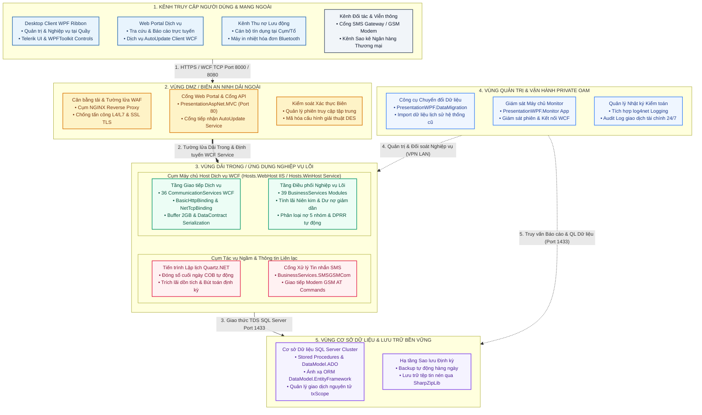
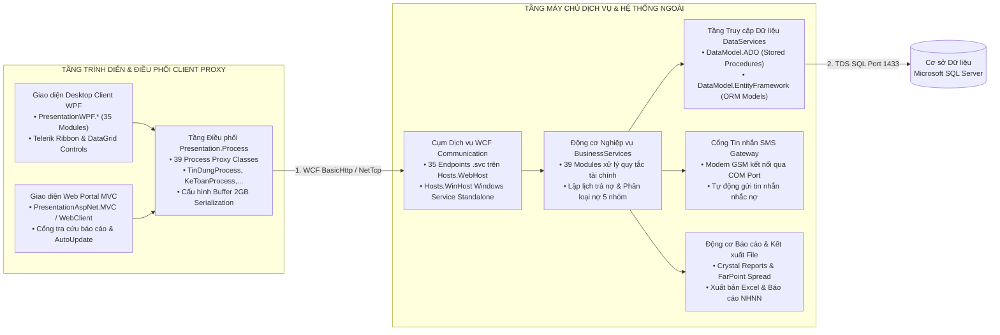
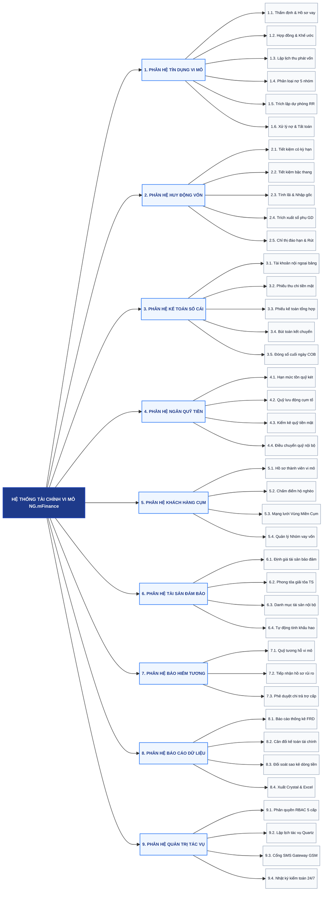
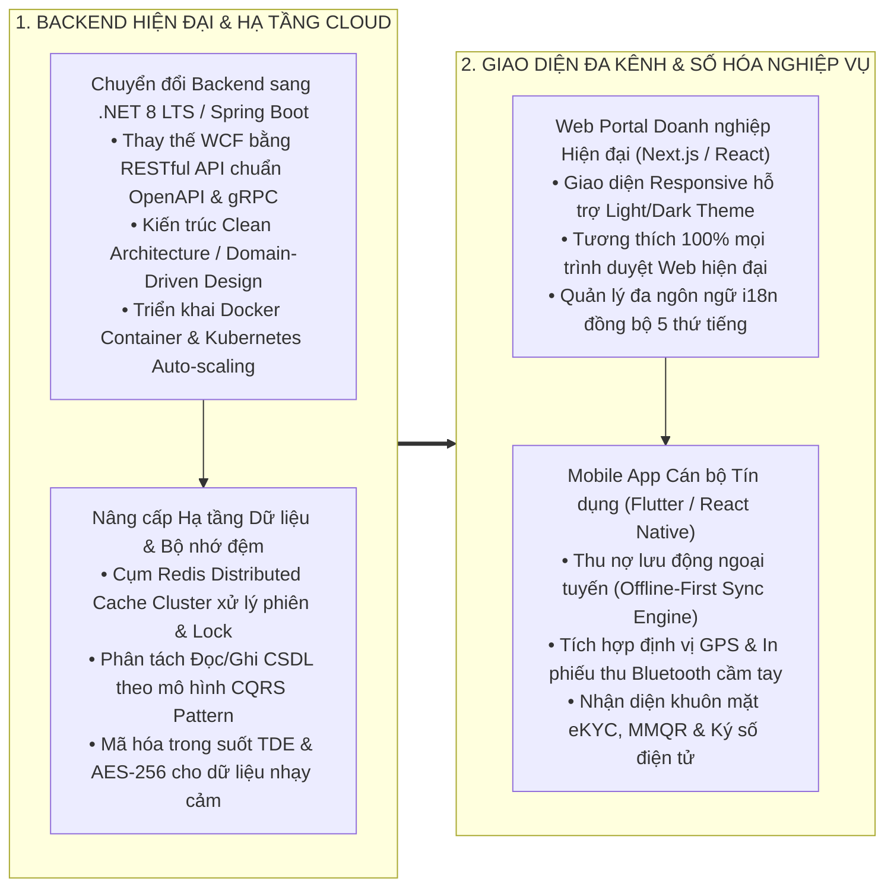

# PHÂN TÍCH KIẾN TRÚC VÀ MÃ NGUỒN NG.mFinance

---

## 1. TỔNG QUAN HỆ THỐNG VÀ CÔNG NGHỆ

### 1.1. Bối cảnh dự án BMF Myanmar
Hệ thống NG.mFinance (Micro Finance Platform) là giải pháp phần mềm quản trị nghiệp vụ Tài chính Vi mô và Core Banking chuyên sâu, được đóng gói và triển khai thực tế cho tổ chức tài chính vi mô **BMF (Bago Microfinance)** tại thị trường Myanmar trên cơ sở dữ liệu `NG-mFINA-BMF_20180402`.

Hệ thống quản lý toàn diện vòng đời tín dụng vi mô, huy động vốn tiết kiệm, kế toán hạch toán kép, quản lý ngân quỹ tiền mặt, bảo hiểm tương hỗ, phân loại nợ tự động theo quy định của **Cục Quản lý Tài chính Vi mô Myanmar (FRD)**, hỗ trợ đơn vị tiền tệ **MMK (Myanmar Kyat)**, quản lý định danh công dân qua **Thẻ căn cước công dân Myanmar (NRC)** và xuất bản hệ thống báo cáo tài chính, quản trị đa chiều.

### 1.2. Phân vùng an ninh hệ thống



### 1.3. Đặc tả phân vùng an ninh 5 lớp

| Phân vùng an ninh | Tên máy chủ / Container | Cụm dịch vụ / Phân hệ cài đặt | Cổng dịch vụ & Giao thức | Chức năng cốt lõi & Cơ chế an ninh |
| :--- | :--- | :--- | :--- | :--- |
| **1. Kênh Truy cập Người dùng** | Client Workstation / Mobile | Giao diện Desktop WPF Ribbon, Cổng Web Portal, Kênh thu nợ lưu động | HTTPS (443), WCF TCP (8000), Bluetooth | Cung cấp giao diện làm việc cho cán bộ tín dụng và giao dịch viên; đóng gói proxy trung gian Presentation.Process tối ưu hóa tuần tự hóa dữ liệu. |
| **2. Vùng DMZ Biên An ninh** | `micro-server` (Nginx Master) | Cụm NGINX Reverse Proxy, PresentationAspNet.MVC, FRP Client Service | TCP 80, 443 (Trỏ qua `https://mfina.microtec.vn/`) | Tiếp nhận kết nối mạng ngoài từ VPS FRP Gateway (35.247.156.176), phân tải yêu cầu và chuyển tiếp an toàn vào container nghiệp vụ. |
| **3. Vùng Nghiệp vụ Lõi (Dải Trong)** | `micro-finance-app` (Docker) | WCF SOAP Services (.NET 4.0 / Mono XSP4), 36 CommunicationServices, 39 BusinessServices | TCP 1011 (Nội bộ), COM/Serial Port (GSM SMS) | Thực thi toàn bộ quy tắc nghiệp vụ tài chính vi mô, tính toán lịch thu nợ, hạch toán kép, phân loại nợ 5 nhóm, trích lập dự phòng và đóng sổ cuối ngày. Đường dẫn: `/data/uc1-software/apps/micro-finance/`. |
| **4. Vùng Quản trị Private OAM** | `micro-server` (LAN / SSH) | PresentationWPF.DataMigration, PresentationWPF.Monitor, Cụm ELK & Prometheus/Grafana | TCP 65000 (SSH), TCP 5601 (Kibana), TCP 3003 (Grafana) | Chuyển đổi dữ liệu hệ thống cũ, giám sát trạng thái máy chủ, quản lý phiên làm việc và theo dõi nhật ký kiểm toán hệ thống qua `https://monitor.microtec.vn/` & `https://kibana.microtec.vn/`. |
| **5. Vùng Cơ sở Dữ liệu** | `mssql-db` (Docker SQL Server 2017) | Microsoft SQL Server 2017 (`NG-mFINA-BMF_20180402` - 396 bảng), Cụm Redis 7 (`redis-db`) | TCP 1433 (SQL TDS), TCP 6379 (Redis) | Lưu trữ bền vững toàn bộ 396 bảng nghiệp vụ tài chính vi mô; tài khoản `sa` / `Micro@31122020`; sao lưu tự động lúc 02:00 sáng hàng ngày vào `/data/backups/`. |

> [!NOTE]
> Chi tiết toàn bộ thông số hạ tầng máy chủ, cấu hình Docker Container, chuỗi kết nối CSDL và mô hình điều phối mạng được đặc tả tại [docs/deployment_infrastructure.md](file:///Users/micro/Source/erp/mifinace/docs/deployment_infrastructure.md).

---

## 2. KIẾN TRÚC PHÂN TẦNG VÀ CẤU TRÚC MÃ NGUỒN

### 2.1. Cấu trúc thư mục mã nguồn
Cấu trúc mã nguồn của hệ thống được quy hoạch theo mô hình phân tầng hướng dịch vụ:

```
NG.mFinance/
├── Build/                              # Cấu hình đóng gói và thư viện nhị phân xuất bản
│   ├── Build.Client/                   # Bản build môi trường phát triển cho Desktop Client
│   ├── Build.Server/                   # Bản build môi trường phát triển cho Backend Server
│   └── Build.ClientRelease/            # Bộ cài đặt phát hành Client (.msi / Setup)
├── Client/                             # Phân hệ phía người dùng (Presentation Layer)
│   └── 01.Presentation/
│       ├── Presentation.WPF/           # 35 Module giao diện WPF Desktop (XAML / MVVM / Code-behind)
│       ├── Presentation.AspNet/        # 3 Module Web Portal (MVC, WebForms, WebClient)
│       └── Presentation.Process/       # 39 Lớp Process trung gian gọi WCF Service Proxy
├── Server/                             # Phân hệ máy chủ nghiệp vụ (Backend Server)
│   ├── 01.Presentation/               # Công cụ quản trị máy chủ (DataMigration, Monitor)
│   ├── 02.Hosts/                       # Vỏ bọc máy chủ (Hosts.WebHost, Hosts.WinHost, Hosts.Startup)
│   ├── 03.Communication/               # Tầng giao tiếp WCF (Contracts, Messages, 36 Services)
│   ├── 04.Business/                    # Tầng nghiệp vụ lõi (39 Business Services chuyên biệt)
│   └── 05.DataAccess/                  # Tầng truy xuất dữ liệu (DataModel.ADO, EF, 31 Data Services)
├── Utilities/                          # Tiện ích dùng chung toàn hệ thống
│   ├── Utilities.Common/               # Thư viện dùng chung (Bảo mật, Hằng số, Log, Chuyển đổi dữ liệu)
│   └── Utilities.ZATools/              # Công cụ hỗ trợ phát triển và sinh mã tự động
├── Libraries/                          # Các tệp thư viện bên thứ 3 (Telerik, Crystal Reports, Quartz)
└── Documents/                          # Tài liệu và hình ảnh hướng dẫn
```

### 2.2. Giao tiếp và tích hợp dịch vụ



---

## 3. CÂY PHÂN RÃ CHỨC NĂNG HỆ THỐNG



---

## 4. MA TRẬN ĐẶC TẢ PHÂN HỆ NGHIỆP VỤ

| Mã Phân hệ | Tên Phân hệ Nghiệp vụ | Chức năng cốt lõi trong Source Code |
| :--- | :--- | :--- |
| **TDVM / TDTT / TDTD** | Tín dụng Vi mô & Tiêu dùng | Quản lý quy trình tín dụng khép kín: Thẩm định hồ sơ vay → Phê duyệt hạn mức → Lập hợp đồng tín dụng → Giải ngân từng lần theo khế ước → Lập lịch thu nợ theo cụm/nhóm khách hàng → Tạm ứng và hoàn ứng giải ngân lưu động → Thu nợ gốc lãi định kỳ (đơn vị tiền tệ MMK) → Xử lý gia hạn nợ, chuyển nhóm nợ quá hạn (Nhóm 1 đến Nhóm 5) → Trích lập dự phòng rủi ro theo quy chuẩn FRD Myanmar → Xử lý tài sản xiết nợ và tất toán hợp đồng. |
| **HDVO** | Huy động Tiết kiệm | Quản lý sản phẩm tiền gửi tiết kiệm tự nguyện, tiết kiệm bắt buộc của thành viên vay vốn; tính toán lãi suất cố định, thả nổi, bậc thang; trả lãi đầu kỳ, cuối kỳ, định kỳ hoặc lãi nhập gốc; in sổ tiết kiệm, trích xuất sổ phụ và xử lý tất toán/rút trước hạn bằng đồng MMK. |
| **GDKT** | Kế toán Giao dịch | Hạch toán kép theo bảng hệ thống tài khoản kế toán tổ chức tài chính vi mô Myanmar; lập và duyệt các chứng từ thu tiền, chi tiền, ủy nhiệm chi, chứng từ kế toán tổng hợp; hạch toán phân bổ doanh thu, phân bổ chi phí; thực hiện quy trình đóng sổ và khóa sổ cuối ngày (COB). |
| **KHTV** | Khách hàng & Thành viên | Quản lý hồ sơ định danh thành viên qua Thẻ căn cước công dân Myanmar (NRC Card dạng `[Region]/[Township](N)[Number]`); cấu trúc mạng lưới quản lý địa bàn theo 4 cấp (Region/State → District → Township / Branch → Center / Village Track / Nhóm vay vốn); chấm điểm hộ nghèo qua các tiêu chí nhà ở (mái, tường, nền, sàn, nguồn nước, ánh sáng). |
| **NQUY** | Quản lý Ngân quỹ | Quản lý hạn mức tồn quỹ tiền mặt MMK tại két, quỹ của giao dịch viên tại quầy, quỹ của cán bộ tín dụng đi thu tiền lưu động ngoài địa bàn; điều chuyển vốn giữa các phòng giao dịch; kiểm kê và đối đối quỹ cuối ngày. |
| **TSDB** | Tài sản Bảo đảm | Đăng ký danh mục tài sản bảo đảm (bất động sản, phương tiện, giấy tờ có giá, tín chấp cụm tổ); thẩm định và phê duyệt giá trị định giá; phong tỏa, giải tỏa tài sản khi tất toán khế ước. |
| **BHTH** | Bảo hiểm Tương hỗ | Quản lý quỹ tương hỗ cộng đồng cho thành viên vay vốn vi mô; tiếp nhận và phê duyệt hồ sơ yêu cầu chi trả trợ cấp khi khách hàng gặp rủi ro tai nạn, thương tật hoặc thiên tai. |
| **QLTS** | Quản lý Tài sản Nội bộ | Quản lý danh mục tài sản cố định, công cụ dụng cụ của đơn vị; tự động tính khấu hao tài sản định kỳ hàng tháng; điều chuyển tài sản giữa các phòng ban và ghi nhận thanh lý. |
| **BaoCao / KTDL** | Báo cáo & Khai thác Dữ liệu | Xuất bản hệ thống báo cáo định kỳ theo mẫu chuẩn Cục Quản lý Tài chính Vi mô Myanmar (FRD) và Hiệp hội Tài chính Vi mô Myanmar (MMFA); báo cáo cân đối kế toán, báo cáo lưu chuyển tiền tệ, báo cáo phân tích chất lượng tín dụng; tích hợp Crystal Reports và xuất khẩu Excel. |
| **QTHT / Job / SMS** | Quản trị & Tác vụ Tự động | Phân quyền người dùng theo mô hình RBAC 5 cấp; kiểm soát phạm vi chi nhánh; điều phối tác vụ lập lịch Quartz.NET; cổng gửi tin nhắn SMS nhắc nợ qua modem GSM/Com Port (hỗ trợ bảng mã ký tự Myanmar/English). |

---

## 5. ĐÁNH GIÁ KỸ THUẬT VÀ NỢ CÔNG NGHỆ

### 5.1. Điểm mạnh hệ thống
1. **Kiến trúc phân lớp chuẩn mực:** Phân chia rạch ròi giữa Presentation, Process Proxy, WCF Host, Communication Service, Business Logic và Data Access giúp mã nguồn có tính tổ chức cao, dễ bảo trì theo từng nghiệp vụ riêng lẻ.
2. **Bao phủ toàn diện nghiệp vụ đặc thù:** Đã mô hình hóa đầy đủ các nghiệp vụ tài chính vi mô phức tạp (quản lý theo mô hình Cụm/Tổ, giải ngân lưu động, thu nợ theo tuần/tháng tại cơ sở, đánh giá hộ nghèo đa chiều, tương hỗ thành viên).
3. **Cơ chế truyền thông và xử lý dung lượng lớn:** Cấu hình Buffer 2GB và tuần tự hóa tùy biến giúp hệ thống xử lý mượt mà các bảng kê thu tiền hàng loạt mà không gặp lỗi nghẽn bộ nhớ.
4. **Hệ thống hằng số và danh mục chuẩn hóa:** Khai báo tập trung qua `DatabaseConstant` và `BusinessConstant`, giúp bảo đảm tính nhất quán cao trên toàn bộ các tầng ứng dụng.

### 5.2. Hạn chế và nợ kỹ thuật
1. **Ngăn xếp công nghệ đã cũ:** 
   * Xây dựng trên nền .NET Framework 4.0/4.5, không tận dụng được các cải tiến vượt bậc về hiệu năng, bộ nhớ và kiến trúc đa nền tảng của .NET 8 / .NET 9 LTS.
   * Công nghệ giao tiếp WCF hiện đã lỗi thời và không còn được Microsoft hỗ trợ native trên các nền tảng .NET hiện đại.
2. **Hạn chế về nền tảng giao diện người dùng:**
   * Ứng dụng phía Client phụ thuộc hoàn toàn vào hệ điều hành Windows (WPF Desktop App). Cán bộ tín dụng khi ra địa bàn thu tiền tại Cụm/Tổ phải mang máy tính xách tay, chưa có ứng dụng Mobile App (iOS / Android) gọn nhẹ để thu tiền và đồng bộ trực tuyến.
   * Giao diện Web ASP.NET MVC / WebForms hiện tại chỉ đóng vai trò thứ yếu, chưa phải là Single-Page Application hoàn chỉnh.
3. **Phụ thuộc vào các thư viện độc quyền và đã lỗi thời:**
   * Sử dụng các phiên bản cũ của Telerik, Infragistics, FarPoint Spread, Crystal Reports Engine và WPFToolkit.
   * Chuỗi bản quyền tệp tin Aspose được nhúng trực tiếp trong mã nguồn (`ApplicationConstant.asposeWordLic`).
4. **Vấn đề an toàn thông tin và bảo mật cấu hình:**
   * Thuật toán mã hóa cấu hình hệ thống đang sử dụng chuẩn DES cổ điển với chuỗi khóa tĩnh (`!=Q|A'Z?`), tiềm ẩn rủi ro giải mã nếu lộ mã nguồn.
   * Các chuỗi kết nối cơ sở dữ liệu trong một số tệp cấu hình `App.config` / `Web.config` còn lưu trữ thông tin tài khoản truy cập dạng văn bản rõ hoặc chưa được tích hợp hệ thống quản lý khóa tập trung.

---

## 6. LỘ TRÌNH HIỆN ĐẠI HÓA HỆ THỐNG



### 6.1. Kế hoạch hành động
1. **Hiện đại hóa tầng Backend Dịch vụ:**
   * Tái cấu trúc từ WCF sang **RESTful API chuẩn OpenAPI/Swagger** hoặc **gRPC** hiệu năng cao trên nền **.NET 8 LTS**.
   * Đóng gói Backend thành các Container Docker độc lập, triển khai điều phối trên Kubernetes giúp hệ thống tự động mở rộng khi tải cao vào các ngày cao điểm đóng sổ.
2. **Phát triển ứng dụng di động cho Cán bộ Tín dụng (Field Collection App):**
   * Xây dựng Mobile App chạy trên điện thoại di động thông minh (iOS / Android) với tính năng hoạt động ngoại tuyến (Offline-first): Cán bộ tín dụng có thể thu nợ tại vùng sâu vùng xa không có sóng Internet và tự động đồng bộ dữ liệu về máy chủ khi có kết nối mạng.
   * Tích hợp thanh toán số qua **MMQR / KBZPay / WavePay** và in biên lai thu tiền qua máy in nhiệt cầm tay Bluetooth.
3. **Nâng cấp Hệ thống An toàn Thông tin:**
   * Thay thế hoàn toàn mã hóa DES bằng **AES-256** và truyền thông qua kênh bảo mật **TLS 1.3**.
   * Áp dụng cơ chế xác thực phiên hiện đại bằng **OAuth 2.0 / OpenID Connect** kết hợp **Stateless JWT Token** và quản lý phiên trên **Redis Cache Cluster**.
   * Quản lý thông tin bảo mật và chuỗi kết nối qua **HashiCorp Vault** hoặc **Azure Key Vault**.
4. **Tích hợp tính năng Số hóa Tiên tiến:**
   * Tích hợp **eKYC** xác thực danh tính khách hàng qua Thẻ NRC Myanmar và nhận diện khuôn mặt sinh trắc học.
   * Tích hợp **Smart OTP** và **Ký số hợp đồng điện tử**, giảm thiểu hoàn toàn việc in ấn và lưu trữ hồ sơ giấy tờ truyền thống.
