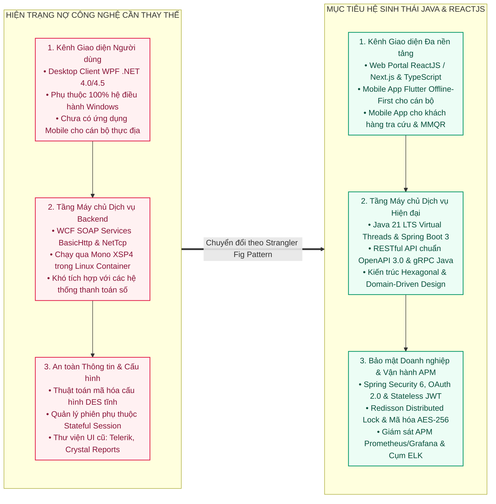
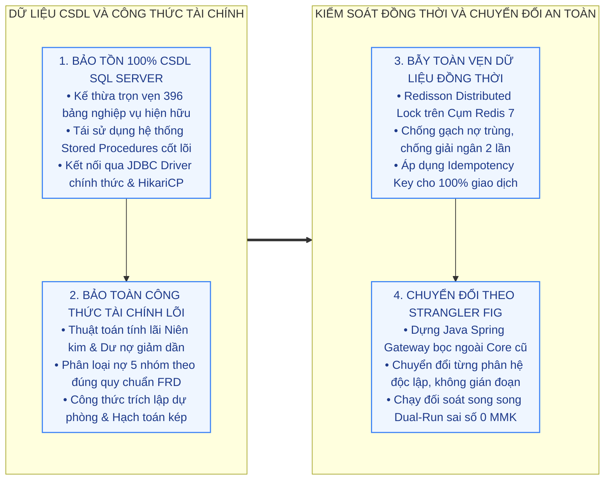
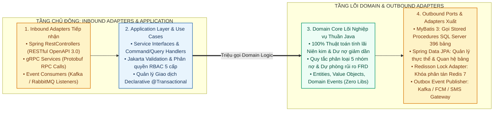
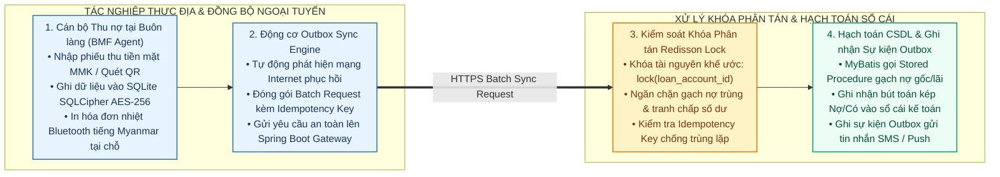
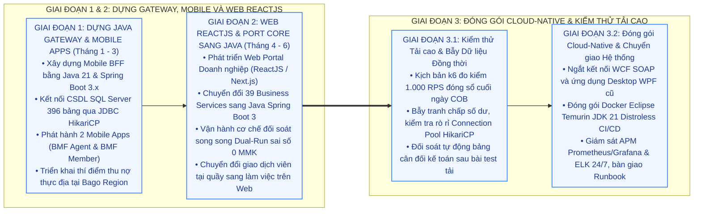
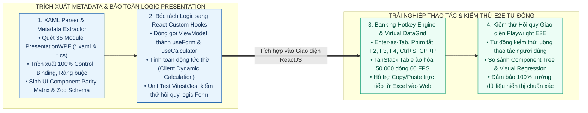

# ĐỀ XUẤT NÂNG CẤP CÔNG NGHỆ HỆ THỐNG NG.mFinance
## CHUYỂN ĐỔI HỆ SINH THÁI JAVA 21 LTS, SPRING BOOT 3 VÀ REACTJS

---

## 1. HIỆN TRẠNG VÀ NỢ KỸ THUẬT

### 1.1. Hiện trạng kiến trúc
Hệ thống NG.mFinance hiện đang phục vụ nghiệp vụ tài chính vi mô toàn diện cho tổ chức tài chính BMF tại Myanmar trên cơ sở dữ liệu `NG-mFINA-BMF_20180402` (396 bảng nghiệp vụ, 36 Communication Services, 39 Business Services):
* **Phân hệ Máy chủ Dịch vụ:** Xây dựng trên nền .NET Framework 4.0/4.5 và công nghệ WCF SOAP Services (BasicHttpBinding & NetTcpBinding), hiện đang khởi chạy qua Mono XSP4 Server trong Docker Container Linux trên máy chủ `micro-server`.
* **Phân hệ Ứng dụng Người dùng:** Giao diện Windows Desktop WPF (XAML, Telerik Ribbon, WPFToolkit) phục vụ các tác vụ tại quầy giao dịch chi nhánh, kết hợp cổng Web ASP.NET MVC / WebForms phụ trợ.
* **Cơ sở Dữ liệu & Lưu trữ:** Cơ sở dữ liệu Microsoft SQL Server 2017 với 396 bảng nghiệp vụ, truy xuất dữ liệu thông qua DataModel.ADO (Stored Procedures) và DataModel.EntityFramework 4.
* **Tiện ích và Dịch vụ Phụ trợ:** Tác vụ lập lịch Quartz.NET, cổng gửi tin nhắn SMS qua modem GSM kết nối cổng COM Serial Port, xuất báo cáo qua Crystal Reports và FarPoint Spread.

### 1.2. Hạn chế và nợ kỹ thuật
1. **Ngăn xếp công nghệ phía máy chủ đã lỗi thời:** Nền tảng .NET Framework 4.0 và công nghệ WCF SOAP hiện không còn được Microsoft hỗ trợ native trên các hệ điều hành và nền tảng đám mây hiện đại, tiêu tốn nhiều tài nguyên bộ nhớ RAM và gây khó khăn lớn khi tích hợp API với các đối tác thanh toán số.
2. **Thiếu kênh tác nghiệp di động ngoài thực địa:** Cán bộ tín dụng khi xuống các buôn làng, cụm tổ vùng sâu vùng xa tại Myanmar phải mang máy tính xách tay cồng kềnh hoặc ghi chép sổ sách giấy thủ công, làm tăng rủi ro sai lệch dữ liệu và trễ hạn đóng sổ cuối ngày (COB).
3. **Phụ thuộc môi trường Windows Desktop:** Giao diện WPF Desktop chỉ chạy được trên hệ điều hành Windows, phát sinh chi phí duy trì bản quyền hệ điều hành và công tác triển khai, cập nhật tệp tin nhị phân cài đặt (.msi) tại từng điểm giao dịch.
4. **Rủi ro an toàn thông tin và bảo mật cấu hình:** Thuật toán mã hóa cấu hình hệ thống đang sử dụng chuẩn DES cổ điển với chuỗi khóa tĩnh, chuỗi kết nối cơ sở dữ liệu chưa được bảo vệ qua hệ thống quản lý khóa tập trung.

---

## 2. NGUYÊN TẮC BẢO TOÀN NGHIỆP VỤ

Để quá trình chuyển đổi sang hệ sinh thái Java và ReactJS không làm thay đổi, gián đoạn hay sai lệch bất kỳ quy trình nghiệp vụ tài chính nào, giải pháp tuân thủ nghiêm ngặt 4 nguyên tắc kỹ thuật cốt lõi:

### 2.1. Bảo tồn mô hình dữ liệu
* Kế thừa nguyên vẹn 100% cơ sở dữ liệu `NG-mFINA-BMF_20180402` gồm 396 bảng nghiệp vụ trên Microsoft SQL Server.
* Kết nối JDBC hiệu năng cao thông qua thư viện chính thức `com.microsoft.sqlserver:mssql-jdbc` kết hợp bộ quản lý kết nối HikariCP.
* Toàn bộ mã trạng thái, mã danh mục phân loại, bảng hệ thống tài khoản kế toán, cấu trúc phân cấp hành chính Myanmar (State/Region → District → Township → Village Track → Village → Center → Group) và quy chuẩn thẻ căn cước công dân Myanmar (NRC Card dạng `[Region]/[Township](N)[Number]`) được giữ nguyên vẹn.

### 2.2. Bảo toàn công thức tài chính
* **Công thức tính lãi suất:** Giữ nguyên các thuật toán tính lãi theo dư nợ giảm dần (Declining Balance), niên kim cố định (Amortization), lãi suất bậc thang, lãi suất cố định, tính lãi dồn tích hàng ngày (Daily Accrued Interest) và lãi nhập gốc.
* **Quy chuẩn phân loại nợ & Dự phòng rủi ro:** Bảo toàn 100% quy tắc phân loại 5 nhóm nợ (Nợ đủ tiêu chuẩn, Nợ cần chú ý, Nợ dưới tiêu chuẩn, Nợ nghi ngờ, Nợ có khả năng mất vốn) và tỷ lệ trích lập dự phòng rủi ro theo đúng quy định của Cục Quản lý Tài chính Vi mô Myanmar (FRD).
* **Hạch toán kế toán kép:** Bảo đảm mọi thao tác thu nợ, giải ngân, gửi tiết kiệm, trích lập dự phòng đều sinh đúng các cặp định khoản Nợ/Có trên hệ thống sổ cái.

### 2.3. Chuyển đổi theo Strangler Fig Pattern
* Không thực hiện đập đi xây lại toàn bộ trong một lần. Hệ thống xây dựng một tầng Gateway trung gian (Spring Cloud Gateway / Spring Boot 3 BFF) bọc quanh lõi dịch vụ hiện hữu.
* Các ứng dụng mới (Web Portal ReactJS, Mobile Apps) giao tiếp thông qua tầng Gateway này. Gateway sẽ điều phối gọi trực tiếp vào CSDL SQL Server hoặc chuyển tiếp qua WCF SOAP Adapter để tận dụng các dịch vụ cũ. Sau đó, từng Business Service sẽ được bóc tách và chuyển đổi dần sang Java 21 / Spring Boot 3 theo kiến trúc Hexagonal.

### 2.4. Bẫy kiểm soát toàn vẹn dữ liệu
* Áp dụng Redisson Distributed Lock trên Cụm Redis để khóa tài nguyên tài chính (tài khoản khách hàng, khế ước vay, sổ tiết kiệm) khi thực hiện các giao dịch nhạy cảm như gạch nợ hàng loạt, chi giải ngân, trích lãi dồn tích và khóa sổ cuối ngày (COB).
* Áp dụng khóa duy nhất `Idempotency Key` cho toàn bộ các giao dịch từ Mobile và Web gửi lên, triệt tiêu hoàn toàn sự cố trùng lặp chứng từ khi đường truyền mạng chập chờn.

---

## 3. MÔ HÌNH KIẾN TRÚC JAVA VÀ REACTJS

```mermaid
%%{init: {'flowchart': {'nodeSpacing': 14, 'rankSpacing': 100, 'padding': 8}}}%%
flowchart LR
    subgraph S_CHANNELS ["KÊNH TRÌNH DIỄN & GATEWAY INTERFACE"]
        direction TB
        subgraph G_CLIENTS ["Kênh Truy cập Người dùng Đa nền tảng"]
            direction TB
            C_WEB["Web Portal Doanh nghiệp (ReactJS / Next.js)<br/>• TypeScript, Clean Architecture / FSD, Ant Design<br/>• Bảng dữ liệu ảo hóa TanStack Table 60 FPS<br/>• Đa ngôn ngữ i18n 5 thứ tiếng & Theme Sáng/Tối"]:::cClient
            C_AGENT["Mobile App Cán bộ Tín dụng (BMF Agent)<br/>• Flutter / React Native (iOS & Android)<br/>• Động cơ Offline-First Sync Engine<br/>• Quét OCR Thẻ NRC, In nhiệt Bluetooth tiếng Myanmar"]:::cClient
            C_CUST["Mobile App Khách hàng (BMF Member)<br/>• Flutter / React Native (iOS & Android)<br/>• Tra cứu dư nợ MMK, lịch trả nợ toàn khóa<br/>• Tạo mã MMQR, liên kết KBZPay & WavePay"]:::cClient
        end

        subgraph G_GATEWAY ["Tầng Cổng Biên & API Gateway"]
            direction TB
            GW_API["Spring Cloud Gateway / Mobile BFF (Java 21)<br/>• OpenAPI 3.0 / SpringDoc Swagger & gRPC<br/>• Spring Security 6, OAuth 2.0 & Stateless JWT<br/>• Bucket4j Rate Limiting, Idempotency Middleware"]:::cGateway
        end

        G_CLIENTS --> GW_API
    end

    subgraph S_CORE ["NGHIỆP VỤ LÕI, CSDL & TIẾN TRÌNH HẠ TẦNG"]
        direction TB
        subgraph G_SERVICES ["Khối Dịch vụ Nghiệp vụ Lõi (Spring Boot 3)"]
            direction TB
            CORE_SVC["Module Nghiệp vụ Lõi (Hexagonal Architecture)<br/>• Tín dụng TDVM, Huy động HDVO, Kế toán GDKT<br/>• Ngân quỹ NQUY, Khách hàng KHTV, Bảo hiểm BHTH<br/>• Báo cáo thống kê FRD, Đóng sổ cuối ngày COB"]:::cCore
            WORKER_SVC["Tiến trình Tác vụ Ngầm & Sự kiện Giao dịch<br/>• Spring Batch & Quartz Scheduler tự động COB<br/>• Transactional Outbox Pattern & Kafka/RabbitMQ<br/>• Cổng gửi tin nhắn SMS Gateway & Firebase FCM"]:::cCore
        end

        subgraph G_STORAGE ["Khối Dữ liệu & Bộ nhớ đệm Phân tán"]
            direction TB
            DB_MSSQL["Cơ sở Dữ liệu Microsoft SQL Server 2017/2022<br/>• Lưu trữ 396 Bảng Nghiệp vụ Cốt lõi<br/>• Truy xuất qua HikariCP + MyBatis 3 & JPA Hibernate 6<br/>• Mã hóa trong suốt TDE & Sao lưu tự động 02:00"]:::cStorage
            CACHE_REDIS["Cụm Bộ nhớ đệm Redis 7 Cluster<br/>• Redisson Distributed Lock (RLock) bảo vệ số dư<br/>• Quản lý phiên làm việc & Token Blacklist<br/>• Bộ nhớ đệm Danh mục hành chính & Tỷ giá MMK"]:::cStorage
        end

        G_SERVICES --> G_STORAGE
    end

    GW_API ==>|"RESTful API / gRPC"| CORE_SVC

    classDef cClient fill:#e8f4fd,stroke:#2b6cb0,stroke-width:1.5px,color:#1a365d;
    classDef cGateway fill:#fef3c7,stroke:#d97706,stroke-width:1.5px,color:#78350f;
    classDef cCore fill:#ecfdf5,stroke:#059669,stroke-width:1.5px,color:#064e3b;
    classDef cStorage fill:#f5f3ff,stroke:#7c3aed,stroke-width:1.5px,color:#4c1d95;
```

### 3.1. Kênh Web Portal và Mobile Apps
* **Web Portal Doanh nghiệp (ReactJS / Next.js):**
  * **Công nghệ:** ReactJS 18/19, Next.js (hoặc Vite), TypeScript, tuân thủ kiến trúc Feature-Sliced Design (FSD) và Clean Architecture.
  * **Quản lý Trạng thái & Dữ liệu:** TanStack Query (React Query) kết hợp Zustand / Redux Toolkit, tối ưu hóa bộ nhớ đệm phía Client.
  * **Giao diện & Thành phần UI:** Ant Design / Material UI / Tailwind CSS, tích hợp bảng dữ liệu ảo hóa cao cấp (TanStack Table / AG Grid) cho phép hiển thị hàng chục nghìn dòng dữ liệu chứng từ kế toán mà không gây giật lag (60 FPS).
  * **Biểu mẫu & Xác thực:** React Hook Form kết hợp thư viện kiểm tra dữ liệu Zod Schema.
  * **Đa ngôn ngữ & Giao diện:** Sử dụng `react-i18next` đồng bộ 5 thứ tiếng (Tiếng Myanmar Unicode, Tiếng Anh, Tiếng Việt, Tiếng Trung, Tiếng Nhật); chuyển đổi giao diện Sáng / Tối.
* **Bộ đôi Ứng dụng Di động Độc lập (Mobile Apps):**
  * **Công nghệ:** Flutter (hoặc React Native).
  * **BMF Agent App (Dành cho Cán bộ Tín dụng thực địa):** Tích hợp Offline-First Sync Engine trên nền SQLite mã hóa SQLCipher AES-256 (hoặc WatermelonDB); hỗ trợ cán bộ thu nợ hàng loạt theo Cụm/Tổ tại buôn làng khi mất mạng; tích hợp quét OCR thẻ căn cước NRC Myanmar, định vị GPS khảo sát nhà ở và in hóa đơn nhiệt Bluetooth tiếng Myanmar cầm tay.
  * **BMF Customer App (Dành cho Khách hàng & Thành viên vi mô):** Tra cứu hợp đồng vay, hạn mức, dư nợ gốc lãi MMK, lịch trả nợ toàn khóa; mở và quản lý sổ tiết kiệm tích lũy; thanh toán nợ trực tuyến qua chuẩn MMQR động và liên kết ví điện tử KBZPay, WavePay, AYA Pay, MytelPay; nhận thông báo biến động số dư qua Push Notification.

### 3.2. Kiến trúc Hexagonal Java 21 Spring Boot 3

* **Khung ứng dụng Backend Hiện đại:**
  * Xây dựng trên nền Java 21 LTS với công nghệ luồng ảo Virtual Threads (Project Loom), cho phép xử lý hàng chục nghìn luồng đồng thời với chi phí bộ nhớ cực thấp.
  * Khung phát triển Spring Boot 3.x (Spring Framework 6), Spring Cloud Gateway, Spring Security 6.
* **Chuẩn hóa Giao diện API:**
  * Cung cấp 100% API chuẩn RESTful (OpenAPI 3.0 / SpringDoc Swagger) cho Web Portal và Mobile Apps.
  * Sử dụng gRPC Java (Protobuf) cho các tác vụ truyền thông nội bộ hiệu năng cao giữa các vi dịch vụ hoặc cụm xử lý nền tảng.
  * Tích hợp bộ lọc an ninh: Bucket4j Rate Limiting, CORS, Idempotency Filter, xác thực Stateless JWT Token kết hợp kiểm soát phiên và thu hồi Token trên Redis.
* **Phân lớp Kiến trúc Hexagonal (Ports and Adapters):**
  * **Domain Layer (Core):** Chứa Entities, Value Objects, Enums, quy tắc nghiệp vụ và công thức tính toán tài chính thuần túy Java (Zero Dependency vào Framework).
  * **Application Layer (Use Cases):** Chứa Service Interfaces, Command/Query Handlers, DTOs, Bean Validation (Jakarta Validation).
  * **Infrastructure Layer (Adapters):**
    * **MyBatis 3 / Spring JDBC:** Ánh xạ và thực thi trực tiếp các Stored Procedures phức tạp, câu lệnh truy vấn báo cáo tài chính hàng loạt với tốc độ tối đa.
    * **Spring Data JPA (Hibernate 6):** Quản lý vòng đời thực thể, quan hệ bảng và tính toàn vẹn giao dịch nguyên tử.

### 3.3. Tầng CSDL và Redis Cache
* **Cơ sở dữ liệu Microsoft SQL Server 2017/2022:**
  * Duy trì nguyên vẹn 396 bảng nghiệp vụ, kết nối qua HikariCP (`maximumPoolSize: 50`, `connectionTimeout: 30000ms`).
  * Bật chế độ Read Committed Snapshot Isolation (RCSI) để tăng tốc độ truy vấn đọc báo cáo mà không gây lock bảng ghi dữ liệu thu nợ.
* **Cụm Bộ nhớ đệm Redis 7 (Distributed Cache & Lock):**
  * Thư viện client Redisson cung cấp khóa phân tán `RLock` với tính năng tự động gia hạn khóa (Watchdog mechanism) chống xung đột dữ liệu tài chính.
  * Quản lý phiên làm việc, lưu trữ danh sách đen Token thu hồi (Token Blacklist).
  * Cache danh mục hành chính Myanmar, bảng tỷ giá, biểu phí và sản phẩm tiết kiệm.

### 3.4. Luồng thu nợ ngoại tuyến và Redisson Lock

---

## 4. MA TRẬN NÂNG CẤP CÔNG NGHỆ

| STT | Thành phần Hệ thống | Công nghệ Hiện tại | Công nghệ Đề xuất (Java - ReactJS) | Lợi ích Kỹ thuật & Vận hành | Giải pháp Bảo toàn 100% Nghiệp vụ |
| :---: | :--- | :--- | :--- | :--- | :--- |
| **1** | **Backend Framework** | .NET Framework 4.0 / Mono XSP4 | **Java 21 LTS + Spring Boot 3.x** | Tận dụng Virtual Threads (Loom), hiệu năng cao, quản lý bộ nhớ vượt trội, chuẩn mực ngân hàng toàn cầu. | Port nguyên vẹn toàn bộ mã nguồn tính toán tài chính; viết Unit Test JUnit 5 kiểm thử hồi quy so khớp từng kết quả. |
| **2** | **Giao thức Giao tiếp** | WCF SOAP (BasicHttp / NetTcp) | **RESTful API (SpringDoc OpenAPI 3.0) & gRPC** | Chuẩn hóa quốc tế, tương thích 100% với Web ReactJS, Mobile Apps, hệ sinh thái Ví điện tử Myanmar. | Xây dựng bộ chuyển đổi (Adapter) ánh xạ 1-1 giữa Message Contracts cũ và Java DTOs RESTful API mới. |
| **3** | **Giao diện Nghiệp vụ Quầy** | Windows Desktop WPF (.NET 4.0) | **Web Portal (ReactJS / Next.js / TypeScript)** | Chạy trực tiếp trên trình duyệt Web (Chrome, Edge, Safari), không cần cài đặt MSI, tương thích đa nền tảng. | Giữ nguyên 100% luồng thao tác, biểu mẫu nhập liệu và hệ thống phím tắt nghiệp vụ quen thuộc của cán bộ. |
| **4** | **Kênh Tác nghiệp Thực địa** | Chưa có (Dùng Laptop / Sổ sách giấy) | **Mobile App (Flutter / React Native - BMF Agent)** | Thu nợ, mở sổ tiết kiệm, thẩm định tín dụng trực tiếp tại buôn làng; in hóa đơn nhiệt Bluetooth tiếng Myanmar. | Tích hợp Offline-First Sync Engine; gạch nợ và phân bổ nợ gốc/lãi theo đúng thuật toán Core CSDL. |
| **5** | **Kênh Khách hàng Số** | Chưa có | **Mobile App (Flutter / React Native - BMF Member)** | Khách hàng tự tra cứu dư nợ, lịch trả nợ, thanh toán trực tuyến qua MMQR / KBZPay / WavePay 24/7. | Tra cứu trực tiếp từ CSDL; thanh toán số tự động sinh chứng từ kế toán hạch toán kép theo đúng quy tắc Core. |
| **6** | **Truy cập Cơ sở Dữ liệu** | ADO.NET thô & Entity Framework 4 | **HikariCP + MyBatis 3 & Spring Data JPA** | HikariCP kết nối CSDL nhanh nhất thế giới; MyBatis gọi Stored Procedures nguyên bản; JPA quản lý quan hệ bảng. | Tái sử dụng 100% các Stored Procedures hiện có trên CSDL SQL Server 396 bảng. |
| **7** | **Xác thực & Quản lý Phiên** | Custom Session / ASP.NET Forms Auth | **Spring Security 6 + OAuth 2.0 / JWT + Redis** | Bảo mật cấp độ doanh nghiệp, hỗ trợ phiên phi trạng thái (Stateless), thu hồi Token tức thì qua Redis Blacklist. | Giữ nguyên mô hình phân quyền RBAC 5 cấp và phân quyền theo phạm vi chi nhánh/Township. |
| **8** | **Mã hóa & Bảo mật Cấu hình** | DES cổ điển, chuỗi khóa tĩnh | **AES-256-GCM, TLS 1.3, Spring Cloud Vault** | Triệt tiêu hoàn toàn rủi ro lộ mã khóa; dữ liệu nhạy cảm được bảo vệ an toàn theo chuẩn an ninh ngân hàng. | Thay thế thuật toán mã hóa tầng tiện ích mà không làm thay đổi định dạng dữ liệu đầu ra. |
| **9** | **Động cơ Báo cáo** | Crystal Reports & FarPoint Spread | **JasperReports / Apache POI & OpenPDF** | Xuất báo cáo PDF, Excel tốc độ cao, hiển thị tiếng Myanmar Unicode sắc nét, không phụ thuộc license độc quyền. | Định dạng báo cáo giữ nguyên 100% theo đúng biểu mẫu chuẩn của Cục Quản lý Tài chính Vi mô Myanmar (FRD). |
| **10** | **Giám sát & Quản trị Nhật ký** | log4net cục bộ ghi ra file text | **Spring Boot Actuator, Micrometer, Prometheus/Grafana & ELK** | Quản lý nhật ký kiểm toán tập trung 24/7; giám sát thời gian thực CPU, RAM, Connection Pool và cảnh báo qua Telegram. | Xuất log JSON cấu trúc chuẩn Elastic Common Schema (ECS), ghi nhận đầy đủ IP, UserID, hành động tài chính. |

---

## 5. LỘ TRÌNH CHUYỂN ĐỔI 3 GIAI ĐOẠN

### 5.1. Giai đoạn 1: Dựng Gateway và Mobile Apps (Tháng 1 - Tháng 3)
* **Mục tiêu:** Bổ sung ngay năng lực thu nợ lưu động ngoài địa bàn cho cán bộ tín dụng mà không can thiệp vào mã nguồn Core WCF và Desktop WPF đang chạy ổn định.
* **Hành động cụ thể:**
  1. Khởi tạo dự án Mobile BFF Gateway trên nền Java 21 LTS & Spring Boot 3.x, kết nối trực tiếp vào CSDL `NG-mFINA-BMF_20180402` qua JDBC HikariCP và Cụm Redis 7 (`redis-db`) qua Redisson.
  2. Cung cấp hệ thống RESTful API cho ứng dụng di động: Đăng nhập, danh mục Cụm/Tổ, bảng kê thu nợ định kỳ, đồng bộ ngoại tuyến, tra cứu lịch nợ.
  3. Hoàn thiện và phát hành 2 ứng dụng di động BMF Agent App và BMF Customer App.
  4. Thí điểm thu nợ thực địa tại 1-2 Township trọng điểm tại Bago Region, đối soát số liệu thu nợ với hệ thống kế toán hàng ngày.

### 5.2. Giai đoạn 2: Hiện đại hóa Web Portal và Core Service (Tháng 4 - Tháng 6)
* **Mục tiêu:** Thay thế dần ứng dụng Desktop WPF bằng Web Portal ReactJS hiện đại và chuyển đổi toàn bộ 39 Business Services sang Java Spring Boot 3 Clean Architecture.
* **Hành động cụ thể:**
  1. Xây dựng giao diện Web Portal (ReactJS / Next.js / TypeScript) cho các phân hệ nghiệp vụ tại quầy: Tín dụng vi mô (TDVM), Huy động tiết kiệm (HDVO), Kế toán giao dịch (GDKT), Quản lý ngân quỹ (NQUY), Báo cáo FRD (BaoCao).
  2. Áp dụng Strangler Fig Pattern: Port logic từ 39 Business Services cũ sang các Spring RestControllers và Domain Services của Java.
  3. Chạy cơ chế Đối chiếu song song (Dual-Run / Shadow Execution): Mọi giao dịch phát sinh trên Web/Mobile được xử lý đồng thời qua cả logic mới và logic cũ để so khớp kết quả từng đồng Kyat (MMK).
  4. Đào tạo cán bộ giao dịch viên chuyển từ phần mềm Desktop sang làm việc trên trình duyệt Web.

### 5.3. Giai đoạn 3: Đóng gói Cloud-Native và kiểm thử tải cao (Tháng 7 - Tháng 8)
* **Mục tiêu:** Ngắt kết nối hoàn toàn WCF SOAP cũ, tối ưu hóa hiệu năng, an toàn thông tin và bàn giao vận hành.
* **Hành động cụ thể:**
  1. Tắt dịch vụ WCF SOAP và ứng dụng Desktop WPF cũ; hệ thống vận hành 100% trên kiến trúc mới (Java 21 Spring Boot 3 + Web ReactJS + Mobile Apps).
  2. Thực hiện bài kiểm thử tải cao (Stress Test) và bẫy toàn vẹn dữ liệu đồng thời bằng công cụ k6:
     * Giả lập 1.000 cán bộ tín dụng đồng loạt gửi bảng kê thu nợ vào thời điểm đóng sổ cuối ngày (COB).
     * Bẫy xung đột khóa phân tán: Xác minh Redisson Lock ngăn chặn hoàn toàn gạch nợ trùng hoặc cạn kiệt Connection Pool HikariCP.
     * Đối soát cân đối kế toán tự động sau khi kết thúc bài test tải.
  3. Hoàn thiện tài liệu kiến trúc (HLD), thiết kế CSDL (DBDD), sổ tay vận hành (Runbook) và quy trình CI/CD tự động (Docker image Eclipse Temurin 21 Distroless).

---

## 6. CƠ CHẾ ĐỐI SOÁT KÉP 6 TẦNG

Để đảm bảo việc chuyển đổi mã nguồn từ .NET WCF sang Java Spring Boot 3 diễn ra chuẩn xác 100%, không phát sinh sai lệch nghiệp vụ dù là nhỏ nhất, hệ thống thiết lập Khung Cơ chế Đối soát Kép 6 Tầng:

```mermaid
%%{init: {'flowchart': {'nodeSpacing': 14, 'rankSpacing': 90, 'padding': 8}}}%%
flowchart LR
    subgraph S_DIFF_LEFT ["NHÂN BẢN LƯU LƯỢNG & THỰC THI SONG SONG"]
        direction TB
        REQ_IN["1. Request Giao dịch Nghiệp vụ<br/>• Web Portal / Mobile App gửi yêu cầu<br/>• Đi kèm Idempotency Key & Header xác thực"]:::cClient
        GW_ROUTE["2. Bộ Điều phối Feature Flag Gateway<br/>• Luồng chính: Gửi tới .NET WCF cũ để xử lý thật<br/>• Luồng phụ: Nhân bản ngầm (Shadow) sang Java 21"]:::cGateway
        RUN_LEGACY["3A. Xử lý trên Core WCF Cũ (.NET 4.0)<br/>• Thực thi nghiệp vụ & Cập nhật CSDL thật<br/>• Trả Response_Legacy về cho người dùng"]:::cLegacy
        RUN_JAVA["3B. Xử lý trên Java 21 Spring Boot 3<br/>• Thực thi Domain Logic trong Shadow Sandbox<br/>• Xuất Response_Modern & Changeset đối soát"]:::cModern
        REQ_IN --> GW_ROUTE
        GW_ROUTE -->|"Luồng chính"| RUN_LEGACY
        GW_ROUTE -.->|"Luồng ngầm Shadow"| RUN_JAVA
    end

    subgraph S_DIFF_RIGHT ["BỘ SO KHỚP TỰ ĐỘNG & ĐIỀU PHỐI CANARY"]
        direction TB
        COMP_DIFF["4. Bộ So khớp Phản hồi Comparator Engine<br/>• So khớp từng trường: Gốc, Lãi, Phạt, Ngày đáo hạn<br/>• So khớp Changeset dữ liệu CSDL: Sai số = 0.00 MMK<br/>• Ghi log chi tiết ECS JSON vào Elasticsearch"]:::cCore
        GATE_EVAL["5. Đánh giá Tỷ lệ Khớp Quality Gate<br/>• Khớp 100.00% trên 50.000 giao dịch thực tế<br/>• Đủ điều kiện kích hoạt Canary chuyển luồng thật<br/>• Phát cảnh báo Telegram nếu phát hiện lệch dữ liệu"]:::cCore
        FLAG_CANARY["6. Điều phối Cờ Canary & Rollback Tức thì<br/>• Chuyển dần 1% → 5% → 20% → 100% sang Java<br/>• Rollback tức thì (< 1s) về WCF cũ nếu có sự cố"]:::cCore
        RUN_LEGACY --> COMP_DIFF
        RUN_JAVA --> COMP_DIFF
        COMP_DIFF --> GATE_EVAL --> FLAG_CANARY
    end

    classDef cClient fill:#e8f4fd,stroke:#2b6cb0,stroke-width:1.5px,color:#1a365d;
    classDef cGateway fill:#fef3c7,stroke:#d97706,stroke-width:1.5px,color:#78350f;
    classDef cLegacy fill:#fff1f2,stroke:#e11d48,stroke-width:1.5px,color:#881337;
    classDef cModern fill:#ecfdf5,stroke:#059669,stroke-width:1.5px,color:#064e3b;
    classDef cCore fill:#f5f3ff,stroke:#7c3aed,stroke-width:1.5px,color:#4c1d95;
```

### 6.1. Phân rã theo Lát cắt dọc
* **Quy tắc thực thi:** Không chuyển đổi theo tầng ngang (không port toàn bộ DAO trước rồi mới port Service). Chuyển đổi độc lập theo từng Lát cắt Dọc (Vertical Slice) của một Use Case cụ thể.
* **Cấu trúc một lát cắt độc lập:**
  1. `Input DTO & Validation`: Tiếp nhận tham số đầu vào và kiểm tra hợp lệ.
  2. `Domain Logic`: Xử lý thuật toán tài chính thuần Java (ví dụ: `CalculateAmortizationSchedule`, `ClassifyLoanAccountGroup`).
  3. `Database Access`: Câu lệnh MyBatis ánh xạ Stored Procedure tương ứng trên CSDL SQL Server 396 bảng.
  4. `Output DTO`: Định dạng dữ liệu phản hồi chuẩn OpenAPI.
* **Lợi ích:** Mỗi Use Case chỉ có kích thước từ 100 đến 300 dòng code, giúp lập trình viên và kiểm thử viên rà soát chi tiết từng dòng lệnh, cô lập hoàn toàn phạm vi ảnh hưởng.

### 6.2. Nhân bản lưu lượng và chạy bóng Shadow
* **Nguyên lý hoạt động:** Tại tầng API Gateway, khi có bất kỳ yêu cầu nào từ Web Portal hoặc Mobile App gửi lên:
  * **Luồng chính:** Gateway chuyển tiếp yêu cầu đến WCF SOAP Backend cũ (.NET 4.0). Kết quả từ WCF cũ sẽ được trả về trực tiếp cho người dùng, bảo đảm trải nghiệm vận hành không bị ảnh hưởng.
  * **Luồng phụ:** Gateway đồng thời sao chép bản tin yêu cầu và đẩy bất đồng bộ sang Java 21 Spring Boot 3 Service.
* **Môi trường thực thi Shadow:** Java Service thực thi toàn bộ logic nghiệp vụ trong một môi trường Shadow Sandbox (giao dịch CSDL ở chế độ Rollback hoặc ghi vào bảng đệm đối soát `SHADOW_AUDIT_LOG`), bảo đảm không làm biến động dữ liệu thật.

### 6.3. Bộ so khớp phản hồi tự động
* **Cơ chế so sánh:** Một module chuyên trách Comparator Engine tiếp nhận đồng thời `Response_Legacy` (từ .NET WCF) và `Response_Modern` (từ Java 21):
  1. **So khớp Giá trị Số học Tài chính:** So sánh từng trường tiền tệ (`PrincipalAmount`, `InterestAmount`, `FeeAmount`, `PenaltyAmount`, `RemainingBalance`). Sai số cho phép tuyệt đối bằng 0.00 MMK.
  2. **So khớp Thuật toán Ngày tháng:** So sánh lịch trả nợ, ngày đến hạn, ngày tính lãi dồn tích theo chuẩn lịch Myanmar và quy tắc làm tròn ngày nghỉ/lễ.
  3. **So khớp Trạng thái Cơ sở Dữ liệu:** So sánh các trường dữ liệu dự kiến cập nhật vào bảng `LOAN_ACCOUNT`, `SAVINGS_ACCOUNT`, `GL_JOURNAL`.
* **Xử lý Bất đồng bộ & Cảnh báo:** Nếu phát hiện bất kỳ sự khác biệt nào, Comparator lập tức ghi log chi tiết cấu trúc JSON theo Elastic Common Schema (ECS) vào Elasticsearch, lưu trữ đầy đủ Input Request, Output Cũ, Output Mới và trường bị lệch dòng để lập trình viên hiệu chỉnh ngay trong ngày.

### 6.4. Bộ kiểm thử chuẩn mực Golden Master
* **Tạo bộ dữ liệu vàng:**
  * Trích xuất 10.000 hồ sơ vay vốn, khế ước, sổ tiết kiệm và bảng kê thu nợ lịch sử thực tế từ cơ sở dữ liệu `NG-mFINA-BMF_20180402`.
  * Chạy 10.000 bộ dữ liệu này qua hệ thống .NET 4.0 cũ và xuất ra 10.000 tệp JSON kết quả chuẩn.
* **Đưa vào CI/CD Pipeline:**
  * Mỗi khi có một Commit hoặc Pull Request mã nguồn Java mới, bài kiểm thử JUnit 5 sẽ tự động chạy lại toàn bộ 10.000 bộ dữ liệu Golden Master.
  * Bắt buộc tỷ lệ khớp phải đạt 100.00% (Pass 10.000 / 10.000 test cases) mới cho phép merge code vào nhánh phát triển chính.

### 6.5. Điều phối Feature Flag và Canary Routing
* **Cơ chế điều tiết luồng:** Sử dụng hệ thống Feature Flag tập trung (quản lý qua Redis Key hoặc Unleash) để kiểm soát tỷ lệ phân bổ luồng thực tế cho từng phân hệ/hàm:
  * **Mức 0 (0% Live / 100% Shadow):** Java Service chỉ chạy ngầm đối soát dữ liệu với WCF cũ.
  * **Mức 1 (1% - 5% Canary):** Sau khi đạt 100% khớp trên 50.000 giao dịch Shadow, bật luồng thật cho 1 Cụm vay vốn (Center) nhỏ tại vùng Bago.
  * **Mức 2 (20% - 50% Phân kỳ):** Mở rộng ra toàn bộ 1 Văn phòng Chi nhánh / Township.
  * **Mức 3 (100% Production):** Chuyển giao hoàn toàn sang Java sau khi kiểm tra không có bất kỳ lỗi phát sinh.
* **Cơ chế Rollback Tức thì (< 1 giây):** Nếu phát sinh bất kỳ ngoại lệ không mong muốn nào tại thực địa, Quản trị viên chỉ cần chuyển cờ Feature Flag trên Redis về `0`, toàn bộ lưu lượng sẽ được định tuyến ngược trở lại hệ thống .NET WCF cũ ngay lập tức mà không cần khởi động lại máy chủ.

### 6.6. Đối soát sổ cái độc lập cuối ngày
* **Thời điểm kích hoạt:** Lúc 23:59 hàng ngày, trước khi thực hiện quy trình đóng sổ cuối ngày (COB).
* **Quy trình đối soát kế toán:**
  1. Tiến trình Spring Batch tự động quét toàn bộ giao dịch phát sinh trong ngày từ 00:00 đến 23:59.
  2. Tính toán song song Bảng Cân đối Phát sinh Tài khoản Kế toán (Trial Balance), Tổng Dư nợ theo 5 Nhóm nợ, Tổng Số dư Tiền gửi Tiết kiệm và Tổng Quỹ Tiền mặt.
  3. So khớp chéo giữa Sổ cái do Java sinh ra và Sổ cái do .NET WCF sinh ra.
  4. Nếu có độ lệch phát sinh dù chỉ 1 MMK, hệ thống lập tức khóa tiến trình đóng sổ COB, kích hoạt cờ cảnh báo khẩn cấp và gửi thông báo đỏ qua Telegram Bot kèm bảng đối chiếu chi tiết để bộ phận nghiệp vụ và kỹ thuật xử lý.

---

## 7. CƠ CHẾ CHUYỂN ĐỔI GIAO DIỆN SANG WEB

Chuyển đổi từ ứng dụng Windows Desktop (WPF XAML) sang Web Single-Page Application (ReactJS / TypeScript) là bài toán phức tạp đòi hỏi phải bảo toàn 100% thành phần trường dữ liệu, giữ nguyên logic tính toán tức thời tại Form và duy trì thói quen thao tác phím tắt tốc độ cao của giao dịch viên ngân hàng.

### 7.1. Trích xuất ma trận thành phần XAML
* **Công cụ trích xuất XAML Parser:** Xây dựng công cụ quét tự động toàn bộ 35 module trong thư mục mã nguồn `Client/01.Presentation/Presentation.WPF/`:
  * Quét toàn bộ tệp `.xaml` và tệp code-behind `.xaml.cs` để lập danh mục 100% thành phần: Tên trường, Kiểu điều khiển Control (TextBox, RadComboBox, DatePicker, CheckBox, RadGridView), Đường dẫn Binding, Quy tắc kiểm tra hợp lệ (Required, Range, Regex), Trạng thái khởi tạo, Cờ ẩn/hiện động (Visibility Binding) và Cờ vô hiệu hóa (IsEnabled Binding).
* **Ma trận Đối chiếu Thành phần:** Mỗi màn hình được xuất ra một bảng đối chiếu chi tiết:
  * Số lượng trường dữ liệu trên WPF = Số lượng trường dữ liệu trên ReactJS (Tỷ lệ bảo toàn 100.00%).
  * Sinh mã tự động cấu trúc kiểm tra dữ liệu Zod Schema & TypeScript Interfaces đồng bộ giữa Frontend và Backend DTOs.

| Thành phần Điều khiển trên WPF Desktop | Thành phần Tương đương trên Web ReactJS | Giải pháp Bảo toàn Trải nghiệm & Logic Thao tác |
| :--- | :--- | :--- |
| `RadRibbonBar & RibbonTab` | Header Navigation Bar + Action Toolbar (AntD) | Tái cấu trúc thành thanh công cụ phẳng hiện đại, nhóm các nút chức năng theo ngữ cảnh màn hình. |
| `RadGridView (Telerik DataGrid)` | `TanStack Virtual Table / AG Grid Enterprise` | Hỗ trợ cuộn ảo hóa 50.000 dòng mượt mà 60 FPS; hỗ trợ gõ sửa trực tiếp trên ô. |
| `RadDateTimePicker / DatePicker` | `Ant Design DatePicker (Dayjs / Luxon)` | Nhập liệu nhanh bằng bàn phím (gõ `ddMMyyyy` tự động nhận dạng ngày); hỗ trợ lịch chuẩn Myanmar. |
| `RadComboBox (Dropdown Filter)` | `React Select / AntD AutoComplete Select` | Tìm kiếm tức thời qua NRC Card, Mã thành viên hoặc Tên buôn làng với cơ chế Debounce 200ms. |
| `RadNumericUpDown / CurrencyBox` | `NumericFormat (react-number-format)` | Tự động phân cách hàng nghìn (`1,000,000 MMK`); ngăn chặn nhập ký tự chữ hoặc số âm không hợp lệ. |
| `RadWindow / Modal Popups` | `Modal Component (React Portal + Backdrop Blur)` | Mở hộp thoại xác nhận nổi trên nền mờ, hỗ trợ phím tắt `Esc` để đóng và `Enter` để xác nhận nhanh. |

### 7.2. Đóng gói logic qua React Custom Hooks
* **Tách biệt hoàn toàn UI và Presentation Logic:**
  * Toàn bộ mã xử lý sự kiện trong ViewModel C# được bóc tách sang các React Custom Hooks chuyên biệt (ví dụ: `useLoanDisbursementForm`, `useAmortizationCalculator`, `useSavingsDepositForm`).
  * **Tính toán động tức thời tại Form:** Khi giao dịch viên nhập số tiền vay, thời hạn vay và loại sản phẩm → Custom Hook lập tức tính toán ngay số tiền gốc/lãi kỳ đầu, số tiền phí bảo hiểm tương hỗ và hiển thị lịch trả nợ tạm tính lên màn hình mà không cần chờ gửi request về máy chủ.
* **Kiểm thử Đơn vị Logic Form (Vitest / Jest):** Toàn bộ các hàm tính toán và validation trong Custom Hooks được viết Unit Test độc lập để so khớp kết quả tính toán trên Form React với ViewModel C# cũ.

### 7.3. Banking Hotkey Engine
* **Nguyên tắc bàn phím là ưu tiên số 1:** Giao dịch viên ngân hàng tại quầy thực hiện hàng trăm giao dịch mỗi ngày và phụ thuộc lớn vào bàn phím để nhập liệu nhanh. Giao diện Web được tích hợp Banking Hotkey Engine:
  * **Cơ chế `Enter-as-Tab`:** Nhấn phím `Enter` tự động chuyển con trỏ focus sang ô nhập liệu kế tiếp theo đúng luồng nghiệp vụ ngân hàng mà không cần dùng phím Tab hay chuột.
  * **Hệ thống Phím tắt Tiêu chuẩn Toàn cục:**
    * `F2`: Mở hộp thoại tra cứu nhanh thông tin thành viên / Khách hàng (theo NRC, Tên, Số điện thoại).
    * `F3`: Mở hộp thoại tra cứu hợp đồng vay vốn / Khế ước nhận nợ.
    * `F4`: Lập bảng tính lịch thu nợ tạm tính.
    * `Ctrl + S`: Lưu chứng từ / Lưu hồ sơ nghiệp vụ.
    * `Ctrl + P`: In phiếu thu / Phiếu chi / Phiếu kế toán.
    * `F5`: Tải lại danh sách dữ liệu bảng kê.
    * `Esc`: Đóng hộp thoại Popup / Hủy bỏ thao tác.

### 7.4. Tương tác bảng tính Excel
* **Chỉnh sửa Bảng kê Thu nợ Hàng loạt:** Bảng kê thu nợ của cán bộ tín dụng cho phép dùng các phím mũi tên (`Up`, `Down`, `Left`, `Right`) để di chuyển giữa các ô và nhập số tiền thu thực tế trực tiếp trên bảng dữ liệu.
* **Tương tác Copy / Paste 2 chiều với Excel:** Cho phép cán bộ sao chép (Copy) hàng trăm dòng dữ liệu từ tệp Excel bên ngoài và dán (Paste) trực tiếp vào bảng trên trình duyệt Web; hệ thống tự động kiểm tra định dạng dữ liệu từng cột và báo lỗi đỏ tại các ô không hợp lệ.

### 7.5. Kiểm thử hồi quy Playwright E2E
* **Kịch bản Kiểm thử Tự động E2E:** Sử dụng công cụ Playwright để tự động hóa 100% kịch bản kiểm thử thao tác người dùng:
  1. Mô phỏng hành vi: Đăng nhập → Mở màn hình Lập khế ước vay → Nhập NRC → Nhập số tiền `500,000 MMK` → Nhấn `Ctrl+S` → Kiểm tra popup xác nhận.
  2. Bẫy kiểm tra ràng buộc: Thử nhập thiếu trường bắt buộc hoặc nhập số tiền vượt hạn mức để xác minh thông báo lỗi hiển thị đúng vị trí.
* **Kiểm thử Cây Cấu trúc Giao diện:** So sánh số lượng thẻ DOM và trường input trên trang Web ReactJS với bản đặc tả UI Schema trích xuất từ XAML để cam kết không bỏ sót bất kỳ trường thông tin nào.
