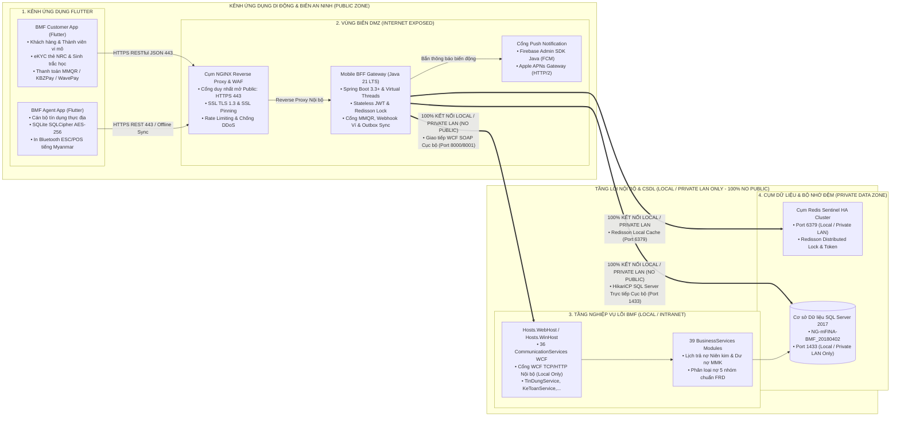
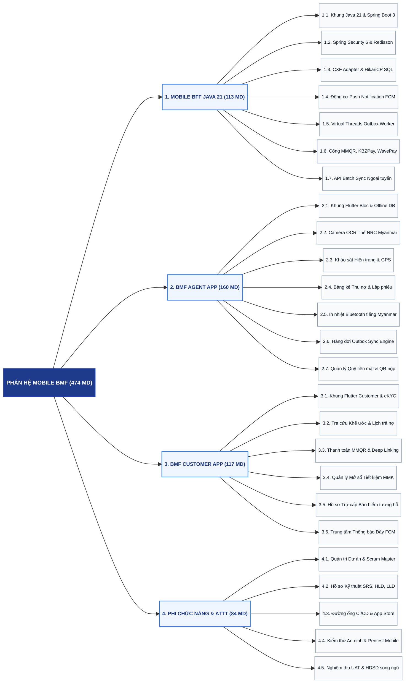
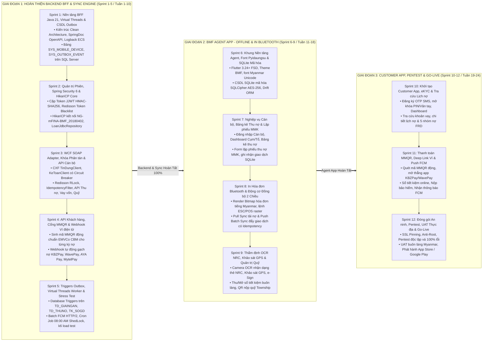
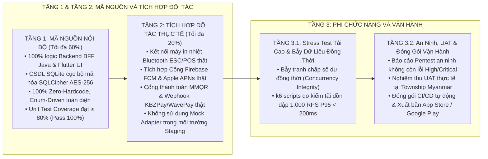

# KẾ HOẠCH TRIỂN KHAI PHÂN HỆ MOBILE BMF

---

## 1. TỔNG QUAN KIẾN TRÚC MỤC TIÊU

### 1.1. Bối cảnh và Mục tiêu Thực hiện
* **Bối cảnh vận hành:** Phân hệ Mobile App là cánh tay nối dài của hệ thống Core Banking Microfinance BMF tại Myanmar trên cơ sở dữ liệu `NG-mFINA-BMF_20180402`. Hệ thống phục vụ quản lý mạng lưới phân cấp: **State/Region → District → Township → Village Track → Village/Ward → Center (Cụm) → Group (Tổ vay vốn)** với đơn vị tiền tệ chính thức là **MMK**.
* **Mục tiêu kỹ thuật cốt lõi:**
  1. **Số hóa 100% tác nghiệp thực địa:** Cung cấp ứng dụng di động chuyên biệt cho Cán bộ tín dụng, Thu ngân lưu động và Trưởng Cụm/Tổ.
  2. **Vận hành ngoại tuyến (Offline-First):** Giải quyết triệt để sự cố mất sóng viễn thông tại các vùng buôn làng sâu xa thông qua CSDL cục bộ mã hóa và Động cơ đồng bộ Outbox.
  3. **Kênh khách hàng tự phục vụ & Thanh toán số:** Cung cấp ứng dụng cho người dân tra cứu nợ, gửi tiết kiệm tích lũy và thanh toán qua chuẩn **MMQR** cùng mạng lưới ví điện tử Myanmar (**KBZPay, WavePay, AYA Pay, MytelPay**).
  4. **Bảo tồn nguyên vẹn Backend Core:** Không can thiệp mã nguồn WCF SOAP Core .NET 4.0/4.5 hiện hữu thông qua tầng Mobile BFF Gateway (Java 21 LTS & Spring Boot 3.3+) và Trigger sự kiện Outbox trên SQL Server 2017.

### 1.2. Mô hình Kiến trúc Phân lớp và Luồng Tương tác

> [!IMPORTANT]
> **NGUYÊN TẮC AN NINH MẠNG CỐT LÕI - KẾT NỐI LOCAL NỘI BỘ (100% ZERO-PUBLIC BACKEND):**
> 1. **Biên tiếp xúc Public:** Chỉ có duy nhất cụm NGINX Reverse Proxy / WAF tại Vùng DMZ được mở cổng tiếp nhận kết nối từ Internet (HTTPS Port 443) cho các ứng dụng di động và Webhook đối tác thanh toán.
> 2. **Kết nối Local / Private LAN:** 100% kết nối từ **Mobile BFF Gateway** sang **Cơ sở dữ liệu SQL Server 2017 (Port 1433)** và **WCF Core Services (Hosts.WebHost / Hosts.WinHost Port 8000/8001)** cũng như **Redis (Port 6379)** đều là **kết nối nội bộ cục bộ (Localhost / Private LAN / Intranet)**.
> 3. **Tường lửa Cô lập Mạng (Network Isolation & Firewall Rules):** Đóng toàn bộ các cổng 1433, 8000, 8001, 6379, 8080 trước Public Internet. WCF Core Service và CSDL SQL Server được cấu hình chỉ chấp nhận gói tin từ địa chỉ IP cục bộ (Localhost / Subnet nội bộ của BFF Gateway), tuyệt đối ngăn chặn mọi rủi ro tấn công từ môi trường mạng bên ngoài.

---

## 2. PHƯƠNG ÁN KỸ THUẬT CHI TIẾT

### 2.1. Phân hệ Ứng dụng Cán bộ Tín dụng Thực địa (BMF Agent App)
* **Nền tảng & Quản lý trạng thái:** Xây dựng trên nền tảng **Flutter (Dart)**, quản lý trạng thái bằng **Bloc Pattern (flutter_bloc)** và cấu trúc thư mục theo chuẩn FSD (Feature-Sliced Design).
* **Động cơ Ngoại tuyến (Offline-First Sync Engine):**
  * Sử dụng **SQLite** kết hợp thư viện mã hóa phần cứng **SQLCipher (AES-256)** và **Drift ORM**.
  * Cấu trúc bảng cục bộ: `Local_Customers`, `Local_Groups`, `Local_Repayment_Schedules`, `Local_Transactions`, `Local_Sync_Queue`.
  * Cơ chế đồng bộ 2 chiều:
    * *Chiều tải xuống (Pull):* Tải toàn bộ danh sách Cụm/Tổ, thành viên, số dư nợ và lịch nợ đến hạn của các Cụm/Tổ được phân công phụ trách.
    * *Chiều đẩy lên (Push):* Các giao dịch thu nợ, mở sổ tiết kiệm, lập hồ sơ vay phát sinh khi mất mạng được lưu vào `Local_Sync_Queue` với trạng thái `PENDING`. Khi thiết bị kết nối lại Internet (4G/Wifi), tiến trình ngầm tự động đẩy dữ liệu lên máy chủ BFF kèm khóa định danh duy nhất `Idempotency-Key` (UUIDv4) để chống gạch nợ trùng.
* **Tích hợp Phần cứng Thực địa:**
  * **Camera OCR Thẻ NRC Myanmar:** Tích hợp bộ xử lý thị giác máy tính cục bộ (On-Device OCR) nhận dạng mẫu căn cước Myanmar `[Region]/[Township](N)[Number]`, bóc tách tự động thông tin không cần gửi ảnh lên máy chủ.
  * **Máy in nhiệt Mini Bluetooth ESC/POS:** Giao tiếp Bluetooth Low Energy (BLE) / Bluetooth Classic với máy in di động cầm tay (khổ 58mm/80mm). Định dạng hóa đơn rendered trực tiếp bằng font chữ Myanmar Unicode (Pyidaungsu Font) dưới dạng dữ liệu đồ họa Bitmap/Raster Graphics để máy in xuất ký tự chuẩn xác 100% không bị vỡ chữ.
  * **Định vị GPS & Chữ ký Điện tử:** Ghi nhận kinh độ/vĩ độ GPS tại thời điểm thu nợ và lưu trữ chữ ký số của người vay dưới dạng Vector Path / Base64 đính kèm khế ước.

### 2.2. Phân hệ Ứng dụng Khách hàng & Thành viên (BMF Customer App)
* **Trải nghiệm người dùng:** Giao diện thiết kế tối giản, trực quan, hỗ trợ song ngữ **Tiếng Myanmar (Unicode)** và **Tiếng Anh**. Tối ưu hóa kích thước gói cài đặt (< 30 MB) phù hợp với các dòng máy Android phân khúc phổ thông tại Myanmar.
* **Định danh & Quản lý Khoản vay:**
  * eKYC Thẻ NRC Myanmar và quét khuôn mặt sinh trắc học.
  * Tra cứu danh sách hợp đồng vay, lịch trả nợ toàn khóa, số tiền gốc/lãi/phí bảo hiểm chi tiết từng kỳ, hiển thị nhóm nợ (Nhóm 1 đến Nhóm 5) chuẩn FRD.
* **Thanh toán Số Myanmar (MMQR & Ví điện tử):**
  * Tích hợp chuẩn **MMQR** theo quy chuẩn của Ngân hàng Trung ương Myanmar (CBM).
  * Hỗ trợ App-to-App Deep Linking kết nối trực tiếp sang các ứng dụng ví điện tử: **KBZPay, WavePay, AYA Pay, MytelPay, CB Pay**.
  * Tiếp nhận Webhook gạch nợ tự động thời gian thực từ cổng thanh toán.
* **Tiết kiệm Vi mô & Tương trợ Thành viên:**
  * Tra cứu sổ tiết kiệm có kỳ hạn/không kỳ hạn, theo dõi lãi dồn tích thực tế hàng ngày MMK.
  * Mở sổ tiết kiệm tích lũy trực tuyến và nộp tiền góp từ ví điện tử.
  * Tra cứu quyền lợi bảo hiểm tương hỗ, nộp hồ sơ yêu cầu trợ cấp trực tiếp kèm ảnh chụp chứng từ y tế.

### 2.3. Tầng Cổng API Di động (Mobile BFF Gateway - Java 21 & Spring Boot 3)
* **Ngăn xếp công nghệ:** **Java 21 LTS (Virtual Threads - Project Loom)**, **Spring Boot 3.3+**, kiến trúc Clean Architecture / Hexagonal.
* **Bảo mật & Quản lý Phiên:**
  * **Spring Security 6 & Stateless JWT:** Ký số HMAC-SHA256 (Access Token 15 phút, Refresh Token 30 ngày lưu tại Keystore/Keychain).
  * **Redisson HA Cluster:** Quản lý Blacklist Token khi đăng xuất/thu hồi quyền và lưu trữ trạng thái thiết bị `SYS_MOBILE_DEVICE`.
  * **Redisson Distributed Lock (`RLock`):** Bảo đảm tính nguyên tử tuyệt đối cho các giao dịch gạch nợ và trả nợ đồng thời từ nhiều nguồn (Cán bộ thu tại chỗ vs Khách hàng quét MMQR qua KBZPay).
* **Kết nối Dữ liệu & Adapter:**
  * **HikariCP + Spring JdbcClient:** Truy xuất trực tiếp SQL Server 2017 `NG-mFINA-BMF_20180402` với độ trễ < 80ms.
  * **Apache CXF / SOAP Wrapper:** Tích hợp với 36 WCF SOAP Services hiện hữu có gắn bộ ngắt mạch Resilience4j Circuit Breaker.
* **Kiến trúc Thông báo Đẩy Zero-Impact Core BE:**
  * Bảng đệm `SYS_OUTBOX_EVENT` ghi nhận sự kiện từ các Trigger CSDL SQL Server trên các bảng nghiệp vụ (`TD_GIAINGAN`, `TD_THUNO`, `TK_SOGD`).
  * Tiến trình `NotificationWorkerService` chạy ngầm trên Java Virtual Threads liên tục quét hàng đợi `PENDING` và bắn tin qua **Firebase Admin SDK for Java (FCM)** và **Apple APNs**.
  * Tiến trình `LoanDueReminderTask` lập lịch ngầm với **ShedLock** vào 08:00 AM hàng ngày quét lịch nợ đến hạn để phát thông báo nhắc nợ tiếng Myanmar.

---

## 3. CẤU TRÚC PHÂN RÃ CÔNG VIỆC WBS

Tổng hợp nỗ lực phân hệ Mobile theo chuẩn định mức Viettel (trích xuất từ hồ sơ ước lượng kỹ thuật): **474.0 Man-Days (21.55 Man-Months)**.

---

## 4. KẾ HOẠCH TRIỂN KHAI THEO SPRINT (CHIẾN LƯỢC BACKEND & SYNC FIRST)

Dự án được triển khai theo chiến lược **Backend & Sync First** qua **24 tuần (6 tháng / 12 Sprint, mỗi Sprint 2 tuần)**, bảo đảm hệ thống máy chủ, CSDL và các API nghiệp vụ hoàn thiện và vận hành ổn định trước khi phát triển ứng dụng di động:

### 4.1. Chi tiết Mục tiêu và Sản phẩm bàn giao từng Sprint

| Sprint | Thời gian | Phân hệ Trọng tâm | Nhiệm vụ Kỹ thuật Chi tiết | Sản phẩm Bàn giao |
| :---: | :---: | :--- | :--- | :--- |
| **Sprint 1** | Tuần 1-2 | Nền tảng BFF Java 21 & CSDL Outbox | • Khởi tạo kiến trúc Clean Architecture Java 21 LTS & Spring Boot 3.3+. • Tạo bảng `SYS_MOBILE_DEVICE`, `SYS_OUTBOX_EVENT` trên CSDL SQL Server. • Thiết lập Virtual Threads, OpenAPI Swagger UI và Logback JSON ECS. • Thiết lập Pipeline CI/CD GitHub Actions và Dockerfile Java 21 đa tầng. | • Source code base BFF Gateway (Java). • CSDL SQL Server sẵn sàng tiếp nhận bảng mới. • Swagger UI hoạt động tại `/swagger-ui.html`. • Pipeline build và test tự động. |
| **Sprint 2** | Tuần 3-4 | Xác thực Bảo mật & Kết nối CSDL Core | • Cấu hình Spring Security 6, ký số cặp Token JJWT (Access 15p, Refresh 30d). • Tích hợp Redisson quản lý Blacklist Token và thông tin thiết bị. • Cấu hình HikariCP kết nối CSDL `NG-mFINA-BMF_20180402`. • Viết `LoanJdbcRepository` truy vấn danh mục Cụm/Tổ và lịch nợ bằng `JdbcClient`. | • Bộ API Đăng nhập cho Cán bộ và Khách hàng (NRC). • Module kiểm soát Token và Blacklist trên Redis. • Tốc độ truy vấn CSDL đạt < 50ms. |
| **Sprint 3** | Tuần 5-6 | WCF Adapter & API Cán bộ Thực địa | • Xây dựng SOAP Client từ WSDL `TinDungService`, `KeToanService` có Circuit Breaker. • Triển khai `IdempotencyFilter` (UUIDv4) và khóa phân tán `Redisson RLock`. • Xây dựng trọn bộ API Cán bộ: Lấy Cụm/Tổ, Bảng kê nợ, Gạch nợ, Nộp hồ sơ vay, Tiết kiệm, Bảo hiểm và QR bàn giao quỹ. | • Toàn bộ 7 API Cán bộ thực địa hoạt động thông suốt. • Gạch nợ và hạch toán kế toán kép chính xác từng đồng MMK. • Khóa phân tán bảo vệ tuyệt đối chống gạch nợ trùng. |
| **Sprint 4** | Tuần 7-8 | API Khách hàng & Webhook Ví Điện tử | • Xây dựng trọn bộ 5 API Khách hàng: Tra cứu khoản vay, Lịch nợ 5 nhóm nợ FRD, Sổ tiết kiệm, Mở sổ tích lũy và Nộp hồ sơ bảo hiểm. • Xây dựng module sinh mã MMQR động chuẩn EMVCo CBM. • Tiếp nhận Webhook gạch nợ tự động thời gian thực từ KBZPay, WavePay, AYA Pay, MytelPay. | • Trọn bộ 5 API Khách hàng sẵn sàng phục vụ Mobile. • Sinh chuỗi và ảnh MMQR động EMVCo chuẩn xác. • Webhook gạch nợ tự động trong 500ms khi nhận thông báo ví. |
| **Sprint 5** | Tuần 9-10 | Triggers Outbox, Worker & Stress Test BE | • Tạo 3 Database Triggers trên `TD_GIAINGAN`, `TD_THUNO`, `TK_SOGD`. • Phát triển `NotificationOutboxWorker` trên Virtual Threads quét hàng đợi `PENDING`. • Tích hợp Firebase Admin SDK đẩy thông báo hàng loạt qua HTTP/2. • Thiết lập Cron Job nhắc nợ 08:00 AM kèm ShedLock Redis. • Chạy k6 kiểm thử tải 1.000 RPS và bẫy dữ liệu đồng thời trên Staging. | • Hệ thống thông báo đẩy Outbox Zero-Impact BE hoàn chỉnh. • Kết quả kiểm thử tải P95 < 200ms, không phát sinh lỗi đồng thời. • **CỘT MỐC: Nghiệm thu hoàn thiện 100% Backend & Sync.** |
| **Sprint 6** | Tuần 11-12 | Nền tảng Agent App & SQLite Mã hóa | • Khởi tạo dự án Flutter 3.24+ BMF Agent theo chuẩn FSD (Feature-Sliced Design). • Nhúng font chữ tiếng Myanmar Unicode (Pyidaungsu), cấu hình Bloc và đa ngôn ngữ. • Cấu hình `DioClient` tự động refresh token và retry interceptor. • Thiết lập CSDL SQLite mã hóa **SQLCipher AES-256** với Drift ORM. • Thiết lập Pipeline Fastlane tự động đóng gói Mobile Android/iOS. | • Ứng dụng Agent khởi chạy mượt mà trên iOS và Android. • CSDL cục bộ SQLite được mã hóa AES-256 an toàn. • Hiển thị tiếng Myanmar sắc nét, chuẩn Unicode. |
| **Sprint 7** | Tuần 13-14 | Nghiệp vụ Cán bộ & Lập phiếu Thu nợ | • Màn hình Đăng nhập Cán bộ, ràng buộc thiết bị và mở khóa sinh trắc học FaceID/Vân tay. • Màn hình Dashboard Cán bộ và Danh sách Cụm/Tổ phân cấp. • Màn hình Bảng kê thu nợ Cụm/Tổ (Collection Sheet). • Dialog lập phiếu thu nợ MMK, tính toán phân bổ gốc/lãi/phí tức thời. • Ghi nhận giao dịch nguyên tử vào SQLite và hàng đợi `LocalSyncQueue`. | • Giao diện thu nợ hoạt động mượt mà 60 FPS. • Thao tác lập phiếu hoàn tất trong dưới 5 giây. • Lưu an toàn dữ liệu phiếu thu ngay cả khi mất sóng hoàn toàn. |
| **Sprint 8** | Tuần 15-16 | In nhiệt Bluetooth & Động cơ Đồng bộ 2 Chiều | • Tích hợp kết nối máy in nhiệt Bluetooth mini (khổ 58mm và 80mm). • Xây dựng Canvas render hóa đơn tiếng Myanmar sang ảnh Bitmap 1-bit. • Đóng gói lệnh in đồ họa raster ESC/POS truyền qua Bluetooth. • Xây dựng tiến trình Pull Sync tải danh mục và Push Batch Sync đẩy giao dịch. • Giao diện hiển thị trạng thái mạng và tiến trình đồng bộ. | • In thành công biên nhận tiếng Myanmar trên máy in nhiệt mini. • Đẩy 50 giao dịch ngoại tuyến lên máy chủ trong vòng 5 giây. • **CỘT MỐC: Đóng gói BMF Agent App MVP v1.0 thử nghiệm thực địa.** |
| **Sprint 9** | Tuần 17-18 | Thẩm định OCR NRC, GPS & Quản trị Quỹ | • Tích hợp On-Device OCR nhận dạng Thẻ căn cước Myanmar `[Region]/[Township](N)[Number]`. • Màn hình khảo sát hiện trạng nhà ở, chuồng trại gia súc đính kèm tọa độ GPS. • Widget ký hợp đồng tín dụng điện tử e-Sign trực tiếp trên màn hình. • Màn hình thu/mở sổ tiết kiệm buôn làng và nộp hồ sơ bảo hiểm tương hỗ. • Quản lý hạn mức quỹ tiền mặt lưu động và sinh mã QR bàn giao quỹ. | • Số hóa 100% quy trình thẩm định và nộp hồ sơ vay vốn. • Nhận dạng thẻ NRC tự động với độ chính xác > 95%. • Kiểm soát an toàn tồn quỹ tiền mặt cán bộ. • **CỘT MỐC: Hoàn thành BMF Agent App v2.0.** |
| **Sprint 10** | Tuần 19-20 | Nền tảng Customer App, eKYC & Tra cứu Nợ | • Khởi tạo Flutter Customer App, thiết lập giao diện Material 3 màu Navy/Cam BMF. • Đăng ký tài khoản thành viên qua số NRC và xác thực OTP SMS. • Thiết lập mã PIN 6 số bảo mật và mở khóa sinh trắc học. • Trang chủ Khách hàng, Tra cứu hợp đồng vay vốn đang hoạt động. • Chi tiết lịch trả nợ toàn khóa và hiển thị 5 nhóm nợ theo chuẩn FRD Myanmar. | • Bản cài đặt **BMF Customer App v1.0**. • Khách hàng đăng ký tài khoản thành công trong dưới 2 phút. • Tra cứu dư nợ gốc lãi và lịch trả nợ chuẩn xác từng kỳ. |
| **Sprint 11** | Tuần 21-22 | Thanh toán MMQR, Deep Link Ví & Push FCM | • Màn hình thanh toán nợ bằng mã MMQR động EMVCo chứa đúng số tiền kỳ này. • App-to-App deep linking mở thẳng ứng dụng ví KBZPay, WavePay, AYA Pay, MytelPay. • Lắng nghe phản hồi gạch nợ tự động và hiển thị biên lai điện tử. • Màn hình quản lý sổ tiết kiệm tích lũy, theo dõi lãi dồn tích thực tế hàng ngày. • Màn hình nộp hồ sơ trợ cấp bảo hiểm tương hỗ đính kèm ảnh chứng từ viện phí. • Tiếp nhận thông báo đẩy Firebase FCM tiếng Myanmar nhắc nợ 08:00 AM. | • Trải nghiệm thanh toán số liền mạch qua ví điện tử. • Gạch nợ tức thời và nhận biên nhận điện tử. • Nhận tin nhắn nhắc nợ tiếng Myanmar tự động trên điện thoại. |
| **Sprint 12** | Tuần 23-24 | An ninh Mobile, Pentest, UAT & Go-Live | • Kích hoạt SSL Certificate Pinning, Anti-Root/Jailbreak, `FLAG_SECURE` và Keystore/Keychain. • Thực thi bài Pentest an ninh độc lập trên Mobile và Gateway, khắc phục 100% cảnh báo. • Tổ chức kiểm thử UAT thực tế tại Township Myanmar trên dữ liệu và máy in thật. • Đào tạo cán bộ tín dụng và xuất bản ứng dụng lên Apple App Store và Google Play. | • Báo cáo Pentest đạt chuẩn không còn lỗ hổng High/Critical. • Biên bản nghiệm thu UAT có chữ ký phê duyệt của khách hàng BMF. • **CỘT MỐC: Hệ sinh thái Mobile BMF Go-Live chính thức.** |

---

## 5. MÔ HÌNH NHÂN SỰ VÀ MA TRẬN RACI

### 5.1. Cơ cấu Đội ngũ Dự án (Dự kiến 8 Nhân sự Toàn thời gian)

| STT | Vai trò Dự án | Số lượng | Trách nhiệm Chính trong Chiến lược Backend-First |
| :---: | :--- | :---: | :--- |
| 1 | **Project Manager / Scrum Master** | 1 | Điều phối tiến độ 12 Sprint, quản trị rủi ro, tổ chức nghiệm thu từng giai đoạn và làm việc trực tiếp với khách hàng BMF. |
| 2 | **Solution Architect / Tech Lead** | 1 | Thiết kế kiến trúc Clean Architecture, kiểm soát chuẩn API RESTful, thuật toán Offline Sync và rà soát chất lượng mã nguồn. |
| 3 | **Backend Developers (Java 21 / Spring Boot 3)** | 2 | Tập trung toàn lực trong Sprint 1-5 phát triển Mobile BFF Gateway, SOAP Adapters, Outbox Worker, Tích hợp MMQR/Ví và Stress Test. |
| 4 | **Mobile Lead / Senior Flutter Dev** | 1 | Chuẩn bị kiến trúc Flutter, nghiên cứu in Bluetooth ESC/POS và OCR trong Giai đoạn 1; dẫn dắt đội Mobile trong Giai đoạn 2 & 3. |
| 5 | **Flutter Developers** | 2 | Phát triển các màn hình giao diện, logic Bloc cho BMF Agent App (Sprint 6-9) và BMF Customer App (Sprint 10-12). |
| 6 | **Quality Assurance / Tester (QA)** | 1 | Viết kịch bản kiểm thử API, chạy test tải k6 trong Giai đoạn 1; thực thi kiểm thử chức năng Mobile và UAT thực địa trong Giai đoạn 2 & 3. |

### 5.2. Ma trận Trách nhiệm RACI

*(Quy ước: **R** - Responsible: Người thực hiện | **A** - Accountable: Người chịu trách nhiệm phê duyệt | **C** - Consulted: Người tham vấn chuyên môn | **I** - Informed: Người nhận thông tin).*

| Hạng mục Công việc / Gói thầu | PM | Tech Lead | Mobile Lead | Dev Team | QA Team | Khách hàng BMF |
| :--- | :---: | :---: | :---: | :---: | :---: | :---: |
| **Khảo sát nghiệp vụ & Soạn thảo SRS/HLD/DBDD** | A | R | C | C | C | I |
| **GIAI ĐOẠN 1: Phát triển Mobile BFF Gateway (Java 21) & CSDL** | I | A/R | C | R | I | I |
| **GIAI ĐOẠN 1: Tích hợp Cổng thanh toán MMQR & Ví điện tử** | I | A | C | R | I | C |
| **GIAI ĐOẠN 1: Triggers Outbox, Virtual Threads Worker & k6 Test** | I | A | C | R | R | I |
| **GIAI ĐOẠN 2: Phát triển BMF Agent App (Offline & In Bluetooth)** | I | A | R | R | I | I |
| **GIAI ĐOẠN 2: Thẩm định Tín dụng OCR NRC & Quản lý Quỹ** | I | A | R | R | I | I |
| **GIAI ĐOẠN 3: Phát triển BMF Customer App (MMQR & eKYC)** | I | A | R | R | I | I |
| **GIAI ĐOẠN 3: Thiết lập CI/CD Fastlane & Đóng gói Mobile** | I | A | R | R | I | I |
| **GIAI ĐOẠN 3: Kiểm thử An ninh ATTT & Vá lỗi Pentest** | I | A | R | R | R | I |
| **GIAI ĐOẠN 3: Tổ chức Nghiệm thu UAT & Đào tạo Thực địa** | A | C | C | I | R | R |
| **GIAI ĐOẠN 3: Phát hành Google Play, App Store & Go-Live** | A | R | R | I | I | I |

---

## 6. QUY TRÌNH KIỂM THỬ VÀ ĐÁNH GIÁ TIẾN ĐỘ 3 TẦNG

Tuân thủ nghiêm ngặt nguyên tắc **"Bằng chứng thực chứng hoặc Chấm 0%" (Hard Evidence or Zero)** theo mô hình Đánh giá Tiến độ 3 Tầng Độc lập:

### 6.1. Chi tiết 4 Bài Bẫy Toàn vẹn Dữ liệu Đồng thời
1. **Bài bẫy Gạch nợ Trùng lặp (Double Payment Prevention):**
   * *Kịch bản:* Cán bộ tại địa bàn lập phiếu thu tiền mặt và bấm đồng bộ cùng lúc khách hàng tự quét mã MMQR qua ứng dụng ví điện tử KBZPay.
   * *Cơ chế xử lý:* Hệ thống áp dụng **Redisson Distributed Lock** trên mã khế ước vay (`LockKey = "LOAN_REPAYMENT:" + Loan_Code`) kèm theo `Idempotency Key`. Giao dịch nào đến trước sẽ chiếm khóa và gạch nợ thành công; giao dịch đến sau bị từ chối với mã lỗi `ERR_TRANSACTION_ALREADY_SETTLED`.
2. **Bài bẫy Đồng bộ Ngoại tuyến Xung đột Lịch nợ (Offline Sync Conflict):**
   * *Kịch bản:* Cán bộ A thu nợ kỳ 12 tại buôn làng khi mất mạng; cùng lúc đó tại phòng giao dịch Township, giao dịch viên thu nợ trực tiếp trên máy tính Desktop.
   * *Cơ chế xử lý:* Áp dụng cơ chế kiểm soát phiên bản dữ liệu (Optimistic Locking / Row Versioning). Khi bản ghi của Cán bộ A đẩy lên, hệ thống đối soát phiên bản: Nếu phát hiện nợ đã được thu tại quầy, hệ thống tự động chuyển số tiền cán bộ thu sang tài khoản Tiền gửi Tiết kiệm Tự nguyện của khách hàng hoặc đưa vào hàng đợi chờ Kế toán trưởng xử lý thủ công, tuyệt đối không để mất mát số dư tiền mặt của người dân.
3. **Bài bẫy Đăng nhập Đa thiết bị và Rút phiên Tức thì (Device Binding Enforcement):**
   * *Kịch bản:* Cán bộ bị mất điện thoại tại địa bàn; quản trị viên thực hiện khóa thiết bị từ Web CMS.
   * *Cơ chế xử lý:* Ngay khi nhận lệnh khóa, Mobile BFF Gateway đưa token của thiết bị vào Redis Blacklist. Tại mọi HTTP request tiếp theo, bộ lọc `JwtAuthenticationFilter` chặn ngay lập tức với mã lỗi `401 Unauthorized` và lệnh xóa sạch CSDL SQLite cục bộ trên máy.
4. **Bài bẫy Tranh chấp Số dư Tiền gửi Tiết kiệm (Saving Balance Contention):**
   * *Kịch bản:* Bắn dồn dập 100 yêu cầu nộp tiền tiết kiệm đồng thời vào cùng một sổ tiết kiệm.
   * *Cơ chế xử lý:* Khóa phân tán trên mã sổ tiết kiệm (`LockKey = "SAVING_ACCOUNT:" + Account_No`), bảo đảm số dư cuối cùng trong CSDL khớp đúng 100% với tổng số tiền nạp, sai số bằng 0 MMK.

---

## 7. MA TRẬN QUẢN TRỊ RỦI RO

| STT | Rủi ro Tiềm ẩn | Mức độ | Ảnh hưởng Kỹ thuật / Vận hành | Biện pháp Phòng ngừa & Xử lý Triệt để |
| :---: | :--- | :---: | :--- | :--- |
| 1 | **Mất kết nối mạng kéo dài tại vùng sâu Myanmar** | Cao | Cán bộ không thể đồng bộ dữ liệu về Core cuối ngày, gây trễ hạn đóng sổ COB. | Thiết kế kiến trúc **Offline-First 100%**; toàn bộ quy trình thu nợ và in hóa đơn chạy độc lập trên CSDL SQLite cục bộ. Cho phép cán bộ đồng bộ dồn dữ liệu khi quay về văn phòng chi nhánh có Wifi. |
| 2 | **Lỗi font chữ tiếng Myanmar trên máy in nhiệt Bluetooth** | Cao | Hóa đơn in ra bị lỗi ô vuông hoặc vỡ ký tự nguyên âm/phụ âm tiếng Myanmar. | Chuyển đổi toàn bộ nội dung hóa đơn sang dạng đồ họa hình ảnh Bitmap độ nét cao trên điện thoại trước khi truyền lệnh in ESC/POS `GS v 0`, bảo đảm hiển thị chuẩn xác 100% trên mọi loại máy in nhiệt cầm tay. |
| 3 | **Thay đổi quy chuẩn API đối tác ví điện tử (KBZPay/WavePay)** | Trung bình | Gián đoạn luồng thanh toán số và Webhook gạch nợ tự động. | Xây dựng tầng Adapter trung gian (Payment Gateway Adapter Pattern); bóc tách hoàn toàn logic giao tiếp đối tác ra khỏi lõi nghiệp vụ. Khi đối tác đổi API, chỉ cần nâng cấp Adapter mà không ảnh hưởng Mobile App. |
| 4 | **Trích xuất dữ liệu trái phép khi cán bộ làm mất điện thoại** | Cao | Nguy cơ lộ thông tin cá nhân và lịch sử vay vốn của hàng nghìn người dân buôn làng. | Kích hoạt mã hóa toàn bộ cơ sở dữ liệu SQLite bằng **SQLCipher AES-256** với chuỗi khóa sinh động từ Android Keystore / iOS Keychain. Thiết lập cơ chế tự hủy dữ liệu nếu nhập sai mã PIN quá 5 lần. |
| 5 | **Thời gian duyệt app trên Apple App Store / Google Play kéo dài** | Trung bình | Làm chậm tiến độ Go-Live của ứng dụng khách hàng. | Chuẩn bị đầy đủ tài liệu giải trình, video quay luồng eKYC Thẻ NRC và tài khoản Demo thử nghiệm; nộp bản duyệt trước ngày dự kiến Go-Live tối thiểu 3 tuần. |

---

## 8. DANH MỤC SẢN PHẨM BÀN GIAO

1. **Bộ Hồ sơ Kỹ thuật Chuẩn Doanh nghiệp:**
   * `SRS_BMF_Mobile.md`: Tài liệu Đặc tả Yêu cầu Phần mềm phân hệ Mobile.
   * `HLD_BMF_Mobile.md`: Tài liệu Thiết kế Tổng thể và Phân vùng An ninh Cổng Mobile BFF.
   * `LLD_BMF_Mobile.md`: Tài liệu Thiết kế Chi tiết Cấp thấp và Sơ đồ Lớp/Tuần tự.
   * `DBDD_BMF_Mobile.md`: Tài liệu Thiết kế Cơ sở Dữ liệu Mở rộng và CSDL Ngoại tuyến SQLite.
   * [mobile_app_dev_tasks.md](file:///Users/micro/Source/erp/mifinace/plan/mobile_app_dev_tasks.md): **Danh mục 62 Task Kỹ thuật Phân rã Chi tiết cho Developer (mô tả từng class, file, DTO, câu lệnh CSDL và tiêu chí nghiệm thu).**
2. **Mã nguồn và Gói Cài đặt Phát hành:**
   * Mã nguồn dự án `Mobile BFF Gateway` (**Java 21 LTS & Spring Boot 3.3+** / Clean Architecture).
   * Mã nguồn dự án `BMF Agent App` (Flutter iOS & Android).
   * Mã nguồn dự án `BMF Customer App` (Flutter iOS & Android).
   * Bộ cài đặt nhị phân: Tệp `BMF_Agent.apk`, `BMF_Customer.apk` và link phát hành TestFlight / App Store.
3. **Bộ Kịch bản Kiểm thử & Tài liệu Vận hành:**
   * Bộ kịch bản kiểm thử tự động API (Postman Collection / Newman).
   * Kịch bản kiểm thử tải cao và bẫy đồng thời (k6 / JMeter Scripts).
   * Báo cáo kiểm thử an ninh ứng dụng di động (Mobile Pentest Report).
   * Sổ tay Hướng dẫn Cài đặt & Vận hành (`HDCD_VH_Mobile.md`).
   * Sổ tay Hướng dẫn Sử dụng song ngữ Myanmar/English (`HDSD_Agent.md` & `HDSD_Customer.md`).
